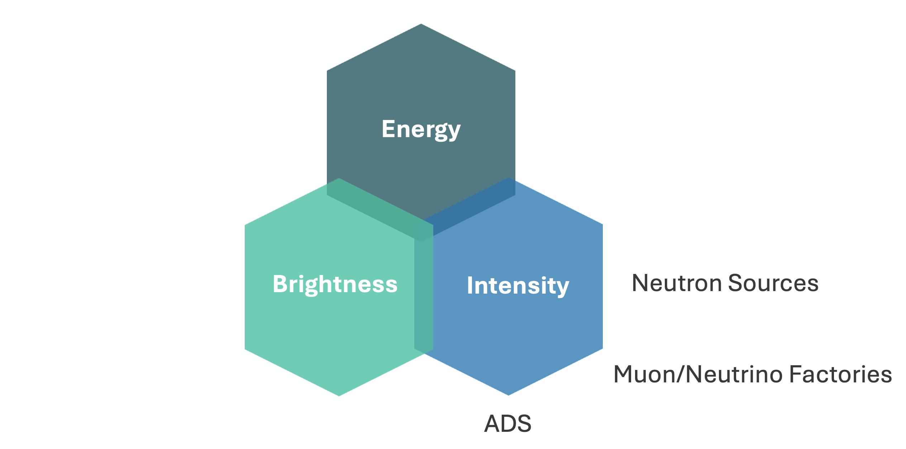
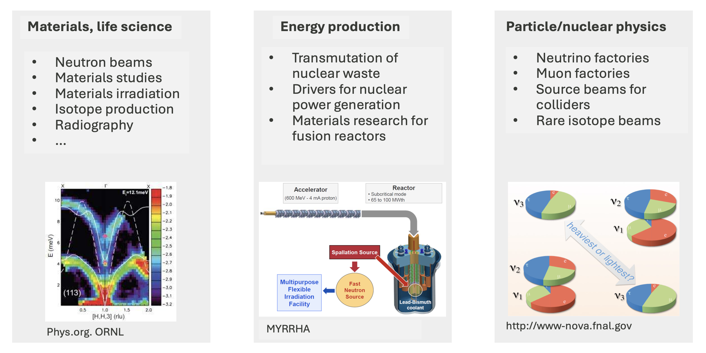
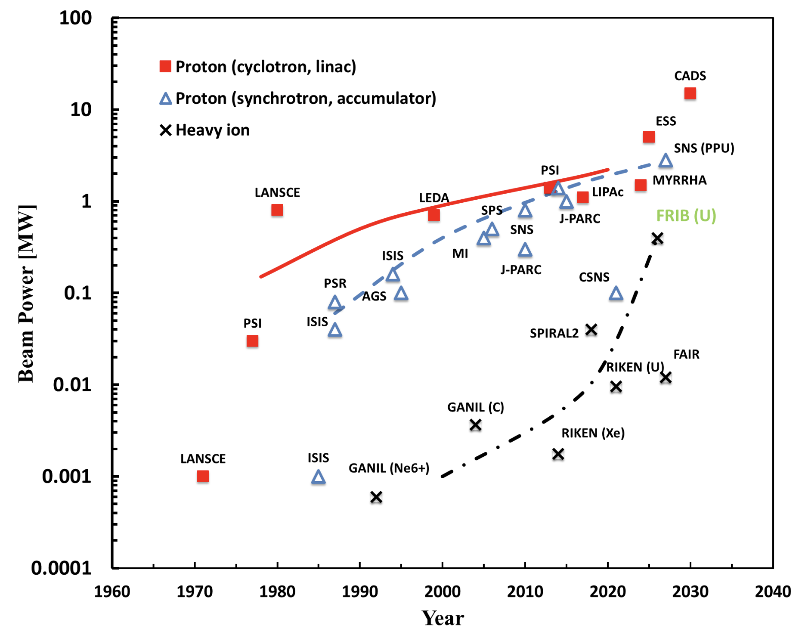

## Three frontiers of accelerator physics

{fig-align=center width=300px}

## Many intensity-frontier applications

{fig-align=center width=400px}

## Beam power has increased exponentially over time

{fig-align=center width=300px}

## What is space charge?

* Direct space charge forces = electric forces arising from charge distribution in rest frame. 
* Presents fundamental limits on beam intensity, power, quality, etc., limiting accelerator performance.
* Effects can be subtle and difficult to model/predict/measure.
* A lot to discuss!

