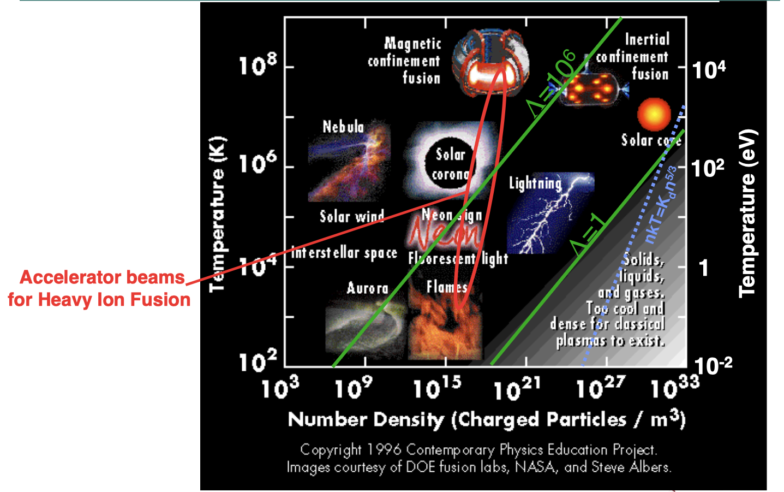
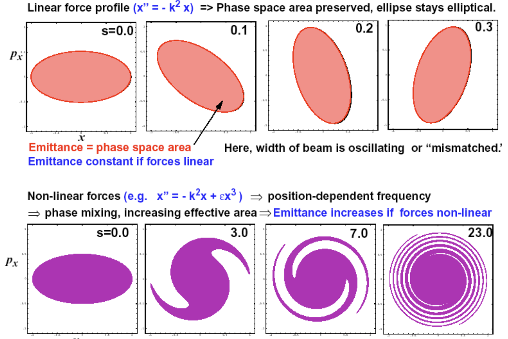

## Overview

* Beam intensity can reach $N = 10^{9} - 10^{14}$ particles per bunch.
* Direct force calculation scales as $N^2$.
* Key insight: we care mostly about the particle *distribution* (macrostate), not individual trajectories (microstate). Think histogram vs. scatter plot.
* Suggests continuum model of beam + self fields.
* Use established concepts/tools from plasma physics --- beams are non-neutral plasmas.

# Debye length, plasma parameter, and plasma frequency

## What is a plasma?

> A *plasma* is a gas of charged particles, in which the potential energy of a typical particle due to its nearest neighbor is much smaller than its kinetic energy. [@nicholson_1983_introduction]

When this condition is violated, we have a *strongly coupled* plasma. (Example: electrons in metals.)

## Debye length

Consider uniform density of electrons ($e$) and ions ($i$): $n_i(\mathbf{x}) = n_e(\mathbf{x}) = n_0$.

Add test particle of charge $q_T$ and infinite mass at $\mathbf{x} = 0$.

Poisson equation relates electric potential $\phi(\mathbf{x})$ to perturbed charge density:

\begin{equation} \label{eq-poisson}
\nabla^2 \phi(\mathbf{x}) = 
-\underbrace{\frac{e \left( n_i(\mathbf{x}) - n_e(\mathbf{x}) \right) }{\epsilon_0}}_{\text{background}} 
- \underbrace{\frac{q_T \delta(\mathbf{x}) }{\epsilon_0}}_{\text{perturbation}} ,
\end{equation}

where $e$ is elementary charge, $\epsilon_0$ is electric constant, $n_e(\mathbf{x})$ is electron density, $n_i(\mathbf{x})$ is ion density, and $\delta$ is Dirac delta function.

---

Electron-electron collisions eventually drive electron distribution to thermal equilibrium at temperature $T_e$ (measured in [eV] so no $k_B$):

\begin{equation}
n_e(\mathbf{x}) = n_0 \exp{ \left( \frac{e \phi(\mathbf{x})}{T_e} \right) } 
\end{equation}

Ion-ion collisions eventually drive ion distribution to equilibrium at temperture $T_i$.

\begin{equation}
n_i(\mathbf{x}) = n_0 \exp{ \left( -\frac{e \phi(\mathbf{x})}{T_i} \right) } 
\end{equation}

Stop here, before electron-ion collisions relax the entire distribution to equilibrium at the same temperature.

---

Assume thermal energy dominates ($e \phi \ll T_{i, e}$) and truncate exponential after single term in Taylor series:

\begin{equation}
n_e(\mathbf{x}) = n_0 \exp{ \left( \frac{e \phi(\mathbf{x})}{T_e} \right) } \approx n_0 \left( 1 + \frac{e \phi(\mathbf{x})}{T_e} \right)
\end{equation}

Insert truncated density functions into Eq. \eqref{eq-poisson}. Away from the origin, in radial coordinates ($r = |\mathbf{x}|$):

\begin{equation} \label{eq-poisson-radial}
\frac{1}{r^2} \frac{\partial }{\partial r} \left( r^2 \frac{\partial \phi}{\partial r} \right) 
= \frac{e^2 n_0}{\epsilon_0} \left( \frac{1}{T_e} + \frac{1}{T_i} \right) \phi(r) .
\end{equation}

Define **Debye length** $\lambda_{e}$ and $\lambda_i$ for electrons and ions:

\begin{equation}
\lambda_{e} = \sqrt{\frac{\epsilon_0 T_{e}}{n_0 e^2}}, \quad\quad \lambda_{i} = \sqrt{\frac{\epsilon_0 T_{i}}{n_0 e^2}}
\end{equation}

And total Debye length $\lambda_D^{-2} = \lambda_e^{-2} + \lambda_i^{-2}$ such that

\begin{equation} \label{eq-poisson-radial-debye}
\frac{1}{r^2} \frac{\partial }{\partial r} \left( r^2 \frac{\partial \phi}{\partial r} \right) 
= \lambda_D^{-2} \phi(r) .
\end{equation}

--- 

The solution to Eq. \eqref{eq-poisson-radial-debye} is the *Yukawa potential*:

\begin{equation} \label{eq-yukawa}
\boxed{
\phi(r) = \frac{q_T}{4 \pi \epsilon_0 r} e^{-r/\lambda_D} = \phi_0(r) e^{-r/\lambda_D}
}
\end{equation}

* Describes *screening* effect: test particle attracts cloud of opposite charge.
* Deybe length $\lambda_D$ sets length scale for *collective* vs. *collisional* effects.
* Similar potentials appear in nuclear physics.

## Plasma parameter

Define the **plasma parameter** $\Lambda$ as the typical number of particles in a "Debye cube":

\begin{equation}
\Lambda \equiv n_0 \lambda_D^3 .
\end{equation}

The average nearest-neighbor distance is $r \sim n_0^{-1/3}$, and the average potential energy between neighboring particles is

\begin{equation}
\left| q\phi(\mathbf{x}) \right| \sim q^2 r^{-1} \sim q^2 n_0^{1/3} .
\end{equation}

In a weakly coupled plasma, the average kinetic energy is much larger than the average nearest-neighbor potential energy:

\begin{equation}
T \gg q^2 n_0^{1/3}.
\end{equation}

This means there are a lot of particles in a typical Debye cube:

\begin{equation} \label{eq-plasma-parameter}
\Lambda = n_0 \lambda_D^3 = n_0 \left( \frac{\epsilon_0 T}{n_0 q^2} \right)^{3/2} \gg 1.
\end{equation}

## Plasma frequency

Start with uniform-density slab of electrons and ions (density $n_0$), in region $0 \le x \le L$. Assume infinite-mass ions.

Displace electron slab by small distance $\Delta \ll L$ along $x$ axis. 

Surface charge density $\sigma = \pm q n_0 \Delta$ accumulates on either face. This gives us a parallel-plate capacitor with field $E$ pointing along $x$ axis:

\begin{equation}
E(\Delta) = \frac{\sigma}{\epsilon_0} = -\frac{n_0 q \Delta}{\epsilon_0}
\end{equation}

The electrons perform harmonic oscillations at the **plasma frequency** $\omega_p$:

\begin{equation}
\ddot{\Delta} = -\omega_p^2 \Delta ,
\end{equation}

\begin{equation}
\omega_p \equiv \left( \frac{n_0 q^2}{\epsilon_0 m} \right)^{1/2}.
\end{equation}

---

The relationship between the plasma frequency and Debye length defines a *thermal velocity* $v_T$:

\begin{equation}
v_T \equiv \omega_p \lambda_D = \left( \frac{T}{m} \right)^{1/2}.
\end{equation}

The Debye length $\lambda_D$, plasma frequency $\omega_p$, and thermal velocity $v_T$ define the characteristic length and time scales of collective oscillations in the plasma.

## Accelerator beams are non-neutral plasmas

{#fig-plasma-diagram width=100%}

# Kinetic theory

---

> Kinetic theory studies the macroscopic properties of large numbers of particles, starting from their (classical) equations of motion [@kardar_2007_statistical].

## Klimontovich Equation

Consider set of $N$ particles moving in six-dimensional phase space defined by the position $\mathbf{x} = (x, y, z)$ and momentum $\mathbf{p} = (p_x, p_y, p_z).$

Let $\left\{ \mathbf{X}_i(t) ,\mathbf{P}_i(t) \right\}$ be the *orbit* or *trajectory* of particle number $i$ at time $t$.

Let $f^m(\mathbf{x}, \mathbf{p}, t)$ be the distribution function:

\begin{equation} \label{eq-dist-dirac}
f^m(\mathbf{x}, \mathbf{p}, t) = 
\sum_{i=1}^{N}
\delta \left[ \mathbf{x} - \mathbf{X}_i(t) \right]
\delta \left[ \mathbf{p} - \mathbf{P}_i(t) \right],
\end{equation}

where $\delta$ is the Dirac delta function. Here $m$ stands for *microscopic*, indicating a singular distribution function describing a set of point-particles, rather than a smooth density. 

Total number of particles does not change:

\begin{equation} \label{eq-dist-norm}
N = \int f^m(\mathbf{x}, \mathbf{p}, t) d\mathbf{x} d\mathbf{p}.
\end{equation}

---

The charge density $\rho^m(\mathbf{x}, t)$ and current density $\mathbf{J}^m(\mathbf{x}, t)$ are written as

\begin{equation}
\begin{aligned}
\rho^m(\mathbf{x}, t) 
&= 
\rho^{ext}(\mathbf{x}, t) + 
q \int f^m(\mathbf{x}, \mathbf{p}, t) d\mathbf{p} \\
&= 
\rho^{ext}(\mathbf{x}, t) + 
q \sum_{i=1}^{N} {
    \delta \left[ \mathbf{x} - \mathbf{X}_i(t) \right]
},
\end{aligned}
\end{equation}

\begin{equation}
\begin{aligned}
\mathbf{J}^m(\mathbf{x}, t) 
&= 
\mathbf{J}^{ext}(\mathbf{x}, t) +
q \int \dot{\mathbf{x}} f^m(\mathbf{x}, \mathbf{p}, t) d\mathbf{p} \\
&= 
\mathbf{J}^{ext}(\mathbf{x}, t) + 
q \sum_{i=1}^{N} {
    \dot{\mathbf{X}}_i(t) 
    \delta \left[ \mathbf{x} - \mathbf{X}_i(t) \right]
},
\end{aligned}
\end{equation}

where $\rho^{ext}(\mathbf{x}, t)$ and $\mathbf{J}^{ext}(\mathbf{x}, t)$ are from external sources.

---

The charge and current densities generate an electric field $\mathbf{E}^m(\mathbf{x}, t)$ and magnetic field $\mathbf{B}^m(\mathbf{x}, t)$, which satisfy the Maxwell equations:

\begin{equation} \label{eq-micro-maxwell}
\begin{aligned}
    \nabla \cdot \mathbf{E}^m(\mathbf{x}, t) &= \rho^m(\mathbf{x}, t) / \epsilon_0. \\
    \nabla \cdot \mathbf{B}^m(\mathbf{x}, t) &= 0. \\
    \nabla \times \mathbf{E}^m(\mathbf{x}, t) &= \partial_t \mathbf{B}^m(\mathbf{x}, t). \\
    \nabla \times \mathbf{B}^m(\mathbf{x}, t) &= 
        \mu_0 \mathbf{J}^m(\mathbf{x}, t) + 
        \mu_0 \epsilon_0  \partial_t \mathbf{E}^m(\mathbf{x}, t),
\end{aligned}
\end{equation}

along with boundary conditions. 

---

The microscopic fields and particle trajectories determine the force $\mathbf{F}_i$ on particle $i$

\begin{equation}
\begin{aligned}
\mathbf{F}_i
= \dot{\mathbf{P}}_i(t)
= q 
\left(
    \mathbf{E}^{m} \left[ \mathbf{X}_i(t), t \right] 
    + \dot{\mathbf{X}}_i(t) \times \mathbf{B}^{m} \left[ \mathbf{X}_i(t), t \right]
\right),
\end{aligned}
\end{equation}

Note the relationship between the velocity and momentum:

\begin{equation}
\mathbf{P}_i(t) = \gamma_i m \dot{\mathbf{X}}_i(t),
\end{equation}

\begin{equation}
\gamma_i = \left[ 1 + \frac{|\mathbf{P}_i|^2}{(mc)^2} \right]^{1/2}.
\end{equation}

This is an exact/complete description of the system.

---

We will study the time-evolution of the microscopic distribution function:

\begin{align}
\frac{\partial}{\partial t} f^m(\mathbf{x}, \mathbf{p}, t)
&= 
\frac{\partial}{\partial t} 
\left[
    \sum_{i=1}^{N}
    \delta \left[ \mathbf{x} - \mathbf{X}_i(t) \right]
    \delta \left[ \mathbf{p} - \mathbf{P}_i(t) \right]
\right] .
\end{align}

::: {.callout-note}
\begin{align}
\frac{\partial}{\partial t} f[\mathbf{g}(t)] &= \dot{\mathbf{g}}(t) \cdot \frac{\partial f}{\partial \mathbf{g}} \\
\frac{\partial}{\partial \mathbf{u}} f(\mathbf{u} - \mathbf{v}) &= -\frac{\partial}{\partial \mathbf{v}} f(\mathbf{u} - \mathbf{v})
\end{align}
:::

\begin{align}
\frac{\partial}{\partial t} f^m(\mathbf{x}, \mathbf{p}, t)
&= 
- 
\sum_{i=1}^{N}
    \left\{
          \dot{\mathbf{X}}_i(t) \cdot \frac{\partial}{\partial \mathbf{x}}
        + \dot{\mathbf{P}}_i(t) \cdot \frac{\partial}{\partial \mathbf{p}}
    \right\}
    \delta \left[ \mathbf{x} - \mathbf{X}_i(t) \right]
    \delta \left[ \mathbf{p} - \mathbf{P}_i(t) \right]
\end{align}

---

::: {.callout-note}
\begin{align}
\mathbf{u} \delta(\mathbf{u} - \mathbf{v}) &= \mathbf{v} \delta(\mathbf{u} - \mathbf{v}) \\
\mathbf{v} \cdot \frac{\partial}{\partial \mathbf{u}} \delta(\mathbf{u} - \mathbf{v})
&= \frac{\partial}{\partial \mathbf{u}} \cdot \left[ \mathbf{v} \delta(\mathbf{u} - \mathbf{v}) \right] \\
&= \frac{\partial}{\partial \mathbf{u}} \cdot \left[ \mathbf{u} \delta(\mathbf{u} - \mathbf{v}) \right]
\end{align}
:::

\begin{equation}
\begin{aligned}
\frac{\partial}{\partial t} f^m(\mathbf{x}, \mathbf{p}, t) 
&= 
-\sum_{i=1}^{N}
\left\{
      \dot{\mathbf{X}}_i(t) \cdot \frac{\partial}{\partial \mathbf{x}}
    + \dot{\mathbf{P}}_i(t) \cdot \frac{\partial}{\partial \mathbf{p}}
\right\}
\delta \left[ \mathbf{x} - \mathbf{X}_i(t) \right]
\delta \left[ \mathbf{p} - \mathbf{P}_i(t) \right]
\\
&= 
-\sum_{i=1}^{N}
\left\{
      \dot{\mathbf{x}} \cdot \frac{\partial}{\partial {\mathbf{x}}}
    + \dot{\mathbf{p}} \cdot \frac{\partial}{\partial {\mathbf{p}}}
\right\}
\delta \left[ \mathbf{x} - \mathbf{X}_i(t) \right]
\delta \left[ \mathbf{p} - \mathbf{P}_i(t) \right]
\\
&=
-\left\{
      \dot{\mathbf{x}} \cdot \frac{\partial}{\partial {\mathbf{x}}}
    + \dot{\mathbf{p}} \cdot \frac{\partial}{\partial {\mathbf{p}}}
\right\}
\sum_{i=1}^{N}
\delta \left[ \mathbf{x} - \mathbf{X}_i(t) \right]
\delta \left[ \mathbf{p} - \mathbf{P}_i(t) \right]
\\
&=
-\left\{
    + \dot{\mathbf{x}} \cdot \frac{\partial}{\partial {\mathbf{x}}}
    + \dot{\mathbf{p}} \cdot \frac{\partial}{\partial {\mathbf{p}}}
\right\}
f^m(\mathbf{x}, \mathbf{p}, t) 
\end{aligned}
\end{equation}

---

Write out $\dot{\mathbf{p}}$ (the equation of motion):

\begin{equation} \label{eq-klimontovich}
\begin{aligned}
\boxed{
\left\{
    \frac{\partial}{\partial t}
    + \dot{\mathbf{x}} \cdot \frac{\partial}{\partial {\mathbf{x}}}
    + q 
    \left[ 
        \mathbf{E}^m(\mathbf{x}, t) 
        + \dot{\mathbf{x}} \times \mathbf{B}^m(\mathbf{x}, t) 
    \right]
    \cdot \frac{\partial}{\partial {\mathbf{p}}}
\right\}
f^m(\mathbf{x}, \mathbf{p}, t) =0
}
\end{aligned}
\end{equation}

Eq. \eqref{eq-klimontovich} is known as the *Klimontovich Equation*.

## Coarse-graining

The Klimontovich equation, combined with the Maxwell equations, is an exact description of the $N$-particle system, but this is more information than we need. 

Generate the smoothed distribution function $f(\mathbf{x}, \mathbf{p}, t)$ by averaging $f^m(\mathbf{x}, \mathbf{p}, t)$ over a box of dimensions $\Delta_x$, $\Delta_p$:

\begin{equation}
\begin{aligned}
f(\mathbf{x}, \mathbf{p}, t)
&= \langle f^m(\mathbf{x}, \mathbf{p}, t) \rangle \\
&= 
\frac{1}{\Delta_{x}^3 \Delta_{p}^3}
\int_{\Delta_{\mathbf{x}}} \int_{\Delta_{\mathbf{p}}} f^m(\mathbf{x}, \mathbf{p}, t) d\mathbf{x} d\mathbf{p}.
\end{aligned}
\end{equation}

Assume spatial averaging window much smaller than Debye length: $n^{-1/3} \ll \Delta_{x} \ll \lambda_D$ (always possible for weakly coupled plasma).

Assume momentum averaging window much smaller than thermal momentum: $0 \ll \Delta_{p} \ll mv_T$.

---

With the averaging procedure defined, split distribution function into smooth and rapidly fluctuating components:

\begin{equation} \label{eq-smooth-f}
f^m(\mathbf{x}, \mathbf{p}, t) = f(\mathbf{x}, \mathbf{p}, t) + \delta f(\mathbf{x}, \mathbf{p}, t)
\end{equation}

Averaging procedure gives $\langle \delta f \rangle = 0$. 

Do the same to the fields:

\begin{equation}
\begin{aligned} \label{eq-smooth-fields}
\mathbf{E}^m(\mathbf{x}, t) &= \mathbf{E}(\mathbf{x}, t) + \delta \mathbf{E}(\mathbf{x}, t), \\
\mathbf{B}^m(\mathbf{x}, t) &= \mathbf{B}(\mathbf{x}, t) + \delta \mathbf{B}(\mathbf{x}, t),
\end{aligned}
\end{equation}

where $\langle \delta \mathbf{E} \rangle = \langle \delta \mathbf{B} \rangle = 0$, $\mathbf{E} = \langle \mathbf{E}^m \rangle$, and $\mathbf{B} = \langle \mathbf{B}^m \rangle$.  

---

The averaged Klimontovich equation gives the *kinetic equation*:

\begin{multline} \label{eq-kinetic}
\left\{
    \frac{\partial}{\partial t} + 
    \dot{\mathbf{x}} \cdot \frac{\partial}{\partial \mathbf{x}}
    + q \left[ \mathbf{E}(\mathbf{x}, t) + \dot{\mathbf{x}} \times \mathbf{B}(\mathbf{x}, t) \right]  \cdot \frac{\partial}{\partial \mathbf{p}}
\right\}
f(\mathbf{x}, \mathbf{p}, t) 
\\
= -q 
\left\langle 
    \left[ 
        \delta\mathbf{E}(\mathbf{x}, t) 
        + \dot{\mathbf{x}} \times \delta\mathbf{B}(\mathbf{x}, t) 
        \right]
\right \rangle
\end{multline}

LHS describes *collective* effects involving *smoothly varying* quantities.

RHS describes *collisional* effects involving rapidly varying quantities.

Rough estimate: define collisional cross section $\sigma$ and collision frequency $\nu_c = \sigma n v_T$; ratio of collision frequency to plasma frequency gives approximate relation:

\begin{equation}
\frac{\text{Collisional effects}}{\text{Collective effects}} \sim \frac{1}{\Lambda}.
\end{equation}

## When can collisional terms be ignored?

Approximate scaling of LHS (streaming):

\begin{equation}
\left\{
\frac{\partial}{\partial t} 
+ \dot{\mathbf{x}} \cdot \frac{\partial}{\partial \mathbf{x}}
+ q \left[ \mathbf{E} + \dot{\mathbf{x}} \times \mathbf{B} \right]  \cdot \frac{\partial}{\partial \mathbf{p}}
\right\}
f
\sim
\omega_p f .
\end{equation}

Approximate scaling of RHS (collisions):

\begin{equation}
-q 
\left\langle 
\left[ 
  \delta\mathbf{E} + \dot{\mathbf{x}} \times \delta\mathbf{B} 
\right]
\right\rangle 
\sim \nu_c f
\end{equation}

To estimate collision cross section $\sigma = \pi r_c^2$, assume thermal energy $T$ is on the order of electostatic potential at between charges at distance $r_c$:

\begin{equation}
T = \frac{q^2}{4 \pi \epsilon_0 r_c} .
\end{equation}

\begin{align}
\nu_c = \sigma n v_T = \pi r_c^2 n v_T \sim \frac{1}{16 \pi} \frac{v_T}{\lambda_D^4 n}
\end{align}

\begin{align}
\frac{\text{LHS}}{\text{RHS}} \sim \frac{\omega_p}{\nu_c} \sim \Lambda
\end{align}

## Vlasov equation

Setting collisional terms to zero in Eq. \eqref{eq-kinetic} gives the *Vlasov Equation*:

\begin{equation} \label{eq-vlasov}
\boxed{
\left\{
    \frac{\partial}{\partial t} + 
    \dot{\mathbf{x}} \cdot \frac{\partial}{\partial \mathbf{x}}
    + q \left[ \mathbf{E}(\mathbf{x}, t) + \dot{\mathbf{x}} \times \mathbf{B}(\mathbf{x}, t) \right]  \cdot \frac{\partial}{\partial \mathbf{p}}
\right\}
f(\mathbf{x}, \mathbf{p}, t) 
= 0
}
\end{equation}

The smoothed (mean) fields satisfy the Maxwell equations: 

\begin{equation} \label{eq-maxwell}
\begin{aligned}
\nabla \cdot \mathbf{E}(\mathbf{x}, t) &= \rho(\mathbf{x}, t) / \epsilon_0, \\
\nabla \cdot \mathbf{B}(\mathbf{x}, t) &= 0, \\
\nabla \times \mathbf{E}(\mathbf{x}, t) &= \partial_t \mathbf{B}(\mathbf{x}, t), \\
\nabla \times \mathbf{B}(\mathbf{x}, t) &= 
    \mu_0 \mathbf{J}(\mathbf{x}, t) + 
    \mu_0 \epsilon_0  \partial_t \mathbf{E}(\mathbf{x}, t),
\end{aligned}
\end{equation}

where $\rho(\mathbf{x}, t)$ and $\mathbf{J}(\mathbf{x}, t)$ are the smoothed charge and current densities:

\begin{align}
\rho(\mathbf{x}, t) 
&= \rho^0(\mathbf{x}, t) 
+ q \int f(\mathbf{x}, \mathbf{p}, t) d\mathbf{p} \\
\mathbf{J}(\mathbf{x}, t) 
&= \mathbf{J}^0(\mathbf{x}, t) 
+ q \int \dot{\mathbf{x}} f(\mathbf{x}, \mathbf{p}, t) d\mathbf{p}.
\end{align}

# Conservation of phase space density

---

Instead of Klimontovich equation, which describes the density of particles 6-D phase space, we can start from the Liouville equation, which descries the density of "systems" in $6N$-D phase space.

\begin{equation}
f(\mathbf{x}_1, \mathbf{p}_1, \dots , \mathbf{x}_N, \dots \mathbf{p}_N, t) 
= 
\prod_{i = 1}^{N}
\delta \left[ \mathbf{x}_i - \mathbf{X}_i(t) \right]
\delta \left[ \mathbf{p}_i - \mathbf{P}_i(t) \right]
\end{equation}

The same relations used in the Klimontovich derivation can be used to express $\partial f / \partial t$ as:

\begin{align}
\frac{\partial f}{\partial t} 
&= 
-\sum_{i=1}^{N}
\left\{
    \dot{\mathbf{X}}_i(t) \cdot \frac{\partial}{\partial \mathbf{x}_i}
  + \dot{\mathbf{P}}_i(t) \cdot \frac{\partial}{\partial \mathbf{p}_i}
\right\}
\prod_{i = 1}^{N}
\delta \left[ \mathbf{x}_i - \mathbf{X}_i(t) \right]
\delta \left[ \mathbf{p}_i - \mathbf{P}_i(t) \right]
\end{align}

The delta functions let us substitute $\dot{\mathbf{x}}_i$ and $\dot{\mathbf{p}}_i$ for $\dot{\mathbf{X}}_i$ and $\dot{\mathbf{P}}_i$.

\begin{align}
\boxed{
\left\{
\frac{\partial }{\partial t} 
+ \sum_{i=1}^{N} \dot{\mathbf{x}}_i(t) \cdot \frac{\partial}{\partial \mathbf{x}_i}
+ \sum_{i=1}^{N} \dot{\mathbf{p}}_i(t) \cdot \frac{\partial}{\partial \mathbf{p}_i}
\right\}
f(\mathbf{x}_1, \mathbf{p}_1, \dots , \mathbf{x}_N, \dots \mathbf{p}_N, t) = 0
}
\end{align}

This is the *Liouville equation*, which states the conservation of the density in $6N$-D phase space.

## (BBGYK hierarchy)

We can calculate the one-particle distribution function from the full distribution function by integrating over the other $N - 1$ dimensions.

\begin{equation}
f_1(\mathbf{x}_1, \mathbf{p}_1, t)
= \int f(\mathbf{x}_1, \mathbf{p}_1, \dots , \mathbf{x}_N, \mathbf{p}_N, t) \prod_{i = 2}^{N} d\mathbf{x}_i d \mathbf{p}_i
\end{equation}

Or the two-particle distribution function by integrating over the other $N - 2$ dimensions:

\begin{equation}
f_2(\mathbf{x}_1, \mathbf{p}_1, \mathbf{x}_2, \mathbf{p}_2, t)
= \int f(\mathbf{x}_1, \mathbf{p}_1, \mathbf{x}_N, \mathbf{p}_N, t) \prod_{i = 3}^{N} d\mathbf{x}_i d \mathbf{p}_i
\end{equation}

And so on for the $k$-particle distribution function:

\begin{equation}
f_k(\mathbf{x}_1, \mathbf{p}_1, \dots, \mathbf{x}_k, \mathbf{p}_k, t)
= \int f(\mathbf{x}_1, \mathbf{p}_1, \mathbf{x}_N, \mathbf{p}_N, t) \prod_{i = k + 1}^{N} d\mathbf{x}_i d \mathbf{p}_i
\end{equation}

---

Suppose the Hamiltonian is

\begin{equation}
H(\mathbf{x}_1, \mathbf{p}_1, \dots, \mathbf{x}_N, \mathbf{p}_N) 
= \sum_{i=1}^{N} \left[ \frac{|\mathbf{p}_i|^2}{2 m} + U(\mathbf{x}_i) \right] 
+ \frac{1}{2} \sum_{i=1}^{N} \sum_{j=1}^{N} \mathcal{V}(\mathbf{x}_i - \mathbf{x}_j)
\end{equation}

and is split into $H = H_k + H_{N - k} + H'$:

\begin{align}
H_k &= 
  \sum_{i=1}^{k} \left[ \frac{|\mathbf{p}_i|^2}{2 m} + U(\mathbf{x}_i) \right] 
+ \frac{1}{2} \sum_{i=1}^{k} \sum_{j=1}^{k} \mathcal{V}(\mathbf{x}_i - \mathbf{x}_j)
\\
H_{N - k} &= 
  \sum_{i=k + 1}^{N} \left[ \frac{|\mathbf{p}_i|^2}{2 m} + U(\mathbf{x}_i) \right] 
+ \frac{1}{2} \sum_{i=k+1}^{N} \sum_{j=k+1}^{N} \mathcal{V}(\mathbf{x}_i - \mathbf{x}_j)
\\
H' &= \sum_{i=1}^{k} \sum_{j=k+1}^{N} \mathcal{V}(\mathbf{x}_i - \mathbf{x}_j)
\end{align}

---

It can be shown [@kardar_2007_statistical; @nicholson_1983_introduction] that the time-evolution of $f_k$ depends on $f_{k + 1}$, leading to an infinite hierarchy of equations (BBGYK):

\begin{equation}
\frac{\partial f_k}{\partial t} - \left\{ H_k, f_k \right\} = 
\sum_{i=1}^{k} \int \frac{\partial \mathcal{V}(\mathbf{x}_i - \mathbf{x}_{k + 1})}{\partial \mathbf{x}_i} \cdot \frac{\partial f_{k + 1}}{\partial \mathbf{p}_k}
\end{equation}

* LHS contains *streaming* terms; RHS contains *collision integral*.
* No simplification relative to Liouville equation or Klimontovich equation.
* But can truncate hierarchy to control accuracy of collision integral.
* Vlasov equation derived from $k=1$ equation and approximation $f_2(\mathbf{x}_1, \mathbf{p}_1, \mathbf{x}_2, \mathbf{p}_2, t) = f_1(\mathbf{x}_1, \mathbf{p}_1, t) f_1(\mathbf{x}_2, \mathbf{p}_2, t)$. This means we ignore two-particle correlations. The trajectories depend only the mean field, not on the exact locations of all other particles.
* None of this is shown here; see textbooks for detailed treatments.

## Conservation of phase space density in Hamiltonian systems

Given a Hamiltonian $H(\mathbf{q}, \mathbf{p}, t)$, the coordinates evolve according to

\begin{equation}
\begin{aligned}
\dot{\mathbf{q}} &= +\nabla_{\mathbf{p}} H, \\
\dot{\mathbf{p}} &= -\nabla_{\mathbf{q}} H.
\end{aligned}
\end{equation}

Define $\mathbf{z} = (\mathbf{q}, \mathbf{p})$. The divergence of $\dot{\mathbf{z}}$ vanishes:

\begin{equation}
\begin{aligned}
\nabla \cdot \dot{\mathbf{z}}
&= \nabla_{\mathbf{q}} \cdot \dot{\mathbf{q}} + \nabla_{\mathbf{p}} \cdot \dot{\mathbf{p}} \\
&= \left[ \nabla_{\mathbf{q}} \cdot \nabla_{\mathbf{p}} - \nabla_{\mathbf{p}} \cdot \nabla_{\mathbf{q}} \right] H \\
&= 0.
\end{aligned}
\end{equation}

From the continuity equation, we find that the time derivative along the orbit also vanishes:

\begin{equation}
\begin{aligned}
    \partial_{t} f + \nabla \cdot (f \dot{\mathbf{z}}) &= 0 , \\
    \partial_{t} f + \dot{\mathbf{z}} \cdot \nabla f + (\nabla \cdot \dot{\mathbf{z}}) f &= 0, \\
    \partial_{t} f + \dot{\mathbf{z}} \cdot \nabla f &= 0, \\
    \frac{df}{dt} \bigg\rvert_{\text{orbit}} &= 0.
\end{aligned}
\end{equation}

## Vlasov equation in canonical coordinates

\begin{equation}
\begin{aligned}
  \frac{\partial f}{\partial t}
+ \frac{\partial H}{\partial \mathbf{p}} \cdot \frac{\partial f}{\partial \mathbf{q}}
- \frac{\partial H}{\partial \mathbf{q}} \cdot \frac{\partial f}{\partial \mathbf{p}}
= 0.
\end{aligned}
\end{equation}

Under coordinate transformation $(\mathbf{q}, \mathbf{p}) \rightarrow (\hat{\mathbf{q}}, \hat{\mathbf{p}})$, we have

\begin{equation}
f(\mathbf{q}, \mathbf{p}) d\mathbf{q} d\mathbf{p} = 
\hat{f}(\hat{\mathbf{q}}, \hat{\mathbf{p}}) d\hat{\mathbf{q}} d\hat{\mathbf{p}}
\end{equation}

And for canonical transformations we have

\begin{equation}
d\mathbf{q} d\mathbf{p} = d\hat{\mathbf{q}} d\hat{\mathbf{p}}
\end{equation}

Therefore $f$ is invariant under canonical transformations.

# Statistical moments and emittances

## Expected values

If $f(\mathbf{z})$ is a probability density function, the expected value of quantity $g(\mathbf{z})$ (with respect to $f$) is:

\begin{equation}
\left\langle g(\mathbf{z}) \right\rangle 
\equiv
\int f(\mathbf{z}) g(\mathbf{z}) d\mathbf{z} ,
\end{equation}

where the integral is over all space. 

## Moments

It will later be useful to describe the phase space density by its low-order *moments*. The first-order moments represent the mean $\mathbf{\mu}$ of the distribution:

\begin{equation}
\mathbf{\mu} 
\equiv
\left\langle \mathbf{z} \right\rangle 
=
\int  \mathbf{z} f(\mathbf{z}) d\mathbf{z} .
\end{equation}

The second-order moments are contained in the covariance matrix $\boldsymbol{\Sigma}$:

\begin{equation}
\boldsymbol{\Sigma} = \int (\mathbf{z} - \langle \mathbf{z} \rangle) (\mathbf{z} - \langle \mathbf{z} \rangle)^T f(\mathbf{z}) d\mathbf{z}.
\end{equation}

With $\langle \mathbf{z} \rangle = 0$ and $\mathbf{z} = [x, p_x, y, p_y, z, p_z]^T$,
 
\begin{equation}
\boldsymbol{\Sigma} = 
\begin{bmatrix}
   \langle x x \rangle & 
   \langle x p_x \rangle & 
   \langle x y \rangle & 
   \langle x p_y \rangle & 
   \langle x z \rangle & 
   \langle x p_z \rangle
   \\
   \langle p_x x \rangle & 
   \langle p_x p_x \rangle & 
   \langle p_x y \rangle & 
   \langle p_x p_y \rangle & 
   \langle p_x z \rangle & 
   \langle p_x p_z \rangle
   \\
   \langle y x \rangle & 
   \langle y p_x \rangle & 
   \langle y y \rangle & 
   \langle y p_y \rangle & 
   \langle y z \rangle & 
   \langle y p_z \rangle
   \\
   \langle p_y x \rangle & 
   \langle p_y p_x \rangle & 
   \langle p_y y \rangle & 
   \langle p_y p_y \rangle & 
   \langle p_y z \rangle & 
   \langle p_y p_z \rangle
   \\
   \langle z x \rangle & 
   \langle z p_x \rangle & 
   \langle z y \rangle & 
   \langle z p_y \rangle & 
   \langle z z \rangle & 
   \langle z p_z \rangle
   \\
   \langle p_z x \rangle & 
   \langle p_z p_x \rangle & 
   \langle p_z y \rangle & 
   \langle p_z p_y \rangle & 
   \langle p_z z \rangle & 
   \langle p_z p_z \rangle
\end{bmatrix}.
\end{equation}

## RMS ellipsoid

Covariance matrix defines ellipsoid: $\mathbf{z}^T \boldsymbol{\Sigma}^{-1} \mathbf{z} = 1$. Projection onto two dimensions defines *rms ellipse*.

{fig-align=center width=200px}

## Emittance

The *emittance* is the volume of the rms ellipsoid and is conserved under linear symplectic transformation $\mathbf{M}$:

\begin{equation}
\varepsilon = \sqrt{ \det{\boldsymbol{\Sigma}} } = \sqrt{ \det{\mathbf{M}\boldsymbol{\Sigma}\mathbf{M}^T} }.
\end{equation}

The $K$-dimensional emittance is the product of the *intrinsic* emittances $\{ \varepsilon_1, \dots, \varepsilon_K \}$, which are individually conserved:

\begin{equation}
\varepsilon = \prod_{k = 1}^{K} \varepsilon_k .
\end{equation}

The eigenemittances correspond to two-dimensional emittances after a symplectic diagonalization of $\boldsymbol{\Sigma}$ [@williamson_1936_algebraic].

\begin{align}
\boldsymbol{\Sigma} &= \mathbf{V} \hat{\boldsymbol{\Sigma}} \mathbf{V}^T , \\
\hat{\boldsymbol{\Sigma}} &= \text{diag}{(\varepsilon_1, \varepsilon_1, \dots, \varepsilon_K, \varepsilon_K)}
\end{align}

## Intrinsic vs. projected emittances 

If the covariance matrix has the following block-diagonal form

\begin{equation}
\boldsymbol{\Sigma} = 
\begin{bmatrix}
    \boldsymbol{\Sigma}_{xx} & 0 & 0 \\
    0 & \boldsymbol{\Sigma}_{yy} & 0 \\
    0 & 0 & \boldsymbol{\Sigma}_{zz}
\end{bmatrix} ,
\end{equation}

then the intrinsic emittances reduce to the *projected* emittances $\varepsilon_x$, $\varepsilon_y$, $\varepsilon_z$ (area of rms ellipse).

\begin{equation}
\begin{aligned}
    \varepsilon_x &= \sqrt{ \det{ \boldsymbol{\Sigma}_{xx} }}, \\
    \varepsilon_y &= \sqrt{ \det{ \boldsymbol{\Sigma}_{yy} }}, \\
    \varepsilon_z &= \sqrt{ \det{ \boldsymbol{\Sigma}_{zz} }}. \\
\end{aligned}
\end{equation}

The projected emittances are conserved only for *uncoupled* symplectic linear transformations. 

## Nonlinear maps do not conserve RMS emittance

{#fig-spirals width=200px}

## References

:::{#refs}
:::