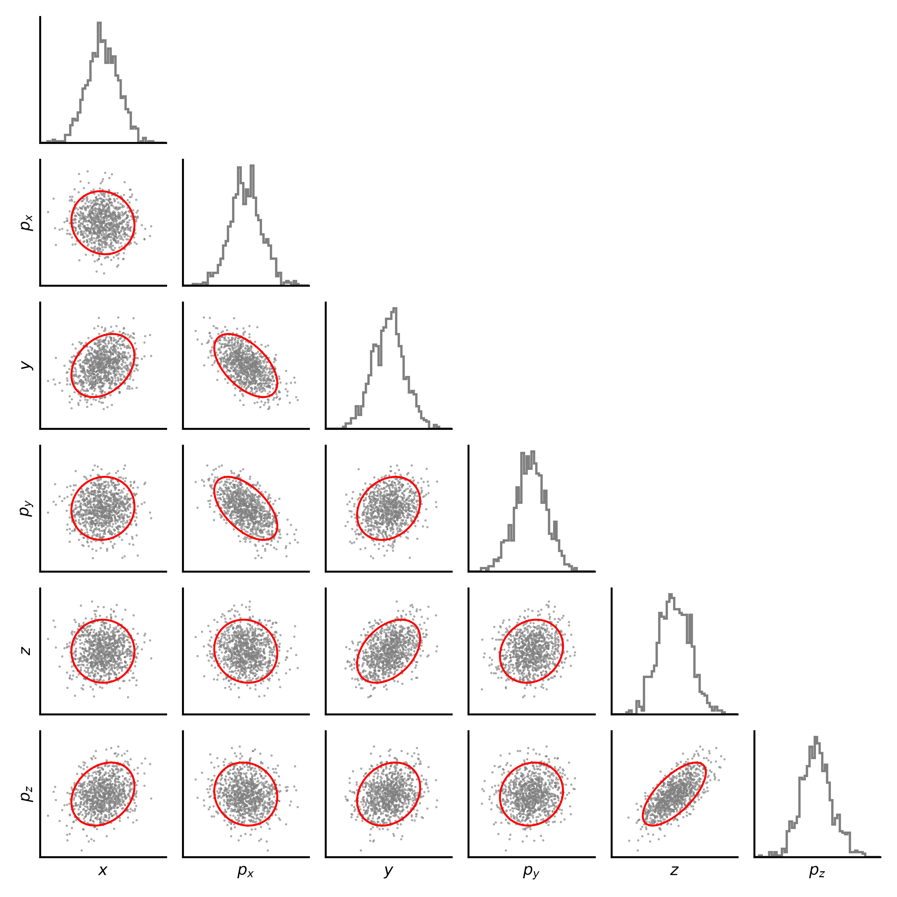
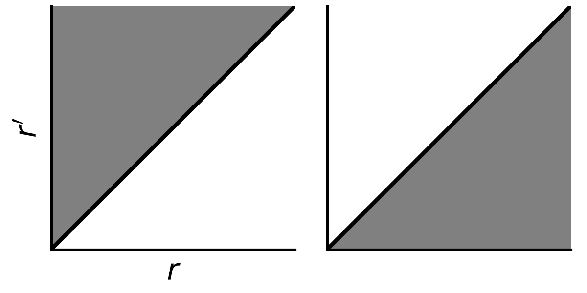

## Envelope equations: reduced-order characterization of beam dynamics (first/second moments) {.unlisted}

{fig-align=center width=300px}

## Road map {.unlisted}

* Start from single particle equation of motion: $\mathbf{F} = q(\mathbf{E} + \mathbf{v} \times \mathbf{B})$.
* Make use of:
    * Paraxial (near-axis) approximation
    * Conservation of angular momentum
    * Axisymmetry of external forces
* Arrive at single-particle paraxial ray equation [@reiser_2008_theory].
* Take statistical averages to obtain moment/envelope equations.

# Paraxial ray equation

## Equation of motion in cylindrical coordinates

Equation of motion for particle of mass $m$ and charge $q$ in electric field $\mathbf{E}$ and magnetic field $\mathbf{B}$:

\begin{equation}
\label{eq-lorentz}
\frac{d\mathbf{p}}{dt} = \frac{d(\gamma m \dot{\mathbf{x}})}{dt} = q \left( \mathbf{E} + \dot{\mathbf{x}} \times \mathbf{B} \right),
\end{equation}

Switch to cylindrical coordinates $(r, \theta, z)$:

\begin{equation}
\begin{aligned}
\label{eq-momentum-cylindrical}
\mathbf{p} 
&= p_x \hat{x} + p_y \hat{y} + p_z \hat{z} \\
&= p_r \hat{r} + p_\theta^* \hat{\theta} + p_z \hat{z}.
\end{aligned}
\end{equation}

The components $p_r$ and $p_\theta^*$ are given by

\begin{equation}
\begin{aligned}
    p_r &=  \gamma m \dot{r}, \\
    p_\theta^* &= \gamma m r \dot{\theta}.
\end{aligned}
\end{equation}

The symbol $p_\theta^*$ is used to reserve $p_\theta$ for the *canonical* angular momentum, defined later.

--- 

In cylindrical coordinates, the unit vectors depend on the particle position and thus change with time:

\begin{equation}
\begin{aligned}
\label{eq-cylindrical-unit-vector-dt}
    \dot{\hat{r}} &\equiv d\hat{r} / dt = \dot{\theta} \hat{\theta} ,\\
    \dot{\hat{\theta}} &\equiv d \hat{\theta} / dt = -\dot{\theta} \hat{r}.
\end{aligned}
\end{equation}

Thus, the time derivative of the momentum vector in Eq. \eqref{eq-momentum-cylindrical} is:

\begin{align}
\label{eq-dpdt}
\frac{d\mathbf{p}}{dt} 
&=  
\frac{d}{dt} \left( p_r \hat{r} + p_\theta^* \hat{\theta} + p_z \hat{z} \right) 
\\
&= 
\dot{p_r} \hat{r} 
+ p_r \dot{\hat{r}}
+ \dot{p}_\theta \hat{\theta} 
+ p_\theta^* \dot{\hat{\theta}}
+ \dot{p}_z \hat{z}
\\
&= 
  \left( \dot{p}_r - p_\theta^* \dot{\theta} \right) \hat{r}
+ \left( \dot{p}_\theta + p_r \dot{\theta} \right) \hat{\theta}
+ \dot{p}_z \hat{z} 
\label{eq-dpdt-theta}
\\
&= 
   \left[ \frac{d(\gamma m \dot{r})}{dt} - \gamma m r \dot{\theta}^2\right] \hat{r}
+ \left[ \frac{d(\gamma m r \dot{\theta})}{dt} + \gamma m \dot{r} \dot{\theta} \right] \hat{\theta}
+ \left[ \frac{d(\gamma m \dot{z})}{dt} \right] \hat{z}.
\\
&= 
   \left[ \frac{d(\gamma m \dot{r})}{dt} - \gamma m r \dot{\theta}^2\right] \hat{r}
+ \left[ \frac{1}{r}\frac{d}{dt}\left(\gamma m r^2 \dot{\theta}\right) \right] \hat{\theta}
+ \left[ \frac{d(\gamma m \dot{z})}{dt} \right] \hat{z}.
\end{align}

This takes care of the left side of the Lorentz force equation (Eq. \eqref{eq-lorentz}).

---

The right side of Eq. \eqref{eq-lorentz} requires the cylindrical field components:

\begin{equation}
\begin{aligned}
    \mathbf{E} &= E_r \hat{r} + E_\theta \hat{\theta} + E_z \hat{z}, \\
    \mathbf{B} &= B_r \hat{r} + B_\theta \hat{\theta} + B_z \hat{z}.
\end{aligned}
\end{equation}

Evaluating the cross product $\dot{\mathbf{x}} \times \mathbf{B}$,

\begin{equation}
\dot{\mathbf{x}} \times \mathbf{B} = 
\begin{vmatrix}
    \hat{r} & \hat{\theta} & \hat{z} \\
    \dot{r} & r \dot{\theta} & \dot{z} \\
    B_r & B_\theta & B_z
\end{vmatrix},
\end{equation}

leads to

\begin{align}
\frac{d(\gamma m \dot{r})}{dt} - \gamma m r \dot{\theta}^2 
&= q \left( E_r + r \dot{\theta} B_z - \dot{z} B_\theta \right) \label{eq-eom-r} , \\
\frac{1}{r} \frac{d(\gamma m r^2 \dot{\theta})}{dt}
&= q \left( E_\theta + \dot{z} B_r - \dot{r} B_z \right) \label{eq-eom-theta} , \\
\frac{d(\gamma m \dot{z})}{dt} 
&= q \left( E_z + \dot{r} B_\theta - r \dot{\theta} B_r \right) \label{eq-eom-z}
\end{align}

## From fields to potentials

Write the fields in terms of the scalar potential $\phi(\mathbf{x})$ and vector potential $\mathbf{A}(\mathbf{x})$:

\begin{equation}
\begin{aligned}
    \mathbf{E} &= -\nabla \phi - \frac{\partial \mathbf{A}}{\partial t}, \\
    \mathbf{B} &= \nabla \times \mathbf{A}.
\end{aligned}
\end{equation}

The gradient $\nabla \phi$ in cylindrical coordinates is:

\begin{equation}
\label{eq-cylindrical-grad}
\nabla \phi 
= \left[ \frac{\partial \phi}{\partial r} \right] \hat{r} 
+ \left[ \frac{1}{r} \frac{\partial \phi}{\partial \theta} \right] \hat{\theta}
+ \left[ \frac{\partial \phi}{\partial z} \right] \hat{z}.
\end{equation}

And the curl $\nabla \times \mathbf{A}$ is:

\begin{equation}
\label{eq-cylindrical-curl}
\nabla \times \mathbf{A}
= 
\left[ 
      \frac{1}{r}\frac{\partial A_z}{\partial \theta} 
    - \frac{\partial A_\theta}{\partial z} 
\right] 
\hat{r}
+ 
\left[  
    \frac{\partial A_r}{\partial z} - \frac{\partial A_z}{\partial r}
\right] 
\hat{\theta}
+ 
\frac{1}{r} 
\left[
    \frac{\partial (r A_\theta)}{\partial r} - \frac{\partial A_r}{\partial \theta}
\right]
\hat{z} .
\end{equation}

---

Axial symmetry means all partial derivatives with respect to $\theta$ are zero in Eq. \eqref{eq-cylindrical-grad} and Eq. \eqref{eq-cylindrical-curl}. This gives the following expressions for the fields in terms of the potentials in cylindrical coordinates:

\begin{equation}
\begin{aligned}
\mathbf{E} &= 
   \left[ -\frac{\partial \phi}{\partial r} - \frac{\partial A_r}{\partial t} \right] \hat{r}
 + \left[ -\frac{\partial A_\theta}{\partial t} \right] \hat{\theta}
 + \left[ -\frac{\partial \phi}{\partial z} - \frac{\partial A_z}{\partial t} \right] \hat{z}
 ,
 \\
 \mathbf{B} &=
   \left[ -\frac{\partial A_\theta}{\partial r} \right] \hat{r}
 + \left[ \frac{\partial A_r}{\partial z} - \frac{\partial A_z}{\partial r}\right] \hat{\theta}
 + \left[ \frac{1}{r} \frac{\partial (r A_\theta)}{\partial r} \right] \hat{z}.
\end{aligned}
\end{equation}

## Conservation of angular momentum

Use the potentials to rewrite the angular equation of motion (Eq. \eqref{eq-eom-theta}):

\begin{equation}
\label{eq-canonical-momentum-derivation}
\begin{aligned}
\frac{d}{dt}\left( \gamma m r^2 \dot{\theta} \right)
&= q r \left( E_\theta + \dot{z} B_r - \dot{r} B_z \right) \\
&= q r 
\left(
    \left[ -\frac{\partial A_\theta}{\partial t} \right] 
    + \dot{z} \left[ -\frac{\partial A_\theta}{\partial z} \right] 
    - \dot{r} \left[ \frac{1}{r} \frac{\partial(r A_\theta)}{\partial r} \right]
\right) \\
&= -q 
\left(
    \frac{\partial(rA_\theta)}{\partial t} 
    + \dot{z} \frac{\partial(rA_\theta)}{\partial z}
    + \dot{r} \frac{\partial(rA_\theta)}{\partial r}
\right) \\
&= -q 
\left[ 
    \frac{\partial}{\partial t} 
    + \dot{z} \frac{\partial}{\partial z} 
    + \dot{r} \frac{\partial}{\partial r} 
\right] \left( r A_\theta \right) \\
&= -q 
\left[ 
    \frac{\partial}{\partial t} + \dot{\mathbf{x}} \cdot \nabla     
\right] \left( r A_\theta \right) \\
&= -\frac{d(qrA_\theta)}{dt}.
\end{aligned}
\end{equation}

---

Eq. \eqref{eq-canonical-momentum-derivation} can then be written as:

\begin{equation}
\label{eq-canonical-momentum-conserved}
\frac{d}{dt} \left( \gamma m r^2 \dot{\theta} + q r A_\theta \right) = 0.
\end{equation}

This motivates the definition of the \textit{canonical angular momentum}:

\begin{equation}
\label{eq-canonical-momentum}
p_\theta \equiv \gamma m r^2 \dot{\theta} + q r A_\theta,
\end{equation}

such that $dp_\theta / dt = 0$. We may also write $p_\theta$ in terms of the magnetic flux $\psi(r)$ though a circle of radius $r$ \textit{[Figure]}:

\begin{equation}
\psi(r) = \int \mathbf{B} \cdot d\boldsymbol{\Omega} = \int \nabla \times \mathbf{A} \cdot d\boldsymbol{\Omega} = \oint \mathbf{A} \cdot d\mathbf{l} = 2 \pi r A_\theta.  
\end{equation}

Therefore, Eq. \eqref{eq-canonical-momentum} can be written

\begin{equation}
p_\theta \equiv \gamma m r^2 \dot{\theta} + \frac{q \psi(r)}{2 \pi}.
\end{equation}

## Series expansion of axially symmetric fields

Consider external fields $\mathbf{E}$ and $\mathbf{B}$ with azimuthal symmetry ($\partial / \partial \theta = 0$). In the absence of charge and current densities, 

\begin{equation}
\begin{aligned}
    \nabla \cdot \mathbf{E} &= 0 , \\
    \nabla \cdot \mathbf{B} &= 0 , \\
    \nabla \times \mathbf{E} &= 0 , \\
    \nabla \times \mathbf{B} &= 0 . \\
\end{aligned}
\end{equation}

The vanishing curl means we can express the fields as

\begin{equation}
\begin{aligned}
\mathbf{E} &= -\nabla \phi, \\
\mathbf{B} &= -\nabla \phi_m,
\end{aligned}
\end{equation}

for scalar potentials $\phi$ and $\phi_m$. Additionally, the vanishing divergence leads to the Laplace equation for the scalar potential:

\begin{equation}
\nabla^2 \phi = 0.
\end{equation}

---

In cylindrical coordinates, the Laplace equation for the potential is:

\begin{equation}
\frac{1}{r} \frac{\partial}{\partial r} \left( r \frac{\partial \phi}{\partial r} \right) + \frac{\partial^2 \phi}{\partial z^2} = 0.
\end{equation}

The azimuthal symmetry will lead to a simplified form of the scalar potential in terms of its on-axis derivatives along the $z$ axis. First, expand the potential $\phi(r, z)$ as a power series,

\begin{equation}
\phi(r, z) = \sum_{n = 0}^{\infty} h_{2n}(z) r^{2n},
\end{equation}

where the $h_{2n}(z)$ are functions of $z$. The on-axis potential is given by $h_0(z) = \phi(0, z)$.

---

The rotational symmetry eliminates all odd powers of $r$ in the series. 

At the origin ($r = 0$), we must have $E_r = B_r = 0$. If we allowed the $n = 1$ term $h_1(z) r$, we would have $E_r(0, z) = -\partial \phi(r, z) / \partial{r} \vert_{r=0} = h_1(z) \ne 0$. 

---

The derivatives in the Laplace equation are:

\begin{equation}
\begin{aligned}
\frac{1}{r} \frac{\partial}{\partial r} \left( r \frac{\partial \phi}{\partial r} \right)
&= \sum_{n = 1}^{\infty} (2n)^2 h_{2n}(z) r^{2n - 2}, 
\\
\frac{\partial^2 \phi}{\partial z^2} &= \sum_{n=0}^{\infty} h_{2n}''(z) r^{2n},
\end{aligned}
\end{equation}

where $h'(z) = \partial h(z) / \partial z.$ 

---

Thus, $\nabla^2 \phi = 0$ becomes:

\begin{equation}
\begin{aligned}
  \sum_{n = 1}^{\infty} (2n)^2 h_{2n}(z) r^{2n - 2}
+ \sum_{n=0}^{\infty} h_{2n}''(z) r^{2n}
&= 0
\\
  \sum_{n = 0}^{\infty} (2n + 2)^2 h_{2n + 2}(z) r^{2n}
+ \sum_{n=0}^{\infty} h_{2n}''(z) r^{2n}
&= 0
\\
  \sum_{n = 0}^{\infty} \left[ (2n + 2)^2 h_{2n + 2}(z)
+ h_{2n}''(z) \right]
&= 0
\end{aligned}
\end{equation}

The result is a recurrence relation,

\begin{equation}
h_{2n + 2}(z) = - \frac{h_{2n}''(z)}{(2n + 2)^2},
\end{equation}

with which we can write all terms as derivatives of $h_0(z)$ with respect to $z$:

\begin{equation}
\begin{aligned}
h_2(z)  &= -\frac{1}{4}\frac{\partial^2 h_0(z)}{\partial z^2},
\\
h_4(z)  &= +\frac{1}{64}\frac{\partial^4 h_0(z)}{\partial z^4},
\\
\vdots
\end{aligned}
\end{equation}

---

We may thus write the potential at all points in space using only the $z$-derivatives of the on-axis potential $\phi(0, z)$:

\begin{equation}
\label{eq-axially-symmetric-field-series}
\phi(r, z) = \sum_{n = 0}^{\infty}
\frac{(-1)^n}{(n!)^2}
\frac{\partial^{2n} \phi(0, z) }{\partial z^{2n}} 
\left( \frac{r}{2} \right)^{2n} .
\end{equation}

---

We now express the fields in terms of the expanded scalar potentials. Write the magnetic field as $\mathbf{B} = B_r \hat{r} + B_z \hat{z}$. Using the series expansion of $\phi_m(r, z)$, we find for the $z$ component of the field:

\begin{equation}
\label{eq-bz-expansion}
\begin{aligned}
B_z(r, z) 
&= -\frac{\partial \phi_m}{\partial z} \\
&= -\frac{\partial}{\partial z} \left[ \sum_{n=0}^{\infty} \frac{(-1)^{2n}}{(n!)^2} \frac{\partial^{2n} \phi_m(0, z)}{\partial z^{2n}} \left(\frac{r}{2}\right)^2 \right]
\\
&= -\sum_{n=0}^{\infty} \frac{(-1)^{2n}}{(n!)^2} \frac{\partial^{2n + 1} \phi_m(0, z)}{\partial z^{2n + 1}} \left(\frac{r}{2}\right)^2
.
\end{aligned}
\end{equation}

Define $B(z)$ as the on-axis value of $B_z(z)$:

\begin{equation}
\label{eq-def-bz}
B(z) \equiv B_z(0, z) = -\frac{\partial \phi_m(0, z)}{\partial z} .
\end{equation}

---

Inserting Eq. \eqref{eq-def-bz} into Eq. \eqref{eq-bz-expansion} gives:

\begin{equation}
\begin{aligned}
B_z(r, z) 
&= \sum_{n=0}^{\infty} \frac{(-1)^{2n}}{(n!)^2} \frac{\partial^{2n}}{\partial z^{2n}} \left[ -\frac{\partial \phi_m(0, z)}{\partial z} \right] \left(\frac{r}{2}\right)^2 
\\
B_z(r, z) 
&= \sum_{n=0}^{\infty} \frac{(-1)^{2n}}{(n!)^2} \frac{\partial^{2n} B(z)}{\partial z^{2n}} \left(\frac{r}{2}\right)^2 
.
\end{aligned}
\end{equation}

For the radial component, we find:

\begin{equation}
B_r(r, z) = 
\sum_{n=1}^{\infty} \frac{(-1)^{n}}{n! (n - 1)!} \frac{\partial^{2n - 1} B(z)}{\partial z^{2n - 1}} \left(\frac{r}{2}\right)^{2n - 1}
.
\end{equation}

---

A similar procedure gives the radial and longitudinal components of the electric field. Define $V(z)$ as the on-axis value of the electric potential $\phi$:

\begin{equation}
V(z) \equiv \phi(0, z).
\end{equation}

This gives:

\begin{equation}
\begin{aligned}
E_z(r, z) 
&= -\frac{\partial \phi}{\partial z} 
= -\sum_{n=0}^{\infty} \frac{(-1)^{n}}{(n!)^2} \frac{\partial^{2n + 1} V(z)}{\partial z^{2n + 1}} \left(\frac{r}{2}\right)^{2n}
.
\\
E_r(r, z) 
&= -\frac{\partial \phi}{\partial r}
= -\sum_{n=1}^{\infty} \frac{(-1)^{n}}{n! (n - 1)!} \frac{\partial^{2n} V(z)}{\partial z^{2n}} \left(\frac{r}{2}\right)^{2n - 1}
.
\end{aligned}
\end{equation}

## Derivation of paraxial ray equation

We will now take the \textit{paraxial} limit, assuming small transverse position and velocity: $\dot{r} \ll \dot{z}$, $r\dot{\theta} \ll \dot{z}$. If $v = (\dot{r}^2 + r^2\dot{\theta}^2) + \dot{z}^2)^{1/2}$ is the total velocity, the paraxial limit gives $\dot{z} = (v^2 - \dot{r}^2 - r^2\dot{\theta}^2)^{1/2} \approx v$.

To first order in $r$ and ${r'}$, the external fields are:

\begin{equation}
\begin{aligned}
E_r^{(ext)} &\approx \frac{1}{2} \frac{\partial^2 V(z)}{\partial z^2} r , \\
B_z^{(ext)} &\approx B(z) , \\
B_\theta^{(ext)} &= 0 \quad (\text{since } \partial \phi_m / \partial \theta = 0) .
\end{aligned}
\end{equation}

Plug these truncated fields into the radial equation of motion (Eq. \eqref{eq-eom-r}):

\begin{equation}
\begin{aligned}
\frac{d(\gamma m \dot{r})}{dt} - \gamma m r \dot{\theta}^2 
&= q \left( E_r + r \dot{\theta} B_z - \dot{z} B_\theta \right) ,
\\
&\approx 
q \left( \frac{1}{2} \frac{\partial^2 V(z)}{\partial z^2} r + r \dot{\theta} B(z) \right)
\end{aligned}
\end{equation}

---

Use $s$ as the independent variable: $ds = \beta c dt$. Using $' \equiv d/dz$ and dropping the $\approx$ symbol gives:

\begin{equation}
\beta c \frac{d\left( \gamma m \beta c r' \right)}{dz} - \gamma m r (\beta c \theta')^2 =
q \left( \frac{1}{2} V''(z) r + r \beta c \theta' B(z) \right) .
\end{equation}

Expand the derivative in the first term and divide by $\gamma \beta^2 m c^2$:

\begin{equation}
\label{eq-rpp}
r'' + \frac{(\gamma \beta)'}{(\gamma \beta)} r' - r \theta'^2
= 
\frac{q}{\gamma \beta^2 m c^2}
\left( \frac{1}{2} V''(z) + \beta c \theta' B(z) \right) r .
\end{equation}

---

Now use the definition of the canonical angular momentum $p_\theta$ (Eq. \eqref{eq-canonical-momentum}) to eliminate $\theta'$, noting that the flux $\psi(r) = \pi r^2 B$:

\begin{equation}
\label{eq-theta-prime}
\begin{aligned}
    \theta' 
    &= \frac{\dot{\theta}}{\beta c} 
    \\
    &= \frac{1}{\beta c} \frac{1}{\gamma m r^2} \left( p_\theta - \frac{q \psi(r)}{2 \pi} \right),
    \\
    &= \frac{p_\theta}{\gamma m \beta c r^2} - \frac{\omega_c}{2 \gamma \beta c}.
\end{aligned}
\end{equation}

We have defined the \textit{cyclotron frequency} $\omega_c \equiv \frac{qB}{m}$.

Substitute Eq. \eqref{eq-theta-prime} into Eq. \eqref{eq-rpp}:

\begin{equation}
    r'' + \frac{(\gamma\beta)'}{\gamma\beta} r
    + \left( \frac{\omega_c}{2 \gamma \beta c} \right)^2 r
    - \left(\frac{p_\theta}{\gamma m \beta c} \right)^2 \frac{1}{r^3}
    =
    \frac{q}{\gamma m \beta^2 c^2} \frac{1}{2} V''(z) r
\end{equation}

---

The rate of change in the particle energy is given by

\begin{align}
\frac{d (\gamma m c^2)}{dt} &= q \mathbf{E} \cdot \mathbf{v} .
\end{align}

Rearrange and switch from $t$ to $z$. In the paraxial limit:

\begin{align}
\gamma' 
&= \frac{q}{mc^2} \frac{\mathbf{E} \cdot \mathbf{v}}{v_z} \\
&= \frac{q}{mc^2} \frac{E_x v_x + E_y v_y + E_z v_z}{v_z} \\
&\approx \frac{q}{mc^2} E_z .
\end{align}

Giving the approximate relationship:

\begin{align}
\gamma'' \approx \frac{q}{mc^2} E_z' = -\frac{q}{mc^2} V'' .
\end{align}

---

This approximation of $\lambda''$ leads to the \textit{paraxial ray equation}:

\begin{equation}
\label{eq-paraxial}
\begin{aligned}
\boxed{
r''
+ {\frac{(\gamma\beta)'}{(\gamma\beta)} r'}
+ \left( \frac{\gamma''}{2 \gamma \beta^2} \right) r
+ \left( \frac{\omega_c}{2\gamma \beta c} \right)^2 r
- \left( \frac{p_\theta}{\gamma m \beta c} \right)^2 \frac{1}{r^3}
= 0 .
}
\end{aligned}
\end{equation}

Terms in order: (i) inertial term; (ii) accelerative damping; (iii) $E_r$ from converging field lines; (iv) solenoidal focusing ($v_\theta B_z$, part of centrifugal term); (v) centrifugal defocusing.

## Addition of self-generated fields

We can also account for linearized self-fields $\mathbf{E}^{(self)}$ and $\mathbf{B}^{(self)}$. Adding these self-generated fields to the radial equation of motion gives:

\begin{equation}
r'' + \frac{(\gamma\beta)'}{(\gamma\beta)} - r\theta'^2 
= 
\frac{q}{m c^2 \gamma \beta^2} 
\left( 
  \frac{1}{2} V''(z) r + \beta c \theta' B(z) r 
  + E_r^{(self)} - \beta c B_{\theta}^{(self)} 
\right) .
\end{equation}

So we only need the $r$ component of the self-generated electric field and the $\theta$ component of the self-generated magnetic field. We will ignore the $B_z^{(self)}$ term in the paraxial limit.

Recall that $V(z) \equiv \phi(0, z)$ is the external potential $\phi$ on-axis, and to linear order $E_r(r, z) \approx V''(z) r / 2$. Similarly, $B(z) \equiv B_z(0, z)$ is the external magnetic field on-axis, and to linear order $B_z(r, z) \approx B(z)$.

---

Assuming cylindrical symmetry of the beam, the Poisson equation for the self-generated electric potential is:

\begin{equation} \label{eq-poisson-self-field}
\begin{aligned}
    \frac{1}{r} \frac{\partial}{\partial r} \left( r \frac{\partial \phi^{(self)}}{\partial r} \right) 
    + \frac{\partial^2 \phi^{(self)}}{\partial s^2} 
    = -\frac{\rho(r)}{\epsilon_0}.
\end{aligned}
\end{equation}

Solving for $\partial \phi^{(self)} / \partial r$ relates the radial electric field to $z$-derivative of the potential:

\begin{equation}
\begin{aligned}
    E_r^{(self)}
    = -\frac{\partial \phi^{(self)}}{\partial r} 
    = \frac{\lambda(r)}{2 \pi \epsilon_0 r} + \frac{1}{2} \frac{\partial^2 \phi^{(self)}}{\partial z^2} r,
\end{aligned}
\end{equation}

where $\lambda$ is the line-charge density,

\begin{equation}
\lambda(r) \equiv \int_{0}^{r} 2 \pi \rho(\tilde{r}) \tilde{r} d\tilde{r}.
\end{equation}

Above, it is assumed that $\partial^2 \phi^{(self)} / \partial z^2$ has no dependence on $r$ (keep lowest-order term).

---

For the $\theta$ component of the self-generated magnetic field, use Ampere's law:

\begin{align}
\oint \mathbf{B}^{(self)} \cdot d\mathbf{l} &= \mu_0 I_{enc} \\
2 \pi r B_\theta^{(self)} 
&= \mu_0 \int_{0}^{r} 2 \pi \tilde{r} J_z(\tilde{r}) d\tilde{r} = \mu_0 \lambda(r) v_z \\
B_\theta^{(self)} &= \frac{\mu_0 \beta c \lambda(r)}{2 \pi r} = \frac{\beta}{c} \frac{\lambda(r)}{2 \pi \epsilon_0 r}.
\end{align}

---

We can now evaluate $E_r^{(self)} - \beta c B_\theta^{(self)}$:

\begin{equation}
\begin{aligned}
E_r^{(self)} - \beta c B_\theta^{(self)}
&= \frac{1}{\gamma^2} \frac{\lambda(r)}{2 \pi \epsilon_0 r} + \frac{1}{2} \frac{\partial^2 \phi^{(self)}}{\partial z^2} r,
\end{aligned}
\end{equation}

We can also repeat the approximation of $\gamma''$ with the inclusion of the self-generated electric field.

\begin{equation}
\begin{aligned}
\gamma'' &\approx -\frac{q}{mc^2} \frac{\partial^2}{\partial z^2} \left( V + \phi^{(self)} \right) .
\end{aligned}
\end{equation}

The result is a driving term on the right side of the paraxial ray equation:

\begin{equation}
\label{eq-paraxial-sc}
\begin{aligned}
\boxed{
r''
+ {\frac{(\gamma\beta)'}{(\gamma\beta)} r'}
+ \left( \frac{\gamma''}{2 \gamma \beta^2} \right) r
+ \left( \frac{\omega_c}{2\gamma \beta c} \right)^2 r
- \left( \frac{p_\theta}{\gamma m \beta c} \right)^2 \frac{1}{r^3}
= \frac{q}{m c^2 \beta^2 \gamma^3} \frac{\lambda(r)}{2 \pi \epsilon_0 r}
}
\end{aligned}
\end{equation}

# Envelope equations for axially symmetric beams

## Time-evolution of expected values

Let $g(\mathbf{x}, \mathbf{x}')$ be any function of the phase space coordinates. Use brackets to indicate the expected value of $g$ under probability distribution $f$:

\begin{equation}
\langle g \rangle \equiv \iint g(\mathbf{x}, \mathbf{x}') f(\mathbf{x}, \mathbf{x'}, s) d\mathbf{x} d\mathbf{x}'.
\end{equation}

How does $\langle g \rangle$ evolve in time ($s$)?

\begin{equation}
\frac{d \langle g \rangle}{ds} = \frac{d}{ds} \iint g(\mathbf{x}, \mathbf{x}') f(\mathbf{x}, \mathbf{x'}, s) d\mathbf{x} d\mathbf{x}'
\end{equation}

---

\begin{equation}
\begin{aligned}
\frac{d \langle g \rangle}{ds} 
&= \frac{d}{ds} \iint g(\mathbf{x}, \mathbf{x}') f(\mathbf{x}, \mathbf{x'}, s) d\mathbf{x} d\mathbf{x}' \\
&= \iint g(\mathbf{x}, \mathbf{x}') \frac{\partial f(\mathbf{x}, \mathbf{x}', s)}{\partial s} d\mathbf{x} d\mathbf{x}' \quad \textit{(Leibniz Rule)} \\
&= \iint g(\mathbf{x}, \mathbf{x}') 
\left[
  -\mathbf{x}' \cdot \frac{\partial f}{\partial \mathbf{x}} 
  -\mathbf{x}'' \cdot \frac{\partial f}{\partial \mathbf{x}'} 
\right] 
d\mathbf{x} d\mathbf{x}' \quad \textit{(Vlasov equation)} .
\end{aligned}
\end{equation}

---

Since $f$ vanishes at the integration boundary ($\infty$), we can use integration by parts to flip the gradients from $f$ to $g$: 

\begin{equation}
\begin{aligned}
    \iint \left[ \mathbf{x}' \cdot \frac{\partial f}{\partial \mathbf{x}} g \right] d\mathbf{x}d\mathbf{x}'
    &= -\iint \left[ \mathbf{x}' \cdot \frac{\partial g}{\partial \mathbf{x}} f \right] d\mathbf{x}d\mathbf{x}'
    \\
    &= -\langle \mathbf{x}' \cdot {\partial g}/{\partial \mathbf{x}} \rangle.
\end{aligned}
\end{equation}

\begin{equation}
\begin{aligned}
    \iint \left[ \mathbf{x}'' \cdot \frac{\partial f}{\partial \mathbf{x}'} g \right] d\mathbf{x}d\mathbf{x}'
    &= -\iint \left[ \mathbf{x}'' \cdot \frac{\partial g}{\partial \mathbf{x}'} f \right] d\mathbf{x}d\mathbf{x}'
    \\
    &= -\langle \mathbf{x}'' \cdot {\partial g}/{\partial \mathbf{x}'} \rangle.
\end{aligned}
\end{equation}

---

Integration by parts (one-dimensional):

\begin{equation}
\int_{a}^{b} f(x) g'(x) dx = \left[ f(x) g(x) \right]_{a}^{b} - \int_{a}^{b} f'(x) g(x) dx .
\end{equation}

---

\begin{equation}
\begin{aligned}
. 
&= \iint g(\mathbf{x}, \mathbf{x}') \mathbf{x}' \cdot \frac{\partial f(\mathbf{x}, \mathbf{x}', s)}{\partial \mathbf{x}} d\mathbf{x} d\mathbf{x}' \\
&= 
\iiiint g(x, x', y, y') 
\left[ 
  x' \frac{\partial}{\partial x} + y' \frac{\partial}{\partial y} 
\right] 
f(x, x', y, y', s) dx dx' dy dy' 
\\
&= 
  \iiint x' \left[ \int g \frac{\partial f}{\partial x} dx \right] dx' dy dy' 
+ \iiint y' \left[ \int g \frac{\partial f}{\partial y} dy \right] dx dx' dy'
\\
&= - \iiiint f \left[ x' \frac{\partial g}{\partial x} + y' \frac{\partial g}{\partial y} \right] dx dx' dy dy' \\
&= - \iint f(\mathbf{x}, \mathbf{x}', s) \left[ \mathbf{x}' \cdot \frac{\partial g(\mathbf{x}, \mathbf{x}')}{\partial \mathbf{x}} \right] d\mathbf{x} d\mathbf{x}' \\
&= - \left\langle \mathbf{x}'  \cdot \frac{\partial g}{\partial \mathbf{x}} \right\rangle .
\end{aligned}
\end{equation}

---

We can then write $d \langle g \rangle / ds$ as:

\begin{equation}
\frac{d \langle g \rangle}{d s}
= \left\langle \mathbf{x}'  \cdot \frac{\partial g}{\partial \mathbf{x} } \right\rangle
+ \left\langle \mathbf{x}'' \cdot \frac{\partial g}{\partial \mathbf{x}'} \right\rangle .
\end{equation}

From the definition of the total derivative:

\begin{equation}
\frac{dg}{ds}
= \mathbf{x}'  \cdot \frac{\partial g}{\partial \mathbf{x}}
+ \mathbf{x}'' \cdot \frac{\partial g}{\partial \mathbf{x}'}.
\end{equation}

Therefore, the time-derivative of the expected value is the same as the expected value of the time-derivative:

\begin{equation}
\frac{d \langle g \rangle} {ds} = \left\langle \frac{dg}{ds} \right\rangle.
\end{equation}

---

To evaluate $d\langle{g}\rangle/ds$, we can evaluate $dg/ds$ and then perform the averaging. For example:

\begin{align}
\frac{d}{ds} \langle x x  \rangle &= 2 \langle xx' \rangle \\
\frac{d}{ds} \langle x'x' \rangle &= 2 \langle x'x'' \rangle \\
\frac{d}{ds} \langle x x' \rangle &= \langle xx'' \rangle + \langle x'x' \rangle \\
\vdots
\end{align}

## Evolution of second moments

Define the root-mean-square (rms) radius $\tilde{r} \equiv \sqrt{\langle r^2 \rangle}$.

Evaluate $\tilde{r}'$:

\begin{equation}
\begin{aligned}
\frac{d}{ds} \tilde{r}^2 &= \frac{d}{ds} \langle r^2 \rangle \\
\tilde{r}' &= \frac{\langle rr' \rangle}{\tilde{r}} .
\end{aligned}
\end{equation}

Evaluate $\tilde{r}''$:

\begin{equation}
\begin{aligned}
\tilde{r}'' &= \frac{\langle{rr''}\rangle + \langle{r'r'}\rangle}{\tilde{r}} - \frac{ \langle{rr'}\rangle \tilde{r}'}{\tilde{r}^2} \\
\tilde{r}'' &= \frac{\langle rr'' \rangle}{\tilde{r}} + \frac{\langle{rr}\rangle \langle{r'r'}\rangle - \langle{rr'}\rangle \langle{rr'}\rangle}{\tilde{r}^3} .
\end{aligned}
\end{equation}

What is $\langle r r'' \rangle$ ?

## Evaluation of $\langle r r'' \rangle$

Return to the paraxial ray equation for the radius $r$ (including linear self-fields):

\begin{equation}
\begin{aligned}
r''
+ {\frac{(\gamma\beta)'}{(\gamma\beta)} r'}
+ \left( \frac{\gamma''}{2 \gamma \beta^2} \right) r
+ \left( \frac{\omega_c}{2\gamma \beta c} \right)^2 r
- \left( \frac{p_\theta}{\gamma m \beta c} \right)^2 \frac{1}{r^3}
- \frac{q}{m c^2 \beta^2 \gamma^3} \frac{\lambda(r)}{2 \pi \epsilon_0 r} 
= 0 .
\end{aligned}
\end{equation}

Rewrite as:

\begin{equation}
\begin{aligned}
r''
+ {\frac{(\gamma\beta)'}{(\gamma\beta)} r'}
+ \left( \frac{\gamma''}{2 \gamma \beta^2} \right) r
- \frac{\omega_c \theta' r}{\gamma \beta c}
- \theta'^2 r
- \frac{q}{m c^2 \beta^2 \gamma^3} \frac{\lambda(r)}{2 \pi \epsilon_0 r} 
= 0.
\end{aligned}
\end{equation}

Multiply by $r$ and take averages:

\begin{multline}
\langle{rr''}\rangle
+ \frac{(\gamma\beta)'}{(\gamma\beta)} \langle{rr'}\rangle
+ \left( \frac{\gamma''}{2 \gamma \beta^2} \right) \langle{r^2}\rangle
- \frac{\omega_c}{\gamma \beta c} \langle{\theta' r^2}\rangle 
- \langle{\theta'^2 r^2}\rangle
- \frac{q}{m c^2 \beta^2 \gamma^3} \frac{\langle{\lambda(r)}\rangle}{2 \pi \epsilon_0} 
= 0 .
\end{multline}

---

\begin{align}
p_\theta &\equiv \gamma m \beta c r^2 \theta' + \frac{m \omega_c r^2}{2} 
\\
\langle p_\theta \rangle &= \gamma m \beta c \langle{r^2 \theta'}\rangle + \frac{m \omega_c \langle{r^2}\rangle}{2}
\\
\vdots 
\\
\frac{\omega_c}{\gamma \beta c} \langle{r^2 \theta'}\rangle &= 
  \left( \frac{1}{\gamma\beta m c} \right)^2 \frac{\langle{p_\theta}\rangle^2}{\tilde{r}^2} 
- \frac{\langle{r^2 \theta'}\rangle^2}{\tilde{r}^2} 
- \left(\frac{\omega_c}{2 \gamma \beta c}\right)^2 \tilde{r}^2
\end{align}

\begin{equation}
\boxed{
\tilde{r}'' 
+ \frac{(\gamma \beta)'}{(\gamma\beta)} \tilde{r}'
+ \left( \frac{\gamma''}{2 \gamma \beta^2} \right) \tilde{r}
+ \left( \frac{\omega_c}{2 \gamma \beta c} \right)^2 \tilde{r}
- \left( \frac{\langle p_\theta \rangle}{\gamma m \beta c} \right)^2 \frac{1}{\tilde{r}^3}
- \frac{\varepsilon_r^2}{\tilde{r}^3}
- \frac{Q}{2 \tilde{r}}
= 0 
}
\end{equation}

\begin{equation}
Q \equiv \frac{1}{m c^2 \beta^2\gamma^3} \frac{q \lambda}{2\pi\epsilon_0}
\end{equation}

\begin{equation}
\varepsilon_r \equiv \sqrt{\langle{r^2}\rangle \langle{r'^2}\rangle - \langle{rr'}\rangle^2 + \langle{r^2}\rangle \langle{r^2 \theta'^2}\rangle - \langle{r^2 \theta'}\rangle^2}
\end{equation}

## Note on line density notation

$\lambda(r)$ is the line density within radius $r$:

\begin{equation}
\lambda(r) = \int_{0}^{r} 2 \pi r' \rho(r') dr' 
\end{equation}

Throughout the course, we use $\lambda \equiv \lambda(r = \infty)$. Here is the relationship between $\lambda$ and $\langle \lambda(r) \rangle$:

\begin{align}
\langle \lambda(r) \rangle 
&= \frac{1}{\lambda} \int_{0}^{\infty} 2 \pi r \rho(r) \left[ \int_{0}^{r} 2 \pi r' \rho(r') \right] dr \\
&= \frac{1}{2\lambda} \int_{0}^{\infty} 2 \pi r \rho(r) \left[ \int_{0}^{\infty} 2 \pi r' \rho(r') \right] dr \\
&= \frac{\lambda}{2}
\end{align}

# Cartesian equations of motion

---

Equations of motion ($\mathbf{x} = [x, y]$):

\begin{align}
\frac{d(\gamma m \dot{{x}})}{dt} &= q \left( {E}_x + \dot{y} B_z - \dot{z} B_y \right) \\
\frac{d(\gamma m \dot{{y}})}{dt} &= q \left( {E}_y + \dot{z} B_x - \dot{x} B_z \right)
\end{align}

---

Use $z$ as independent variable: $dz = \beta c dt$:

\begin{align}
{x}'' + \frac{(\gamma\beta)'}{(\gamma\beta)} {x}' 
&= \frac{q}{\gamma m \beta^2 c^2} \left[ {E}_x + \beta c \left( y' B_z - B_y \right) \right] 
\\
{y}'' + \frac{(\gamma\beta)'}{(\gamma\beta)} {y}' 
&= \frac{q}{\gamma m \beta^2 c^2} \left[ {E}_y + \beta c \left( B_x - x' B_z \right) \right]
\end{align}

---

Add electrostatic potential $\phi$ in beam rest frame:

\begin{align}
{x}'' + \frac{(\gamma\beta)'}{(\gamma\beta)} {x}' 
&= \frac{q}{\gamma m \beta^2 c^2} \left[ {E}_x + \beta c \left( y' B_z - B_y \right) - \frac{1}{\gamma^2} \frac{\partial \phi}{\partial {x}} \right] 
\\
{y}'' + \frac{(\gamma\beta)'}{(\gamma\beta)} {y}' 
&= \frac{q}{\gamma m \beta^2 c^2} \left[ {E}_y + \beta c \left( B_x - x' B_z \right) - \frac{1}{\gamma^2} \frac{\partial \phi}{\partial {y}} \right]
\end{align}

---

Assume no external electric field ($E_x = E_y = 0$) and approximate magnetic field as $B_y = G x$, $B_x = -G y$, $B_z = 0$. (See Lund lectures for more detail.)

\begin{align}
{x}'' + \frac{(\gamma\beta)'}{(\gamma\beta)} {x}' 
&= +\frac{q G}{\gamma m \beta c} x - \frac{1}{m c^2 \beta^2 \gamma^3} \frac{\partial \phi}{\partial {x}}
\\
{y}'' + \frac{(\gamma\beta)'}{(\gamma\beta)} {y}' 
&= -\frac{q G}{\gamma m \beta c} y - \frac{1}{m c^2 \beta^2 \gamma^3} \frac{\partial \phi}{\partial {y}}
\end{align}

---

Define rigidity $[B\rho] = p/q = \gamma \beta m c / q$ and linear focusing strengths $\kappa_{x, y} = \pm G / [B\rho]$.

\begin{align}
x'' 
+ \frac{(\gamma\beta)'}{(\gamma\beta)} {x}' 
+\kappa_x(s) x - \frac{q}{m c^2 \beta^2 \gamma^3} \frac{\partial \phi}{\partial {x}}
&= 0
\\
y'' 
+ \frac{(\gamma\beta)'}{(\gamma\beta)} {y}' 
+\kappa_y(s) y - \frac{q}{m c^2 \beta^2 \gamma^3} \frac{\partial \phi}{\partial {y}}
&= 0
\end{align}

# Envelope equations for elliptically symmetric beams

---

\begin{align}
\tilde{x} &= \sqrt{\langle{xx}\rangle} \\
\tilde{x}' &= \frac{\langle{xx'}\rangle}{\tilde{x}} \\
\tilde{x}'' &= \frac{\langle{xx''}\rangle}{\tilde{x}} + \frac{\langle{xx}\rangle\langle{x'x'}\rangle - \langle{xx'}\rangle\langle{xx'}\rangle}{\tilde{x}^3} \\
\tilde{x}'' &= \frac{\langle{xx''}\rangle}{\tilde{x}} + \frac{\varepsilon_x^2}{\tilde{x}^3}
\end{align}

---

Calculate $\langle{xx''}\rangle$ from equation of motion:

\begin{align}
x'' 
+ \frac{(\gamma\beta)'}{(\gamma\beta)} x'
+\kappa_x(s) x 
+ \frac{q}{m c^2 \beta^2 \gamma^3} \frac{\partial \phi}{\partial x}
&= 0
\\
xx'' 
+ \frac{(\gamma\beta)'}{(\gamma\beta)} xx'
+\kappa_x(s) x^2 
+ \frac{q}{m c^2 \beta^2 \gamma^3} x \frac{\partial \phi}{\partial x}
&= 0
\\
\langle{xx''}\rangle + \frac{(\gamma\beta)'}{(\gamma\beta)} \langle{xx'}\rangle
+\kappa_x(s) \langle{x^2}\rangle 
+ \frac{q}{m c^2 \beta^2 \gamma^3} \left\langle{ x \frac{\partial \phi}{\partial x} } \right\rangle
&= 0
\end{align}

\begin{equation}
\boxed{
\langle{xx''}\rangle 
=
-\frac{(\gamma\beta)'}{(\gamma\beta)} \langle{xx'}\rangle
-\kappa_x(s) \langle{x^2}\rangle 
-\frac{q}{m c^2 \beta^2 \gamma^3} \left\langle{ x \frac{\partial \phi}{\partial x} } \right\rangle
}
\end{equation}

---

\begin{align}
\tilde{x}'' 
+ \frac{(\gamma\beta)'}{(\gamma\beta)} \tilde{x}' 
+ \kappa_x(s) \tilde{x}
- \frac{\varepsilon_x^2}{\tilde{x}^3} 
+\frac{q}{mc^2 \beta^2 \gamma^3} \left\langle x \frac{\partial \phi}{\partial x} \right\rangle \frac{1}{\tilde{x}}
&= 0
\\
\tilde{y}'' 
+ \frac{(\gamma\beta)'}{(\gamma\beta)} \tilde{y}' 
+ \kappa_y(s) \tilde{y}
- \frac{\varepsilon_y^2}{\tilde{y}^3} 
+ \frac{q}{mc^2 \beta^2 \gamma^3} \left\langle y \frac{\partial \phi}{\partial y} \right\rangle \frac{1}{\tilde{y}}
&= 0
\end{align}

What is $\left\langle x \frac{\partial \phi}{\partial x} \right\rangle$?

## Linear space charge term in ellipsoidally symmetric charge distribution

Poisson equation:

\begin{equation}
\left( \frac{\partial^2}{\partial x^2} + \frac{\partial^2}{\partial x^2} \right) \phi(x, y) = -\frac{\rho(x, y)}{\epsilon_0} .
\end{equation}

Assume elliptical symmetry: $\rho(x, y) = \rho\left( (x/\tilde{x})^2 + (y/\tilde{y})^2 \right)$. It can then be shown that:

\begin{align}
\left\langle x \frac{\partial \phi}{\partial x} \right\rangle &= -\frac{\lambda}{4 \pi \epsilon_0} \frac{\tilde{x}}{\tilde{x} + \tilde{y}} , \\
\left\langle y \frac{\partial \phi}{\partial y} \right\rangle &= -\frac{\lambda}{4 \pi \epsilon_0} \frac{\tilde{y}}{\tilde{x} + \tilde{y}} .
\end{align}

---

Introduce variable $\chi$:

\begin{align}
\chi &= \frac{x^2}{r_x^2 + t} + \frac{y^2}{r_y^2 + t} \\
\rho(x, y) &= \rho\left( \frac{x^2}{r_x^2} + \frac{y^2}{r_y^2} \right) = \rho(\chi) \bigg\rvert_{t=0}
\end{align}

Define $\eta(\chi)$ such that 

\begin{equation}
\rho(x, y) = \frac{d\eta}{d\chi} \bigg\rvert_{t = 0}
\end{equation}

The following potential solves the Poisson equation:

\begin{equation}
\phi(x, y) = -\frac{r_x r_y}{4 \epsilon_0} \int_{0}^{\infty} \frac{\eta(\chi) dt}{(r_x^2 + t)^{1/2} (r_y^2 + t)^{1/2}}
\end{equation}

This can be proven by direct substitution and is shown in Lund lectures (TED).

---

Now calculate calculate $\langle x {\partial \phi} / {\partial x} \rangle$ [@sacherer_1971_rms].

\begin{align}
\left\langle x \frac{\partial \phi}{\partial x} \right\rangle
&=
\frac{1}{\lambda} 
\iint
\left[ x \frac{\partial \phi}{\partial x} \right]
\rho(x, y)
dx dy ,
\end{align}

where $\lambda = \iint \rho(x, y) dx dy$ . Integrals are over all space.

Take partial derivative of $\phi(x, y)$ with respect to $x$:

\begin{align}
\phi &= -\frac{r_x r_y}{4 \epsilon_0} \int_{0}^{\infty} \frac{ \eta(\chi) dt}{(r_x^2 + t)^{1/2} (r_y^2 + t)^{1/2}}
\\
\frac{\partial \phi}{\partial x} 
&=
-\frac{r_x r_y}{4 \epsilon_0} \int_{0}^{\infty} \frac{ \left({\partial \eta} / {\partial \chi}\right) \left({\partial \chi} / {\partial x}\right) dt}{(r_x^2 + t)^{1/2} (r_y^2 + t)^{1/2}}
\\
&= 
-\frac{r_x r_y x}{2 \epsilon_0} \int_{0}^{\infty} \frac{ \left({\partial \eta} / {\partial \chi}\right) ds}{(r_x^2 + t)^{3/2} (r_y^2 + t)^{1/2}}
\\
x \frac{\partial \phi}{\partial x} 
&=
-\frac{r_x r_y x^2}{2 \epsilon_0} \int_{0}^{\infty} \frac{ \left({\partial \eta} / {\partial \chi}\right) ds}{(r_x^2 + t)^{3/2} (r_y^2 + t)^{1/2}}
\end{align}

---

\begin{equation}
\boxed{
\left\langle x \frac{\partial \phi}{\partial x} \right\rangle
=
-\frac{r_x r_y}{2 \epsilon_0 \lambda} 
\iint 
x^2
\rho(x, y)
\left[
    \int_{0}^{\infty} \frac{ \rho(\chi) ds}{(r_x^2 + t)^{3/2} (r_y^2 + t)^{1/2}}
\right]
dx dy
}
\end{equation}

Define polar coordinates $r$ and $\theta$:

\begin{align}
r \cos\theta &= \frac{x^2}{r_x^2 + t} \\
r \sin\theta &= \frac{y^2}{r_y^2 + t} \\
dx dy &= (r_x^2 + t)^{1/2} (r_y^2 + t)^{1/2} r dr d\theta
\end{align}

\begin{equation}
\left\langle x \frac{\partial \phi}{\partial x} \right\rangle
=
-\frac{r_x r_y}{2 \epsilon_0 \lambda} 
\int\limits_{0}^{\infty} dr
\int\limits_{0}^{2\pi} d\theta
\int\limits_{0}^{\infty} dt \;
r^3 \cos^2{\theta} \rho(r^2) \rho\left( \frac{r_x^2 + t}{r_x^2} r^2 \cos^2{\theta} + \frac{r_y^2 + t}{r_y^2} r^2 \sin^2\theta \right)
\end{equation}

---

Now define variable $r'$:

\begin{equation}
\begin{aligned}
r'^2 
&= r^2 \left[ \left( \frac{r_x^2 + t}{r_x^2} \right) \cos^2{\theta} + \left( \frac{r_y^2 + t}{r_y^2} \right) \sin^2{\theta} \right] \\
&= r^2 \left[ 1 + t \left( \frac{\cos^2{\theta}}{r_x^2} + \frac{\sin^2{\theta}}{r_r^2} \right) \right]
\end{aligned}
\end{equation}

At fixed $r$:

\begin{equation}
2 r' dr' = r^2 \left( \frac{\cos^2{\theta}}{r_x^2} + \frac{\sin^2{\theta}}{r_r^2} \right) dt
\end{equation}

\begin{align}
\left\langle x \frac{\partial \phi}{\partial x} \right\rangle
&=
-\frac{r_x r_y}{2 \epsilon_0 \lambda} 
\int\limits_{0}^{\infty} dr
\int\limits_{0}^{2\pi} d\theta
\int\limits_{r}^{\infty} dr' \;
\frac{2 r' r^3 \rho(r^2) \rho(r'^2) \cos^2{\theta}}{r^2 \left( \frac{\cos^2{\theta}}{r_x^2} + \frac{\sin^2{\theta}}{r_r^2} \right)}
\\
&=
-\frac{r_x r_y}{\epsilon_0 \lambda} 
\int\limits_{0}^{\infty} dr
\int\limits_{0}^{2\pi} d\theta
\int\limits_{r}^{\infty} dr' \;
\frac{r' r \rho(r^2) \rho(r'^2) \cos^2{\theta}}{ \frac{\cos^2{\theta}}{r_x^2} + \frac{\sin^2{\theta}}{r_r^2}}
\end{align}

---

Integrate over $\theta$:

\begin{equation}
\int_{0}^{2\pi} \frac{\cos^2{\theta} d\theta}{\frac{\cos^2{\theta}}{r_x^2} + \frac{\sin^2{\theta}}{r_y^2}}
= \frac{2 \pi r_x^2 r_y}{r_x + r_y}
\end{equation}

\begin{align}
\left\langle x \frac{\partial \phi}{\partial x} \right\rangle
&=
-\frac{2\pi}{\epsilon_0 \lambda}
 \frac{r_x^3 r_y^2}{r_x + r_y}
\int_{0}^{\infty}
r \rho(r^2)
\left[
\int_{r}^{\infty} r' \rho(r'^2) dr'
\right]
dr
\end{align}

---

Integrand is symmetric with respect to $r$ and $r'$, so integral is same on either side of $r = r'$.

{fig-align=center width=200px}

Therefore, we can can integrate over the entire space and multiply by one half:

\begin{align}
\int_{0}^{\infty} r \rho(r^2) \left[ \int_{r}^{\infty} r' \rho(r'^2) dr' \right] dr
&=
\frac{1}{2} 
\int_{0}^{\infty} r \rho(r^2) \left[ \int_{0}^{\infty} r' \rho(r'^2) dr' \right] dr
\\
&= 
\frac{1}{2} 
\left( \int_{0}^{\infty} r \rho(r^2) \right) \left( \int_{0}^{\infty} r' \rho(r'^2) \right)
\\
&=
\frac{1}{2} 
\left( \int_{0}^{\infty} r \rho(r^2) \right)^2 .
\end{align}

---

Finally, note that the line-charge density for elliptically symmetric distributions is:

\begin{equation}
\begin{aligned}
\lambda 
&= \int_{\infty}^{\infty}\int_{\infty}^{\infty} \rho(x, y) dx dy
\\
&= \int_{\infty}^{\infty}\int_{\infty}^{\infty} \rho(x^2/r_x^2 + y^2/r_y^2) dx dy
\\
&= 2 \pi r_x r_y \int_{0}^{\infty} t \rho(t^2) dt .
\end{aligned}
\end{equation}

\begin{equation}
\boxed{
\left\langle x \frac{\partial \phi}{\partial x} \right\rangle
= -\frac{\lambda}{4\pi \epsilon_0} \frac{\tilde{x}}{\tilde{x} + \tilde{y}}
}
\end{equation}

\begin{equation}
\boxed{
\left\langle y \frac{\partial \phi}{\partial y} \right\rangle
= -\frac{\lambda}{4\pi \epsilon_0} \frac{\tilde{y}}{\tilde{x} + \tilde{y}}
}
\end{equation}

## RMS envelope equations

\begin{align}
\tilde{x}'' 
+ \frac{(\gamma\beta)'}{(\gamma\beta)} \tilde{x}' 
+ \kappa_x(s) \tilde{x}
- \frac{\varepsilon_x(s)^2}{\tilde{x}^3} 
- \frac{Q}{2 \left( \tilde{x} + \tilde{y} \right) }
&= 0 ,
\\
\tilde{y}'' 
+ \frac{(\gamma\beta)'}{(\gamma\beta)} \tilde{y}' 
+ \kappa_y(s) \tilde{y}
- \frac{\varepsilon_y(s)^2}{\tilde{y}^3} 
- \frac{Q}{2 \left( \tilde{x} + \tilde{y} \right) }
&= 0 ,
\end{align}

\begin{equation}
Q  = \frac{\lambda}{mc^2\beta^2\gamma^3} \frac{q}{2 \pi \epsilon_0} .
\end{equation}

* These are the transverse rms envelope equations for an elliptically symmetric distribution in linear (magnetic) external fields. 
* Be careful with definition of emittance, moments, beam size (rms vs. beam-edge) when comparing to papers.
* Acceleration is included, but no energy spread.
* Also assumed no linear coupling betweeen planes.
* Assumed elliptical symmetry of distribution but *not* uniform density!
* Note: space charge kick is always the same in both planes!

## References

::: {#refs}
:::