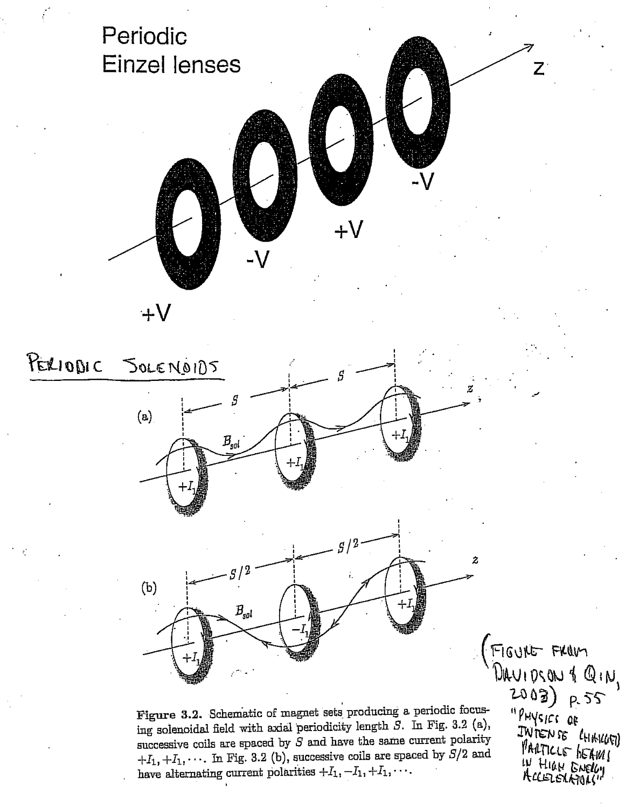
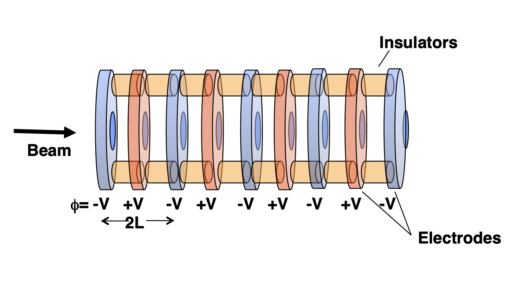
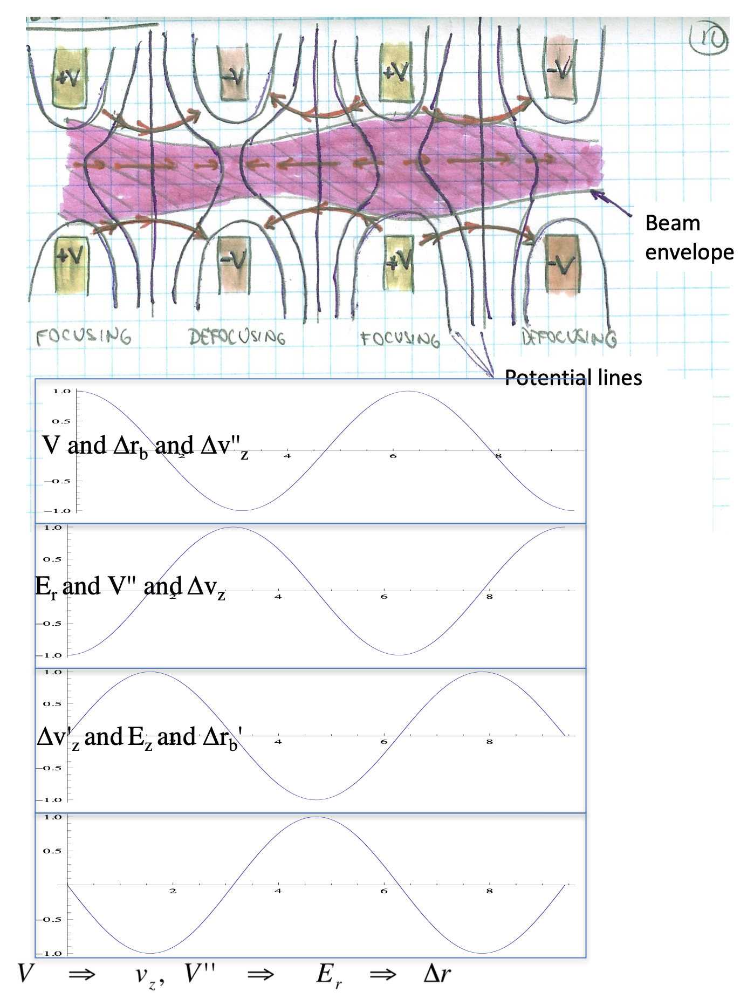
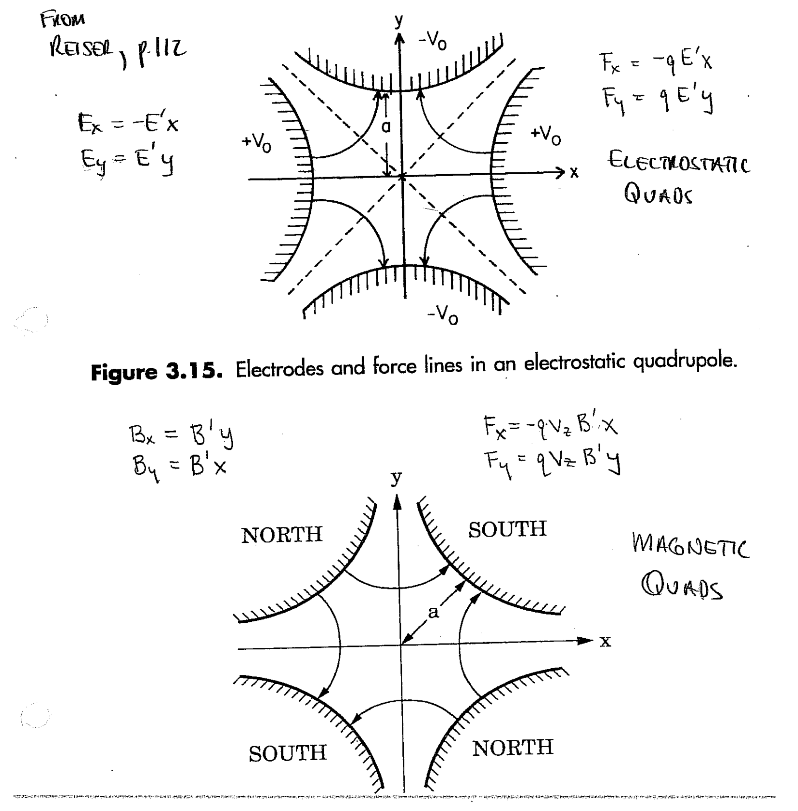
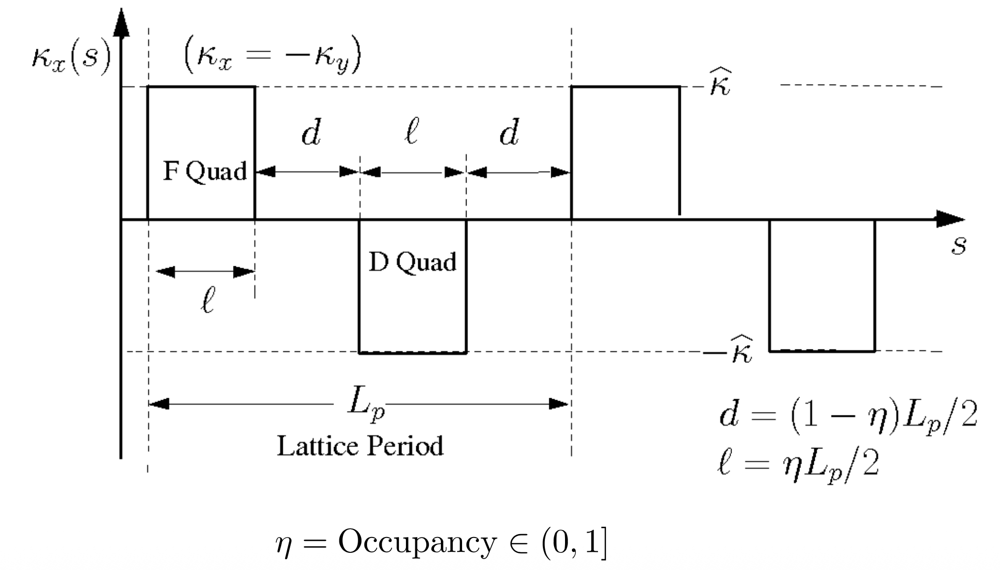
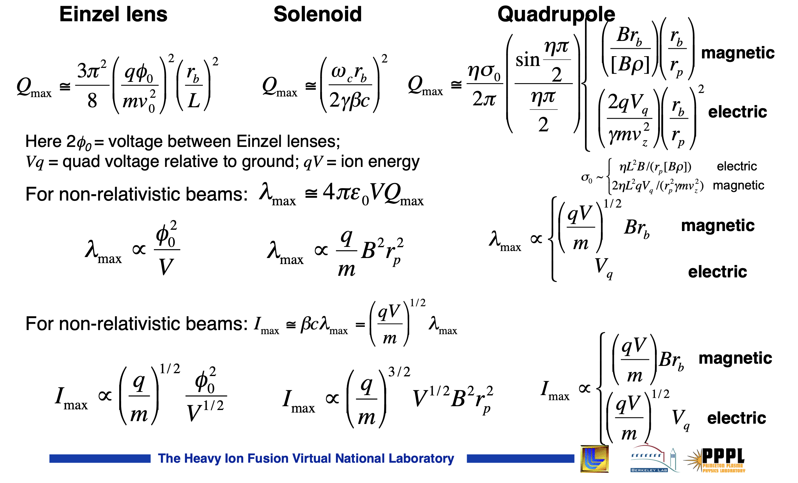

# Beam current limits in axisymmetric focusing channels

---

{fig-align=center height=300px}

## Radial envelope equation

\begin{equation}
\tilde{r}'' 
+ \frac{(\gamma \beta)'}{(\gamma\beta)} \tilde{r}'
+ \left( \frac{\gamma''}{2 \gamma \beta^2} \right) \tilde{r}
+ \left( \frac{\omega_c}{2 \gamma \beta c} \right)^2 \tilde{r}
- \left( \frac{\langle p_\theta \rangle}{\gamma m \beta c} \right)^2 \frac{1}{\tilde{r}^3}
- \frac{\varepsilon_r^2}{\tilde{r}^3}
- \frac{Q}{2 \tilde{r}}
= 0 
\end{equation}

\begin{equation}
\tilde{r} = \sqrt{\langle r^2 \rangle}
\end{equation}

\begin{equation}
\label{eq-canonical-angular-momentum}
p_\theta \equiv \gamma m r^2 \dot{\theta} + q r A_\theta,
\end{equation}

\begin{equation}
\varepsilon_r \equiv \sqrt{\langle{r^2}\rangle \langle{r'^2}\rangle - \langle{rr'}\rangle^2 + \langle{r^2}\rangle \langle{r^2 \theta'^2}\rangle - \langle{r^2 \theta'}\rangle^2}
\end{equation}

\begin{equation}
Q \equiv \frac{1}{m c^2 \beta^2\gamma^3} \frac{q \lambda}{2\pi\epsilon_0}
\end{equation}

## Beam current limit in long solenoid 

Long solenoid: $\mathbf{B} = B_z \hat{z}$.

No acceleration $\gamma' = \gamma'' = 0$.

Set $p_{\theta}= 0$ and $\epsilon_r = 0$ to minimizing "repelling" forces.

\begin{equation}
\tilde{r}'' 
+ \left( \frac{\omega_c}{2 \gamma \beta c} \right)^2 \tilde{r}
- \frac{Q}{2 \tilde{r}}
= 0 
\end{equation}

Maximum beam perveance occurs at equilibrium, when $\tilde{r}' = \tilde{r}'' = 0$:

\begin{equation}
Q = \frac{1}{2} \left( \frac{\omega_c \tilde{r}}{\gamma \beta c} \right)^2
\end{equation}

## Derivation from force balance at low energies

Particle moves with angular velocity $\v_\theta = \omega r$. 

Particle sees linear focusing force from solenoid field $B_z = \omega_c m / q$.

Within beam envelope, particle sees linear defocusing force from space charge.

\begin{align}
\underbrace{m \omega^2 r}_{\text{centrifugal}}
+ \underbrace{\frac{Q m \beta^2 c^2}{2 \tilde{r}^2} r}_{\text{centrifugal}}
&= \underbrace{q v_\theta B_z}_{\text{magnetic}}
\end{align}

\begin{equation}
\omega^2 r + \frac{Q \beta^2 c^2}{2 \tilde{r}^2} r = \omega_c \omega r
\end{equation}

---

\begin{align}
Q(\omega) &= \frac{2 \tilde{r}^2}{\beta^2 c^2} \left( \omega \omega_c - \omega^2 \right) \\
\omega^* &= \max_{\omega} Q(\omega) = \frac{\omega_c}{2} \\
Q(\omega^*) &= \frac{1}{2} \left( \frac{\omega_c \tilde{r}}{\beta c} \right)^2
\end{align}

Equivalent to result from envelope equations when $\gamma^2 \rightarrow 1$:

\begin{equation}
Q = \frac{1}{2} \left( \frac{\omega_c \tilde{r}}{\gamma \beta c} \right)^2
\end{equation}

## Angular kick at solenoid entrance

Approximate solenoid field as step function:

\begin{equation}
\begin{aligned}
B_z(z) = B_0 \left[ \Theta(z) + \Theta(L - z) - 1 \right]
=
\begin{cases}
  0   & \text{if } z < 0 \\
  B_0 & \text{if } 0 \leq z \leq L \\
  0   & \text{if } z > L
\end{cases}
\end{aligned}
\end{equation}

\begin{equation}
\frac{\partial B_z}{\partial z} = B_0 \left[ \delta(z) - \delta(L - z) \right]
\end{equation}

---

Use earlier result to relate longitudinal derivative to radial magnetic field:

\begin{equation}
B_r(r, z) \approx -\frac{r}{2} \frac{\partial B_z}{\partial z} = \frac{r B_0}{2} \left[ \delta(z) - \delta(L - z) \right]
\end{equation}

Compute change in $\theta$ component of momentum at $z = \epsilon$, just after solenoid entrance:

\begin{align}
\frac{d}{dt} p_{\theta}^{*}(r) &= q v_z B_r \\
\Delta p_{\theta}^{*}(r) 
&= q \int_{-\infty}^{\epsilon} B_r(r, z) dz \\
&= \frac{q r B_0}{2} \int_{-\infty}^{\epsilon} \left[ \delta(z) - \delta(L - z) \right] dz \\
&= \frac{q r B_0}{2}
\end{align}

\begin{equation}
v_\theta = \frac{r q B_0}{2 m} = \frac{r \omega_c}{2}
\end{equation}

## Beam current limits in periodic Einzel lens

{fig-align=center height=300px}

---

{fig-align=center height=300px}

---

Ignore centrifugal term, emittance term, and solenoid term in radial envelope equation.

\begin{equation}
\tilde{r}'' + \frac{\gamma'}{\gamma \beta^2} \tilde{r}' + \frac{\gamma''}{2 \gamma \beta^2} - \frac{Q}{2 \tilde{r}} = 0
\end{equation}

Assume non-relativistic beam: $\beta \ll 1$, $\gamma \approx 1$:

\begin{align}
\gamma' &= \beta \beta' \gamma^3 \approx \beta \beta' \\
\gamma'' &\approx \beta' \beta' + \beta \beta''
\end{align}

\begin{align}
\tilde{r}'' 
+ \frac{\beta'}{\beta} \tilde{r}' 
+ \frac{1}{2} \left[ \frac{\beta'^2}{\beta^2} + \frac{\beta''}{\beta} \right] \tilde{r} 
- \frac{Q}{2 \tilde{r}}
= 0
\end{align}

---

Define new variable $R = \sqrt{\beta / \beta_0} \tilde{r}$, where $\beta_0$ is the initial velocity.

\begin{align} 
\tilde{r}' 
&= 
  \left(\frac{\beta}{\beta_0}\right)^{-1/2} R'
- \frac{1}{2} \left(\frac{\beta}{\beta_0}\right)^{-3/2} \left(\frac{\beta'}{\beta}\right) R
\\
\tilde{r}'' 
&=
\left(\frac{\beta}{\beta_0}\right)^{-1/2} R''
- \left(\frac{\beta}{\beta_0}\right)^{-3/2} \left(\frac{\beta'}{\beta_0}\right) R'
+ \frac{3}{4} \left(\frac{\beta}{\beta_0}\right)^{-5/2} \left(\frac{\beta'}{\beta_0}\right)^2 R
- \frac{1}{2} \left(\frac{\beta}{\beta_0}\right)^{-3/2} \left( \frac{\beta''}{\beta_0} \right) R
\end{align}

\begin{equation}
\boxed{
  R'' + \frac{3}{4} \left(\frac{\beta'}{\beta}\right)^2 R - \frac{1}{2} \frac{\beta}{\beta_0} \frac{Q}{R} = 0 .
}
\end{equation}

---

Approximate potential as $\phi(r, z) = \phi_0 \cos(\pi z / L)$. From conservation of energy:

\begin{align}
\Delta \left( \frac{1}{2} m v^2 \right) &= -\Delta \left( \frac{q \phi}{m} \right) \\
\frac{1}{2} m \left( v^2 - v_0^2 \right) &= -q \phi_0 \cos{\left( \frac{\pi z}{L} \right)} \\
v^2 &= v_0^2 - \frac{2 q \phi_0}{m} \cos{\left( \frac{\pi z}{L} \right)}
\end{align}

Use this to rewrite $(\beta' / \beta)^2$:

\begin{align}
v' &= \frac{q \phi_0}{m v} \left( \frac{\pi}{L} \right) \sin \left( \frac{\pi z}{L} \right) 
\\
\frac{v'}{v} &= \frac{q \phi_0}{m v^2} \left( \frac{\pi}{L} \right) \sin \left( \frac{\pi z}{L} \right) 
\\
\left(\frac{\beta'}{\beta}\right)^2 &= \left( \frac{q \phi_0}{m v} \right)^2 \left( \frac{\pi}{L} \right)^2 \sin^2 \left( \frac{\pi z}{L} \right)
\end{align}

---

Assume $v_0^2 \gg \frac{2 q \phi_0}{m}$, so that $v \approx v_0$.

\begin{equation}
\left(\frac{\beta'}{\beta}\right)^2 
\approx 
\left( \frac{q \phi_0}{m v_0} \right)^2 \left( \frac{\pi}{L} \right)^2 \sin^2 \left( \frac{\pi z}{L} \right)
\end{equation}

For equilibrium ($R'' = 0$), look at averages over $z$:

\begin{align}
\overline{\left(\frac{\beta'}{\beta}\right)^2} &= \frac{1}{2} \left( \frac{q \phi_0}{m v_0} \right)^2 \left( \frac{\pi}{L} \right)^2
\\
\overline{\left(\frac{\beta}{\beta_0}\right)} &= 1 
\\
\overline{R} &= \overline{\left(\frac{\beta}{\beta_0}\right)^{1/2}} \tilde{r} = \tilde{r} 
\end{align}

Inserting these terms in the envelope equation with $R'' = 0$ gives the maximum beam perveance:

\begin{equation}
\boxed{
Q_{max} = \frac{3 \pi^2}{4} \left(\frac{q \phi_0}{m \beta_0^2 c^2}\right)^2 \left(\frac{\tilde{r}}{L}\right)^2
}
\end{equation}

# Beam current limits in quadrupolar focusing channels

---

{fig-align=center height=300px}

## RMS envelope equations

\begin{align}
\tilde{x}'' 
+ \frac{(\gamma\beta)'}{(\gamma\beta)} \tilde{x}' 
+ \kappa_x(s) \tilde{x}
- \frac{\varepsilon_x^2}{\tilde{x}^3} 
- \frac{Q}{2 \left( \tilde{x} + \tilde{y} \right) }
&= 0 
\\
\tilde{y}'' 
+ \frac{(\gamma\beta)'}{(\gamma\beta)} \tilde{y}' 
+ \kappa_y(s) \tilde{y}
- \frac{\varepsilon_y^2}{\tilde{y}^3} 
- \frac{Q}{2 \left( \tilde{x} + \tilde{y} \right) }
&= 0 
\end{align}

\begin{align}
Q &= \frac{q \lambda}{2 \pi \epsilon_0 m c^2 \beta^2 \gamma^3} \\
\varepsilon_x(s) &= \sqrt{\langle xx \rangle \langle x'x' \rangle - \langle xx' \rangle \langle xx' \rangle} \\
\varepsilon_y(s) &= \sqrt{\langle yy \rangle \langle y'y' \rangle - \langle yy' \rangle \langle yy' \rangle} \\
\kappa_x(s) &= +\frac{q G} {\gamma \beta m c} \\
\kappa_y(s) &= -\frac{q G} {\gamma \beta m c}
\end{align}

---

Let $\kappa_x(s) = f(s) \kappa$ and $\kappa_y(s) = -\kappa_x(s)$. Ignoring acceleration ($\gamma' = 0$):

\begin{align}
\tilde{x}'' 
+ \kappa f(s) \tilde{x}
- \frac{\varepsilon_x^2}{\tilde{x}^3} 
- \frac{Q}{2 \left( \tilde{x} + \tilde{y} \right) }
&= 0 
\\
\tilde{y}'' 
- \kappa f(s) \tilde{y}
- \frac{\varepsilon_y^2}{\tilde{y}^3} 
- \frac{Q}{2 \left( \tilde{x} + \tilde{y} \right) }
&= 0 
\end{align}

---

{fig-align=center height=140px}

$\eta = L_q / L$.

\begin{equation}
f(s) =
\begin{cases}
  +1 & \text{if } 0  \leq s < L \eta / 2 \\
  -1 & \text{if } L - \eta L / 2  \leq s < L + L \eta / 2 \\
  +1 & \text{if } 2 L - L \eta / 2 \leq s < 2 L \\
   0 & \text{otherwise}
\end{cases}
\end{equation}

---

To derive the maximum beam current, approximate $f(s)$, $\tilde{x}(s)$, and $\tilde{y}(s)$ as sinusoidal functions at the lattice frequency. Then plug into envelope equation, ignore fast-oscillating terms, and solve for equilibrium.

Start with the focusing strength $f(s)$:

\begin{align}
f(s) &= \sum_{n=1}^{\infty} a_n \cos\left(\frac{n \pi s}{L}\right) \\
a_n &= \frac{1}{L} \int_{0}^{2L} f(s) \cos\left(\frac{n \pi s}{L}\right) ds 
\end{align}

\begin{align}
\boxed{
f(s) \approx a_1 \cos\left(\frac{\pi s}{L}\right) 
= \frac{4}{\pi} \sin\left(\frac{\pi \eta}{2}\right) \cos\left(\frac{\pi s}{L}\right) 
}
\end{align}

---

Approximate rms envelope evolution as:

\begin{align}
\tilde{x}(s) &= \frac{\tilde{r}_0}{\sqrt{2}} \left[ 1 + \delta \cos\left( \frac{\pi s}{L} \right) \right] \\
\tilde{y}(s) &= \frac{\tilde{r}_0}{\sqrt{2}} \left[ 1 - \delta \cos\left( \frac{\pi s}{L} \right) \right]
\end{align}

Now evaluate terms in rms envelope equations: $\tilde{x}''$, $f(s) \tilde{x}$, etc.

\begin{align}
\tilde{x}'' = -\frac{\tilde{r}_0}{\sqrt{2}} \delta \frac{\pi^2}{L^2} \cos\left( \frac{\pi s}{L} \right) \\
\tilde{y}'' = +\frac{\tilde{r}_0}{\sqrt{2}} \delta \frac{\pi^2}{L^2} \cos\left( \frac{\pi s}{L} \right)
\end{align}

---

\begin{align}
f(s) \tilde{x}(s) 
&=
\frac{4 \tilde{r}_0}{\sqrt{2} \pi} \sin\left(\frac{\pi \eta}{2}\right) \cos\left(\frac{\pi s}{L}\right) 
\left[ 1 + \delta \cos\left( \frac{\pi s}{L} \right) \right] ,
\\
&= 
\frac{4 \tilde{r}_0}{\sqrt{2} \pi} \sin\left(\frac{\pi \eta}{2}\right) 
\left[ \cos\left(\frac{\pi s}{L}\right) + \delta \cos^2\left( \frac{\pi s}{L} \right) \right] .
\end{align}

Ignore fast oscillating component of $\cos^2(\pi s / L)$:

\begin{equation}
\cos^2\left( \frac{\pi s}{L} \right) 
= \frac{1}{2} + \frac{1}{2} \cos\left(\frac{2 \pi s}{L}\right) \approx \frac{1}{2} .
\end{equation}

This gives:

\begin{align}
f(s) \tilde{x}(s) 
&\approx
\frac{4 \tilde{r}_0}{\sqrt{2} \pi} \sin\left(\frac{\pi \eta}{2}\right) 
\left[ \cos\left(\frac{\pi s}{L}\right) + \frac{\delta}{2} \right] ,
\\
f(s) \tilde{y}(s) 
&\approx
\frac{4 \tilde{r}_0}{\sqrt{2} \pi} \sin\left(\frac{\pi \eta}{2}\right) 
\left[ \cos\left(\frac{\pi s}{L}\right) - \frac{\delta}{2} \right] .
\end{align}

---

Plugging these appoximations into rms envelope equations:

\begin{align}
-\left[ 
  \delta \frac{\pi^2}{L^2} - \frac{4 \kappa}{\pi} \sin\left(\frac{\eta \pi}{2}\right) 
\right] 
\cos\left(\frac{\pi s}{L}\right)
+ \frac{2 \kappa \delta}{\pi} \sin\left(\frac{\eta \pi}{2}\right)
&= 
\frac{Q}{2 \tilde{r}_0^2} ,
\\
+\left[ 
  \delta \frac{\pi^2}{L^2} - \frac{4 \kappa}{\pi} \sin\left(\frac{\eta \pi}{2}\right) 
\right] 
\cos\left(\frac{\pi s}{L}\right)
+ \frac{2 \kappa \delta}{\pi} \sin\left(\frac{\eta \pi}{2}\right)
&= 
\frac{Q}{2 \tilde{r}_0^2} .
\end{align}

Solve for $\delta$ and $Q$:

\begin{align}
\delta &= \frac{4 \kappa L^2}{\pi^3} \sin\left(\frac{\eta\pi}{2}\right)
\\
Q &= \frac{4 \kappa \delta}{\pi} \sin\left(\frac{\eta\pi}{2}\right) \tilde{r}_{0}^2
\end{align}

\begin{equation}
\label{eq:qmax_fodo}
\boxed{
  Q_{max} \approx \left( \frac{2 \kappa L \eta}{\pi} \right)^2 \left( \frac{\sin(\eta\pi / 2)}{(\eta\pi / 2)} \right)^2 \tilde{r}_0^2
}
\end{equation}

## Continuous focusing

\begin{align}
\tilde{x}'' 
+ k_0^2 \tilde{x}
- \frac{\varepsilon^2}{\tilde{x}^3} 
- \frac{Q}{2 \left( \tilde{x} + \tilde{y} \right) }
&= 0 ,
\\
\tilde{y}'' 
+ k_0^2 \tilde{y}
- \frac{\varepsilon_y^2}{\tilde{y}^3} 
- \frac{Q}{2 \left( \tilde{x} + \tilde{y} \right) }
&= 0 .
\end{align}

At equilibrium ($\tilde{x}'' = \tilde{y}'' = 0$), the defocusing space charge term balances the external focusing term. This occurs at the equilibrium rms radius $\tilde{r}_0 = \sqrt{2} \tilde{x} = \sqrt{2} \tilde{y}$.

\begin{equation}
Q_{max} = 2 k_0^2 \tilde{r}_{0}^2
\end{equation}

Comparing to Eq. \eqref{eq:qmax_fodo} gives the oscillation frequency $k_0^2$ for the smooth-focusing approximation of the FODO channel:

\begin{equation}
k_0^2 = \frac{2 \kappa^2 L^2 \eta^2}{\pi^2}\left( \frac{\sin(\eta\pi / 2)}{(\eta \pi / 2)} \right)^2
\end{equation}

---

Define the phase advance $\sigma_0 = k_0 / (2 L)$ to eliminate $L$:

\begin{equation}
k_0^2 = \frac{\eta k \sigma_0}{\sqrt{2} \pi} \frac{\sin(\eta\pi / 2)}{(\eta \pi / 2)}
\end{equation}

\begin{equation}
Q_{max} 
= 2 k_0^2 \tilde{r}_{0}^2
= \frac{\sqrt{2} \eta k \sigma_0}{\pi} \frac{\sin(\eta\pi / 2)}{(\eta \pi / 2)} \tilde{r}_0^2 .
\end{equation}

---

Define $r_b \equiv \sqrt{2} \tilde{r}_0$ as beam edge radius and $r_p$ as pipe radius.

\begin{equation}
Q_{max} = \frac{\eta k \sigma_0}{\sqrt{2} \pi} \frac{\sin(\eta\pi / 2)}{(\eta \pi / 2)} r_b^2 .
\end{equation}

Magnetic quadrupoles:

\begin{equation}
k = \frac{q}{\gamma m \beta c} \frac{dB}{dx} \sim \frac{q}{\gamma m \beta c} \frac{B}{r_p} .
\end{equation}

Electric quadrupoles:

\begin{equation}
k = \frac{q}{\gamma m \beta^2 c^2} \frac{dE}{dx} \sim \frac{2 q V_q}{\gamma m \beta^2 c^2} ,
\end{equation}

where $V_q = \frac{1}{2}\frac{dE}{dx} r_p^2$.

---

{fig-align=center}
