# Introduction

## Simulations often generate low-density cloud of particles far from core

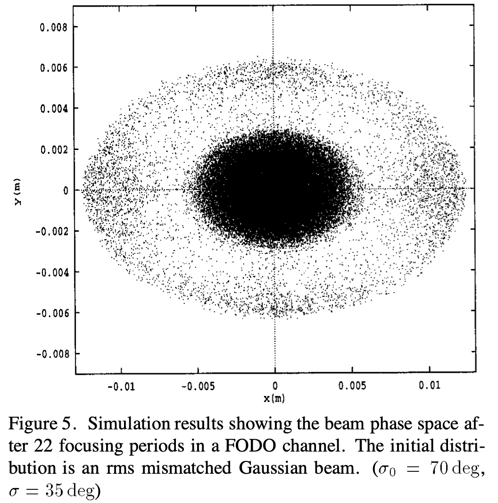{fig-align=center width=150px}

## Measurements show qualitatively similar features

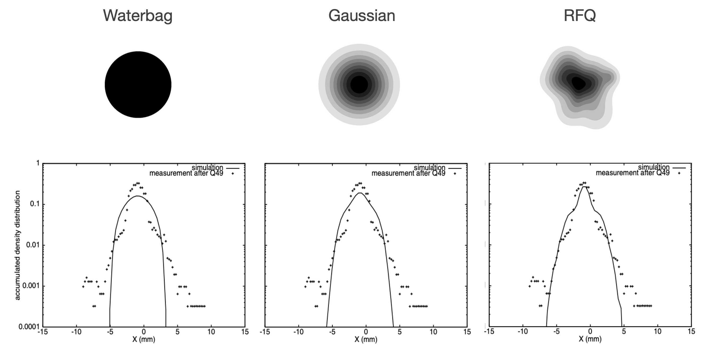{fig-align=center width=400px}

## Measurements show qualitatively similar features

![Source: [@aleksandrov_2020_understanding.]](images/sns_lw_jinst.png)

## One definition of *halo*

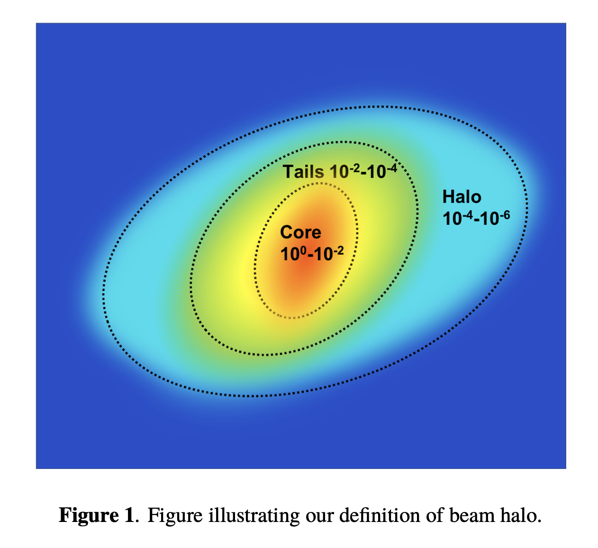{fig-align=center width=300px}

## One definition of *halo*

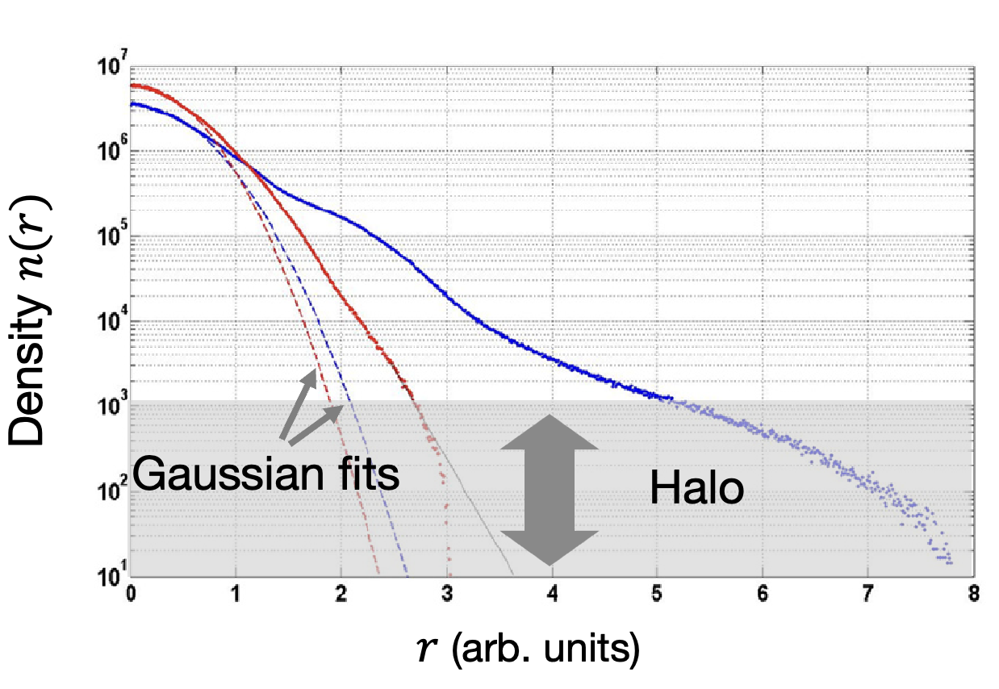{fig-align=center width=300px}

## Why do we care?

* High-energy beam loss $\rightarrow$ accelerator activation
* Example: accelerator production of tritium (APT)
    * 1 GeV, 100 mA.
    * Loss limit = $10^{-9}$ [A/m] to allow hands-on maintenance.
    * 1000 [m] accelerator $\rightarrow$ fractional loss limit $\sim 10^{-5}$.
* Example: ORNL Spallation Neutron Source (SNS)
    * Loss limit $\sim$ 1 [W/m] to allow hands-on maintenance.
    * At $\sim$ 1 MW operation, fractional loss limit $\sim 10^{-6}$.
    * At $\sim$ 3 MW operation, fraction loss limit $\sim 10^{-7}$. 
    * Currently at 2.0 MW, losses at linac hotspots are $\sim$ 0.3 [W/m].

## Why do we care?

![Source: [@ruisard_2026_beam]](images/ruisard_ipac26_power.png){fig-align=center width=400px}

## Why do we care?

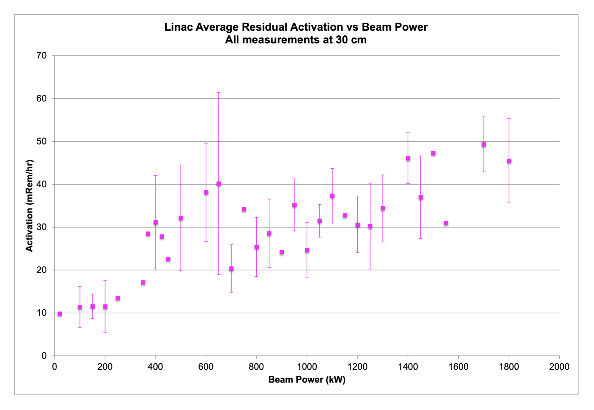{fig-align=center width=400px}

## Why do we care?

![Laser wire measurement discussed in [@liu_2020_laser].](images/sns.png){fig-align=center width=400px}

## Why do we care?

* High-energy beam loss $\rightarrow$ accelerator activation
* Beam loss on walls $\rightarrow$ electron/gas emission + instabilities (electron cloud or e/p instabilities)
* Increased phase space volume $\rightarrow$ limits beam size on target

## Particle-core model of halo formation

* Full analysis would start from Vlasov-Poisson (V-P) equations.
* Instead, assume fixed distribution function with analytic field map; for example, uniform or Gaussian). Allow first moments (mean) and second moments (covariance) to evolve but not higher moments.
* Track test particles in resulting space charge + external fields. *Test particles do not affect space charge fields.*
* This simple model can generate non-trivial/chaotic motion and isolate real halo formation mechanisms.
* Results are often consistent with particle-in-cell (PIC) simulations.

## Plan of attack

* Start with stationary 4D KV equilibrium distribution in axisymmetric/continuous/linear focusing lattice. 
* Perturb beam size, causing oscillations of the rms beam envelope. *Note: distribution function does not change.*
* Decompose envelope oscillations into eigenmodes + frequencies.
* Isolate the so-called *breathing mode* (round beam, oscillating area).
* Develope analytic model of particle motion near resonance using perturbation methods [@gluckstern_1994_analytic].
* Study particle dynamics by numerically integrating ODE system [@wangler_1998_particle].
* Compare results to PIC simulation.

# Envelope modes in continuous focusing channels

## Equilibrium beam radius

KV envelope equations describe evolution of elliptical beam radii $r_{x, y}$ in linear focusing system:

\begin{equation}
\begin{aligned}
r_x'' + \kappa_x(s) r_x - \frac{2 Q}{r_x + r_y} - \frac{\varepsilon_x^2}{r_x^3} &= 0,
\\
r_y'' + \kappa_y(s) r_y - \frac{2 Q}{r_x + r_y} - \frac{\varepsilon_y^2}{r_y^3} &= 0,
\end{aligned}
\end{equation}

where $\varepsilon_{x, y}$ are invariant emittances, $Q$ is beam perveance, and $\kappa_{x, y}(s)$ are linear focusing strengths. 

---

Restrict attention to continuous, axisymmetric focusing systems with $\kappa_x(s) = \kappa_y(s) = k_0^2$. 

Also assume equal emittances: $\varepsilon_x = \varepsilon_y = \varepsilon$.

\begin{equation} \label{eq-env-continuous}
\begin{aligned}
r_x'' + k_0^2 r_x - \frac{2 Q}{r_x + r_y} - \frac{\varepsilon^2}{r_x^3} &= 0,
\\
r_y'' + k_0^2 r_y - \frac{2 Q}{r_x + r_y} - \frac{\varepsilon^2}{r_y^3} &= 0.
\end{aligned}
\end{equation}

---

Equilibrium occurs when $r_x'' = r_y'' = 0$. The equilibrium radius $r_x = r_y = R_0$ solves:

\begin{equation}
\label{eq-equilibrium-radius-equation}
k_0^2 R_0 - Q R_0^{-1} - \varepsilon_2 R_0^{-3} = 0.
\end{equation}

\begin{equation}
\label{eq-radius}
R_0 = \frac{Q^{1/2}}{k_0} \left[ \frac{1}{2} + \frac{1}{2} \sqrt{1 + \frac{4 k_0^2 \varepsilon^2}{Q^2}} \right]^{1/2}.
\end{equation}

In limit of space-charge-dominated ($2 k_0 \varepsilon \ll Q$), or emittance-dominated ($2 k_0 \varepsilon \gg Q$) beam,

\begin{equation}
R_0 \rightarrow \left\{
\begin{array}{@{}ll@{}}
  \sqrt{Q} / {k_0}, & 2 k_0 \varepsilon \ll Q, \\
  \sqrt{\varepsilon / k_0}, & 2 k_0 \varepsilon \gg Q.
\end{array}
\right.
\end{equation}

## Depressed betatron frequency

Single-particle equations of motion within beam edge:

\begin{equation}
\begin{aligned}
x'' + k_0^2 x - \frac{2 Q}{r_x + r_y} \frac{x}{r_x} = 0, \\
y'' + k_0^2 y - \frac{2 Q}{r_x + r_y} \frac{y}{r_y} = 0.
\end{aligned}
\end{equation}

At equilibrium ($r_x = r_y = R_0$),

\begin{equation}
\begin{aligned}
x'' + \left( k_0^2 - \frac{Q}{R_0^2} \right) x = 0, \\
y'' + \left( k_0^2 - \frac{Q}{R_0^2} \right) y = 0. \\
\end{aligned}
\end{equation}

Particles in core oscillate with depressed wavenumber $k$:

\begin{equation}
\label{eq-depressed-focusing-strength}
k^2 \equiv k_0^2 - {Q} / {R_0^2} .
\end{equation}

## Perturbation of equilibrium distribution

Define deviations from the equilibrium radii:

\begin{equation} \label{eq-env-deviations}
\begin{aligned}
r_x(s) = R_0 + \eta_x(s), \\
r_y(s) = R_0 + \eta_y(s). \\
\end{aligned}
\end{equation}

Substituting Eq. \eqref{eq-env-deviations} into Eq. \eqref{eq-env-continuous} gives:

\begin{equation}
\begin{aligned}
\eta_x'' + k_0^2 (R_0 + \eta_x) - \frac{Q}{R_0} \left(1 + \frac{\eta_x + \eta_y}{2 R_0}\right)^{-1} - \frac{\varepsilon^2}{R_0^3} \left( 1 + \frac{\eta_x}{R_0} \right)^{-3} &= 0, 
\\
\eta_y'' + k_0^2 (R_0 + \eta_y) - \frac{Q}{R_0} \left(1 + \frac{\eta_x + \eta_y}{2 R_0}\right)^{-1} - \frac{\varepsilon^2}{R_0^3} \left( 1 + \frac{\eta_y}{R_0} \right)^{-3} &= 0.
\end{aligned}
\end{equation}

---

Assume deviations $\eta_{x, y}$ are much smaller than equilibrium radius $R_0$. Then linearize perturbed envelope equations to give:

\begin{equation}
\begin{aligned}
\eta_x'' + k_0^2 (R_0 + \eta_x) - \frac{Q}{R_0} \left( 1 - \frac{\eta_x + \eta_y}{2 R_0} \right) - \frac{\varepsilon^2}{R_0^3} \left(1 - 3 \frac{\eta_x}{R_0} \right) = 0,
\\
\eta_y'' + k_0^2 (R_0 + \eta_y) - \frac{Q}{R_0} \left( 1 - \frac{\eta_x + \eta_y}{2 R_0} \right) - \frac{\varepsilon^2}{R_0^3} \left(1 - 3 \frac{\eta_y}{R_0} \right) = 0.
\end{aligned}
\end{equation}

Facotr $\eta_x$ and $\eta_y$:

\begin{equation}
\begin{aligned}
\eta_x'' + \left( k_0^2 + \frac{Q}{2 R_0^2} + \frac{3 \varepsilon^2}{R_0^4} \right) \eta_x + \left( \frac{Q}{2 R_0^2} \right) \eta_y &= 0,
\\
\eta_y'' + \left( k_0^2 + \frac{Q}{2 R_0^2} + \frac{3 \varepsilon^2}{R_0^4} \right) \eta_y + \left( \frac{Q}{2 R_0^2} \right) \eta_x &= 0,
\end{aligned}
\end{equation}

where Eq. \eqref{eq-equilibrium-radius-equation} has been used to eliminate the remaining terms. 

---

Using the definition of $k$ (Eq. \eqref{eq-depressed-focusing-strength}) we find:

\begin{equation} \label{eq-env-pert-coupled-1}
\begin{aligned}
\eta_x'' + \left( \frac{3}{2}k_0^2 + \frac{5}{2} k^2 \right) \eta_x + \left( \frac{1}{2}k_0^2 - \frac{1}{2} k^2 \right) \eta_y &= 0,
\\
\eta_y'' + \left( \frac{3}{2}k_0^2 + \frac{5}{2} k^2 \right) \eta_y + \left( \frac{1}{2}k_0^2 - \frac{1}{2} k^2 \right) \eta_x &= 0.
\end{aligned}
\end{equation}

## Eigenmode decomposition of perturbed envelope equations

Eq. \eqref{eq-env-pert-coupled-1} defines a coupled linear system of equations for $\eta_{x, y}$. We will analyze this system in terms of its normal modes. In vector form, Eq. \eqref{eq-env-pert-coupled-1} can be written:

\begin{equation}
\boldsymbol{\eta}'' + \mathbf{A}\boldsymbol{\eta} = 0,
\end{equation}

where $\boldsymbol{\eta} = [\eta_x, \eta_y]^T$ is the vector of perturbed envelope radii and $\mathbf{A}$ is a symmetric matrix of coefficients:

\begin{equation}
\mathbf{A} = 
\begin{bmatrix}
    \alpha_1 & \alpha_2 \\ \alpha_2 & \alpha_1
\end{bmatrix},
\end{equation}

with entries defined as: 

\begin{equation}
\begin{aligned}
    \alpha_1 &= \frac{3}{2}k_0^2 + \frac{5}{2} k^2 , \\
    \alpha_2 &= \frac{1}{2}k_0^2 - \frac{1}{2} k^2.
\end{aligned}
\end{equation}

---

We search for solutions of the form:

\begin{equation} \label{eq-ansantz}
\boldsymbol{\eta}_\pm(s) = \boldsymbol{\eta}_0 e^{i k_\pm s},
\end{equation}

where $k_\pm$ are two distinct frequencies. This leads to an eivenvalue problem:

\begin{equation}
\left( \mathbf{A} - \mathbf{I} k_\pm^2 \right) \boldsymbol{\eta}_\pm = 0.
\end{equation}

---

The eigenvalues give the spatial frequency (wavenumber) of the mismatch oscillations:

\begin{equation}
\begin{aligned}
    k_{+}^{2} &= \alpha_1 + \alpha_2 = 2k_0^2 + 2k^2. \\
    k_{-}^{2} &= \alpha_1 - \alpha_2 =  k_0^2 + 3k^2.
\end{aligned}
\end{equation}

The corresponding eigenvectors are $\boldsymbol{\eta}_\pm$:

\begin{equation}
\begin{aligned}
\boldsymbol{\eta}_{+} &= \sqrt{\frac{1}{2}} 
\begin{bmatrix} +1 \\ +1 \end{bmatrix} \quad \text{(breathing mode)}.
\\    
\boldsymbol{\eta}_{-} &= \sqrt{\frac{1}{2}} 
\begin{bmatrix} +1 \\ -1 \end{bmatrix} \quad \text{(quadrupole mode)}.
\end{aligned}
\end{equation}

---

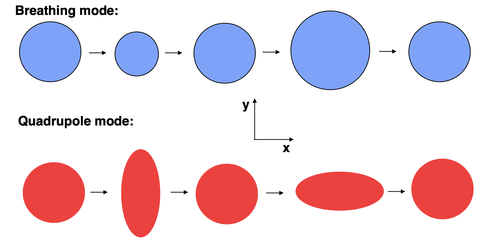{fig-align=center width=300px}

Quadrupole mode as smaller average beam area $\rightarrow$ greater average restoring force $\rightarrow$ higher frequency.

---

{fig-align=left width=300px}

# Particle-core resonance

## What drives resonance?

* Particles far from core oscillate close to natural frequency $k_0$.
* Particles inside core oscillate at depressed frequency $k \le k_0$. 
* Outside core: continuous + nonlinear frequency shift with distance $r$.
* Core mismatch oscillations could drive particle resonance when $k_\pm = n k$---particularly when $n = 2$.

## Warmup: energy gain within core

Following [@oconnell_1993_beam]. Equation of motion for particle within beam radius $R$:

\begin{equation}
\ddot{x} = \left( -\omega_0^2 + K / R^2 \right) x .
\end{equation}

Add small-amplitude envelope oscillations:

\begin{align}
R &\approx R_0 \left( 1 + A \sin(\Omega t) \right) \\
\ddot{x} &\approx A \Omega^2 x \sin(\Omega t) .
\end{align}

Energy gain for particle passing through core depends on relative phase of particle position/velocity and envelope radius:

\begin{align}
\dot{U} = F \dot{x} \approx A \Omega^2 x \dot{x} \sin(\Omega t) .
\end{align}

----

Suppose $x$ oscillates at half the core frequency:

\begin{align}
x       &\sim \sin(\Omega t / 2 + \delta / 2) , \\
\dot{x} &\sim \cos(\Omega t / 2 + \delta / 2) , \\
\dot{U} &\sim \sin(\Omega t) \sin(\Omega t + \delta) .
\end{align}

The phase relationship $\delta$ determines direction and rate of energy flow.

Nonlinear detuning outside core $\rightarrow$ loss of phase coherence. 

---

{fig-align=center width=300px}

---

{fig-align=center width=300px}

---

{fig-align=center width=300px}

---

{fig-align=center width=300px}

---

{fig-align=center width=300px}

---

{fig-align=center width=300px}

# Gluckstern's analytic model

## Gluckstern's analytic model 

* Gluckstern [@gluckstern_1994_analytic] used classical perturbation theory to derive an approximate Hamiltonian to describe the resonant particle dynamics.
* Model used to estimate upper bounds on halo amplitude. 
* Validated by direct ODE integration and PIC simulation.

## Equations of motion

Consider a matched KV distribution of radius $R$ in a continuous focusing channel with wavenumber $k_0$. The single-particle equation of motion in the horizontal plane is

\begin{equation}
\begin{aligned}
x'' + k_0^2 x &= 
\begin{cases}
  \frac{Q x}{R^2}, & r \le R,\\
  \frac{Q x}{r^2}, &  r \ge R ,
\end{cases} 
\end{aligned}
\end{equation}

where $r^2 = x^2 + y^2$. (Replace $x \rightarrow y$ to get vertical plane.)

Will focus on 1D model where $y = y' = 0$:

\begin{equation}
\begin{aligned}
x'' + k_0^2 x &= 
\begin{cases}
  \frac{Q x}{R^2}, & x \le R,\\
  \frac{Q}{x}, &  x \ge R ,
\end{cases} 
\end{aligned}
\end{equation}

Particle sees *linear* force inside beam and *nonlinear* force outside beam.

## Equations of motion

Write equation of motion for $x$ in one line:

\begin{equation}
\label{eq-pcm-eom-exact}
x'' + k_0^2 x = 
\underbrace{\left(\frac{Q}{r^2}\right) x \Theta(r - R)}_{\text{Exterior}} +  \underbrace{\left(\frac{Q}{R^2}\right) x \Theta(R - r)}_{\text{Interior}} ,
\end{equation}

where $\Theta$ is the unit step function:

Subtract linear defocusing force $Q x / R_0^2$ from both sides:

\begin{equation}
\label{eq-pcm-eom-perturbed}
x'' + k^2 x = 
-\frac{Q}{R_0^2} \left( 1 - \frac{R_0^2}{r^2} \right) x \Theta(r - R)
+  Q \left( \frac{1}{R^2} -  \frac{1}{R_0^2}\right) x \Theta(R - r) ,
\end{equation}

where $k$ is the depressed wavenumber at equilibrium.

---

Assume breathing-mode core oscillation at wavenumber $k_+$:

\begin{equation}
R(s) = R_0 \left( 1  - \epsilon \cos(k_+ s) \right),
\end{equation}

where $k_+$ is the breathing mode frequency, $R_0$ is the equilibrium radius, and $\epsilon$ is the strength of the perturbation. 

If $\epsilon$ is small, approximate $1 / R^{2}$ term truncated Taylor series:

\begin{equation}
\label{eq-pcm-taylor}
R^{-2} 
= R_0^{-2} \left( 1 - \epsilon \cos(k_{+}s) \right)^{-2} 
\approx R_0^{-2} \left( 1 + 2 \epsilon \cos(k_+ s) \right).
\end{equation}

Substitute into equation of motion:

\begin{equation}
\label{eq-pcm-eom}
x'' + k^2 x
= 
\underbrace{
    -\frac{Q}{R_0^2} \left( 1 - \frac{R_0^2}{r^2} \right) x \Theta(r - R)
}_{\substack{\text{Nonlinear} \\ \text{detuning}}}
+ 
\underbrace{
    \frac{2 \epsilon Q}{R_0^2} x \cos(k_+ s) \Theta(R - r)
}_{\substack{\text{Linear} \\ \text{interior } \leftrightarrow \text{ exterior}}}
\end{equation}

## More approximations

::: {.nonincremental}

* Assume no angular momentum $\rightarrow$ one-dimensional oscillations along $x$ axis. 
* Get rid of step function and approximate space charge force with \textit{pendulum model}:

\begin{equation}
\label{eq-pcm-eom-pendulum}
x'' + k^2 x
= -\frac{Q}{R_0^4} x^3 + \frac{2 \epsilon Q}{R_0^2} x \cos(k_+ s).
\end{equation}

* Crude approximation of the external nonlinearity but can still capture essential physics.
* Same analysis possible without approximations but is more involved.

:::

---

{fig-align=center width=250px} 

## Phase-amplitude coordinates

Transform to amplitude-phase coordinates $A$, $\psi$:

\begin{align}
\frac{x(s)}{R_0} &\equiv A(s) \sin(\psi(s)) \label{eq-pcm-phase-amp-x} , \\
\frac{x'(s)}{R_0} &\equiv k A(s) \cos(\psi(s)) \label{eq-pcm-phase-amp-xp} ,
\end{align}

with the phase $\psi(s)$ given by

\begin{equation}
\label{eq-pcm-psi}
\psi(s) = k s + \alpha(s),
\end{equation}

where $\alpha(s)$ is a slowly varying function. 

Derive dynamical equations for $A$ and $\psi$ by substituting Eq. \eqref{eq-pcm-phase-amp-x} and Eq. \eqref{eq-pcm-phase-amp-xp} into Eq. \eqref{eq-pcm-eom-pendulum}. 

---

The $s$-derivative of Eq. \eqref{eq-pcm-phase-amp-x} gives

\begin{equation}
\frac{x'}{R_0} = A' \sin\psi + A (k + \alpha') \cos\psi .
\end{equation}

From the definition in Eq. \eqref{eq-pcm-phase-amp-x}, we have the constraint:

\begin{equation}
\label{eq-pcm-deriv-x}
A' \sin\psi + \alpha' A \cos\psi = 0 .
\end{equation}

The $s$-derivative of $x'$ in Eq. \eqref{eq-pcm-phase-amp-xp} gives

\begin{equation}
\frac{x''}{R_0} = k A' \cos\psi - k A (k + \alpha') \sin\psi .
\end{equation}

Substitute these expressions into the equation of motion:
\begin{equation}
x'' + k^2 x
= -\frac{Q}{R_0^4} x^3 + \frac{2 \epsilon Q}{R_0^2} x \cos(k_+ s) \equiv f(x, s).
\end{equation}

---

Result:

\begin{equation}
\label{eq-pcm-eom-pendulum-amp-phase}
R_0 k \left( A' \cos\psi - A \alpha' \sin\psi  \right) = f(A, \psi, s),
\end{equation}

where $f(A, \psi, s)$ is the driving term expressed in the new coordinates $A$ and $\psi$:

\begin{equation} \label{eq-pcm-amp-phase-drive}
\begin{aligned}
    f(A, \psi, s) &= \frac{Q}{R_0} \left[ -A^3 \sin^3\psi + 2 \epsilon A \sin\psi \cos(k_+ s) \right] .
\end{aligned}
\end{equation}

Eq. \eqref{eq-pcm-deriv-x} and Eq. \eqref{eq-pcm-eom-pendulum-amp-phase} define linear system for $A'$ and $\alpha'$.

\begin{equation}
\begin{bmatrix}
    kR_0 \cos\psi & -k R_0 A\sin\psi \\
    \sin\psi & A \cos\psi
\end{bmatrix}
\begin{bmatrix}
    A' \\ \alpha'
\end{bmatrix}
= 
\begin{bmatrix}
    f \\ 0
\end{bmatrix} .
\end{equation}

Solve to find dynamics of amplitude and phase:

\begin{align} 
\label{eq:pcm_dyn_phase}
A'       &= \frac{f(A, \psi, s)}{k R_0  } \cos\psi , \\
-\alpha' &= \frac{f(A, \psi, s)}{k R_0 A} \sin\psi .
\end{align}

## Phase averaging

Define shifted phase $\Psi$ that will vary slowly near resonance ($k_+ \approx 2 k$):

\begin{equation}
\label{eq-pcm-psi-shifted}
\Psi \equiv 2 \psi - k_{+}s. 
\end{equation}

Using this new variable, the driving force in Eq. \eqref{eq-pcm-amp-phase-drive} becomes

\begin{equation} \label{eq-pcm-amp-phase-drive-new}
\begin{aligned}
    f(A, \Psi, \psi) &= \frac{Q}{R_0} \left[ -A^3 \sin^3\psi + 2 \epsilon A \sin\psi \cos(2\psi - \Psi) \right] ,
\end{aligned}
\end{equation}

and the full expressions for $A'$ and $\alpha'$ become:

\begin{equation} \label{eq-pcm-dyn}
\begin{aligned}
A' &= \frac{Q}{k R_0^2} \left[ A^3 \sin^3\psi \cos\psi + 2 \epsilon A \sin\psi \cos\psi \cos(2\psi - \Psi) \right]
\\
\alpha' &= \frac{Q}{k R_0^2} \left[ A^2 \sin^4\psi - 2 \epsilon \sin^2\psi \cos(2\psi - \Psi) \right]
\end{aligned}
\end{equation}

---

Average over one period, holding $\Psi$ fixed:

\begin{equation}
\begin{aligned}
A'      &\rightarrow \frac{1}{2\pi} \int_{0}^{2\pi} A'      d\psi
= \frac{\epsilon Q}{2 k R_0^2} A \sin\Psi ,
\\
\alpha' &\rightarrow \frac{1}{2\pi} \int_{0}^{2\pi} \alpha' d\psi 
= \frac{3Q}{8 k R_0^2}A^2  + \frac{\epsilon Q}{2 k R_0^2} \cos\Psi .
\end{aligned}
\end{equation}

---

Switching to variables $w = A^2 / R_0^2$ and $\Psi' = (2k - k_+) + 2 \alpha'$:

\begin{equation}
\begin{aligned}
w'    &= \frac{\epsilon Q}{k R_0^2} w \sin\Psi , \\
\Psi' &= \frac{Q}{kR_0^2} \left[ -\Delta + \frac{3w}{4} + \epsilon \cos\Psi \right] ,
\end{aligned}
\end{equation}

where 

\begin{equation}
\Delta = k (k_+ - 2k) \frac{R_0^2 }{Q} .
\end{equation}

The variables $w$ and $\Psi$ are canonically conjugate: their evolution equations can be derived from a Hamiltonian $H$:

\begin{equation}
\begin{aligned}
H(w, \Psi) &= \frac{Q}{k R_0^2} \left[ \Delta w - \frac{3}{8}w^2 - \epsilon w \cos\Psi \right] , \\
w'    &= +\partial H / \partial \Psi , \\
\Psi' &= -\partial H / \partial w . 
\end{aligned}
\end{equation}

## Analysis of the Hamiltonian

{fig-align=center width=300px}

## Hamiltonian contours (polar coordinates)

{fig-align=center width=200px}

## Hamiltonian contours (phase space coordinates)

{fig-align=center width=200px}

## Comparison to exact model

Can run same anlysis on exact (hard-edged) model with angular momentum. (Exercise for reader.)

\begin{equation}
x'' + k_0^2 x = 
\underbrace{\left(\frac{Q}{r^2}\right) x \Theta(r - R)}_{\text{Exterior}} +  \underbrace{\left(\frac{Q}{R^2}\right) x \Theta(R - r)}_{\text{Interior}}
\end{equation}

Results qualitatively similar to simpler model.

::: {layout-ncol="2"}
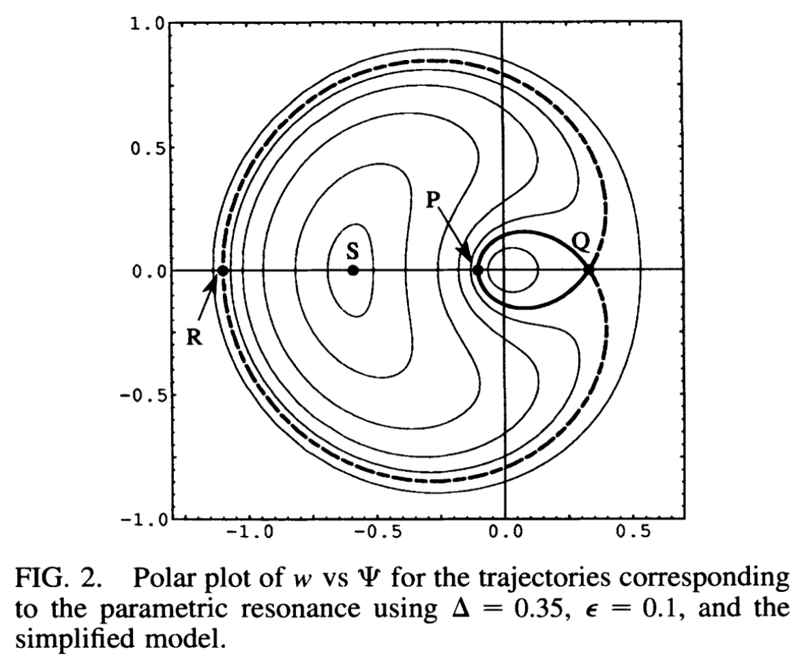{width=30%}

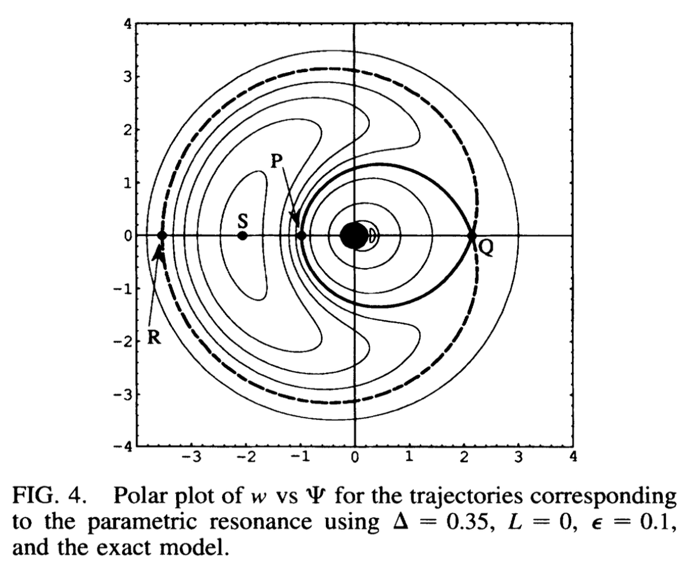{width=30%}
:::

# Particle tracking results

## Dimensionless particle-core model

The equilibrium beam radius $R_0$ occurs when $R'' = R' = 0$:

\begin{equation}
R_0 = (\varepsilon / k_0) \left[ u + \sqrt{1 + u} \right] ,
\end{equation}

where $u = Q / (2 \varepsilon k_0)$. 

Use $R_0$ and $k_0$ to define the the dimensionless coordinates $s \rightarrow k_0 s$ and $R \rightarrow R / R_0$. The equations of motion become:

\begin{align}
R'' &= -R + \frac{\eta^2}{R^3} + \frac{1 - \eta^2}{R} , \\
x'' &= -x + (1 - \eta^2) F(x) \\
F(x) &= 
\begin{cases}
    x / {R^2} & |x| \leq R , \\
    1 / x     & |x| > R ,
\end{cases}
\end{align}

where $\eta = k / k_0 = \sqrt{1 + u^2} - u$ is the tune depression ratio within the beam at the equilibrium radius.

---

{fig-align=center width=50%}

{fig-align=center width=50%}

---

{fig-align=center width=50%}

{fig-align=center width=50%}

---

{fig-align=center width=50%}

{fig-align=center width=50%}

---

{fig-align=center width=50%}

{fig-align=center width=50%}

---

{fig-align=center width=50%}

{fig-align=center width=50%}

---

{fig-align=center width=50%}

{fig-align=center width=50%}

## Resonance locking

* Suppose particle below resonant frequency is driven to larger amplitude.
* Frequency *decreases* with amplitude, toward the resonant frequency (half envelope frequency).
* Thus the particle is "locked in" to the resonance.
* Eventually, at larger amplitudes, frequency becomes too low and particle loses phase coherence.

## Stroboscopic plots

::: {.nonincremental}
* Distribute particles along $x$ axis.
* Numerically integrate ODE system envelope using `scipy.integrate.solve_ivp`.
* Plot system at minima of envelope oscillations.
:::

{fig-align=center width=200px}

## Continuous vs. stroboscopic (matched)

::: {layout-ncol=2}

:::

## Continuous vs. stroboscopic (matched)

::: {layout-ncol=2}

:::

## Continuous vs. stroboscopic (matched)

::: {layout-ncol=2}

:::

## Continuous vs. stroboscopic (mismatched)

::: {layout-ncol=2}

:::

## Continuous vs. stroboscopic (mismatched)

::: {layout-ncol=2}

:::

## Continuous vs. stroboscopic (mismatched)

::: {layout-ncol=2}

:::

---

{fig-align=center width=200px}

---

{fig-align=center width=200px}

---

{fig-align=center width=200px}

---

{fig-align=center width=200px}

---

{fig-align=center width=200px}

## Diagram rotates with envelope phase (position in lattice)

{fig-align=center width=200px}

## Comments

* Patterns in stroboscopic plots are very similar to analytic model.
* For strong space charge (small $\eta$), motion becomes chaotic near separatrix $\rightarrow$ easier for particles to be driven into halo.
* Some progress on analytic model for Gaussian distribution [@batygin_2021_chaotic]. More complicated!
* Tracking models can be extended to 3D or non-continuous focusing channels (@sec-extensions).

## PIC benchmark

* Self-consistent PIC simulation with 4D KV distribution in continuous focusing channel (run using `PyORBIT` code).
* Initial KV distribution is unstable. Some particles begin to exit core.
* Compare halo extent to separatrix from PCM.
* The following plots show the density (log scale) after each envelope oscillation.

---

{fig-align=center width=300px}

---

{fig-align=center width=300px}

---

{fig-align=center width=300px}

---

{fig-align=center width=300px}

---

{fig-align=center width=300px}

---

{fig-align=center width=300px}

---

{fig-align=center width=300px}

---

{fig-align=center width=300px}

---

{fig-align=center width=300px}

---

{fig-align=center width=300px}

---

{fig-align=center width=300px}

---

{fig-align=center width=300px}

---

{fig-align=center width=300px}

---

{fig-align=center width=300px}

---

{fig-align=center width=300px}

---

{fig-align=center width=300px}

---

{fig-align=center width=300px}

---

{fig-align=center width=300px}

---

{fig-align=center width=300px}

---

{fig-align=center width=300px}

---

{fig-align=center width=300px}

---

{fig-align=center width=300px}

---

{fig-align=center width=300px}

---

{fig-align=center width=300px}

---

{fig-align=center width=300px}

---

{fig-align=center width=300px}

---

{fig-align=center width=300px}

---

{fig-align=center width=300px}

---

{fig-align=center width=300px}

---

{fig-align=center width=300px}

---

{fig-align=center width=300px}

---

{fig-align=center width=300px}

---

{fig-align=center width=300px}

---

{fig-align=center width=300px}

---

{fig-align=center width=300px}

---

{fig-align=center width=300px}

---

{fig-align=center width=300px}

---

{fig-align=center width=300px}

---

{fig-align=center width=300px}

---

{fig-align=center width=300px}

---

{fig-align=center width=300px}

---

{fig-align=center width=300px}

---

{fig-align=center width=300px}

---

{fig-align=center width=300px}

---

{fig-align=center width=300px}

---

{fig-align=center width=300px}

---

{fig-align=center width=300px}

---

{fig-align=center width=300px}

---

{fig-align=center width=300px}

---

{fig-align=center width=300px}

---

{fig-align=center width=300px}

---

{fig-align=center width=300px}

# Extensions {#sec-extensions}

## Quadrupole channels

* Analysis in quadrupole focusing channel is much more complicated than continuous focusing channel.
* In quadrupole channel, matched envelope is not stationary with respect to $s$.
* Possibility of envelope instabilities + interaction with core-particle resonance.
* Can still identify even/odd ("breathing/quadrupole") modes; see Lund lectures for detailed analysis.
* See Lund lecture (TKS) for application of PCM to FODO lattice. 
* Older paper: application of PCM to SNS ring, including dispersion [@holmes_1999_space].
* Older paper: application of PCM to FODO channel [@ryne_1995_halos].

## PCM does not predict halo formation for matched beam in quadrupole channel.

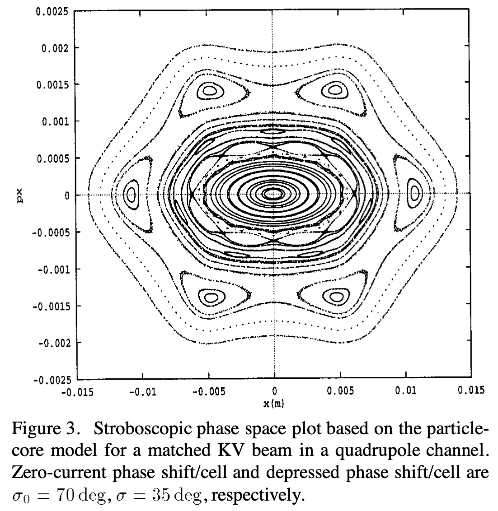{fig-align=center, width=200px}

## Matched vs. mismatched Gaussian distribution in FODO channel

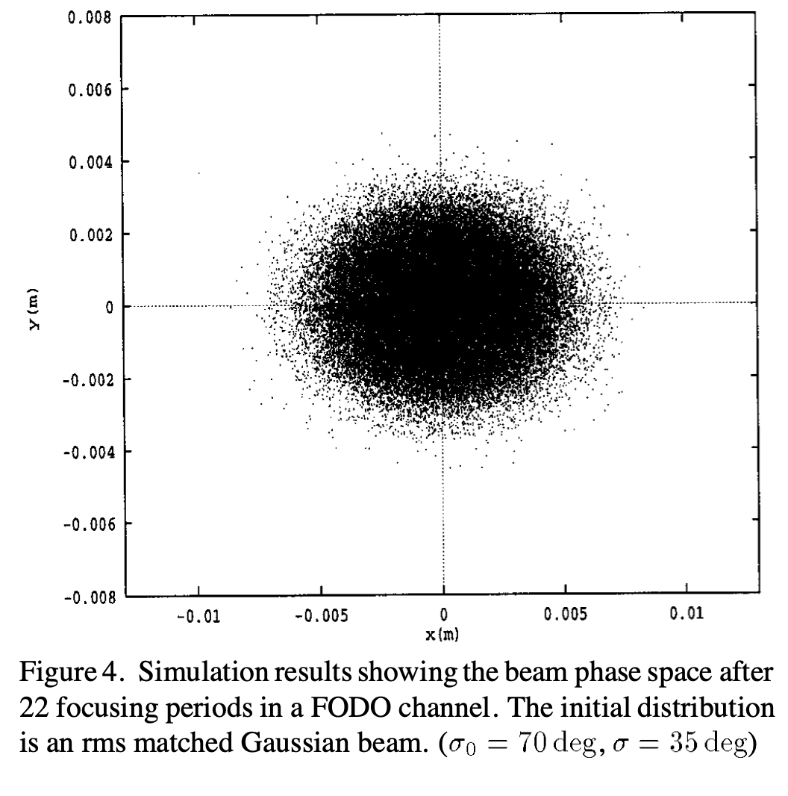{fig-align=center width=150px}

## Matched vs. mismatched Gaussian distribution in FODO channel

{fig-align=center width=150px}

## Energy spread suppresses parametric particle-core resonance

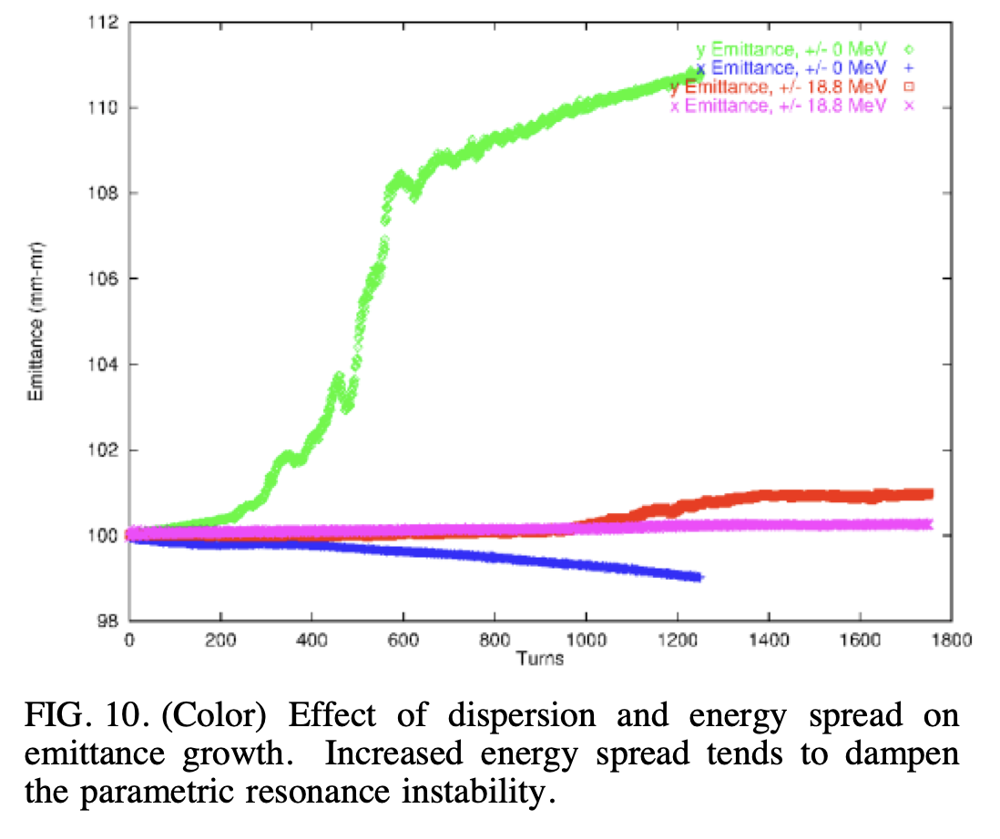{fig-align=center width=150px}

## 3D envelope modes

* It is natural to extend the particle-core analysis to three-dimensional ellipsoidal charge distributions. 
* Simplify things by restricting attention to upright beams with axial symmetry ($\phi(x, y, z) = \phi(r_\parallel, z)$). 

## Electric field in 3D ellipsoid

Equation of ellipsoid with semi-axes $r_x = r_\parallel$, $r_y = r_\parallel$ and $r_z$:

\begin{equation}
\frac{r^2}{r_{\parallel}^2} + \frac{z^2}{r_z^2} = 1
\end{equation}

Electric potential $\phi(r, z)$ within the ellipsoid [@landau_1975_classical]:

\begin{align}
\phi(r, z) &= \frac{\rho r_{\perp}^2 r_{z}}{4 \epsilon_0} \left( \alpha_{\perp} r^2 + \alpha_z z^2 - \delta \right) \\
\alpha_{\perp} &= \int_{0}^{\infty} \frac{dt}{(r_{\perp}^2 + t) \Delta} \\
\alpha_{z} &= \int_{0}^{\infty} \frac{dt}{(r_{z}^2 + t) \Delta} \\
\delta &= \frac{dt}{\Delta)} \\
\Delta &= (r_{\perp}^2 + t) (r_{z}^2 + t)^{1/2} ,
\end{align}

where $\rho$ is the charge density and $\epsilon_0$ is the electric constant.

---

For a non-relativistic beam:

\begin{align}
E_z &= -\frac{\partial \phi}{\partial z} = \frac{\rho}{\epsilon_0} f(\alpha) z , \\
E_r &= -\frac{\partial \phi}{\partial r} = \frac{\rho}{\epsilon_0} \frac{1 - f(\alpha)}{2} r ,
\end{align}

Here $\alpha = r_\parallel / r_z$ is the beam aspect ratio and

\begin{equation}
f(\alpha) = 
\begin{cases}
    \frac{\alpha^2}{1 - \alpha^2} \left[
        \frac{1}{\sqrt{1 - \alpha^2}} \tanh^{-1}{\sqrt{1 - \alpha^2}} - 1 
    \right]
    & \alpha < 1 , 
    \\
    \frac{1}{3} & \alpha = 1, 
    \\
    \frac{1}{\sqrt{\alpha^2 - 1}} \left[
        1 - \frac{1}{\sqrt{\alpha^2 - 1}} \tan^{-1}{\sqrt{\alpha^2 - 1}}            
    \right]
    & \alpha > 1 .
\end{cases}
\end{equation}

---

For a relativistic beam, define $\alpha$ as the aspect ratio in the rest frame: $\alpha = r_{\perp} / (\gamma r_z)$.

\begin{align}
\mathbf{x}_{\perp}'' &= \frac{F_{\perp}}{\gamma \beta^2 m c^2} , 
\\
z'' &= \frac{\mathbf{F}_{\perp}}{\gamma^3 \beta^2 m c^2} , 
\\
\mathbf{F}_\perp &= -\frac{q}{\gamma^2} \frac{\partial \phi}{\partial \mathbf{x}_{\perp}} 
= \frac{q \rho}{2 \epsilon_0 \gamma^2} [1 - f(\alpha)] \mathbf{x}_{\perp} ,
\\
F_z &= \frac{q}{\gamma^2} \frac{\partial \phi}{\partial z}
= \frac{q \rho}{\epsilon_0} f(\alpha) z .
\end{align}

## Linearized equation of motion

Assume constant focusing with wavenumber $k_{x0}$ in transverse plane and $k_{x0}$ in longitudinal plane.

\begin{align}
\mathbf{x}_{\perp}'' + k_{x0}^2 \mathbf{x} 
&= \frac{q \rho [1 - f(\alpha)]}{2 \gamma^3 \beta^2 m c^2 \epsilon_0} \mathbf{x}_{\perp} ,
\\
z'' + k_{z0}^2 z &= \frac{q \rho f(\alpha)}{\gamma^3 \beta^2 m c^2 \epsilon_0} z .
\end{align}

The charge density $\rho$ can be written as

\begin{equation}
\rho = \frac{3 I \lambda}{4 \pi r_{\perp}^2 r_z c} ,
\end{equation}

where $I$ is the beam current, $\lambda$ is the RF wavelength, and $c$ is the speed of light.

---

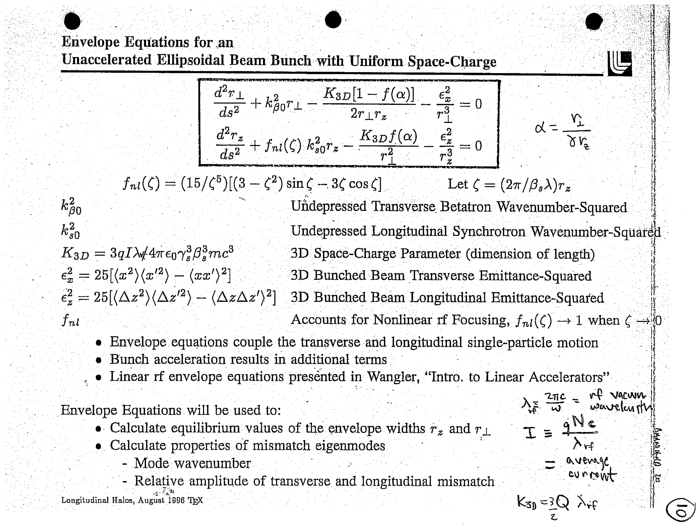{fig-align=center}

---

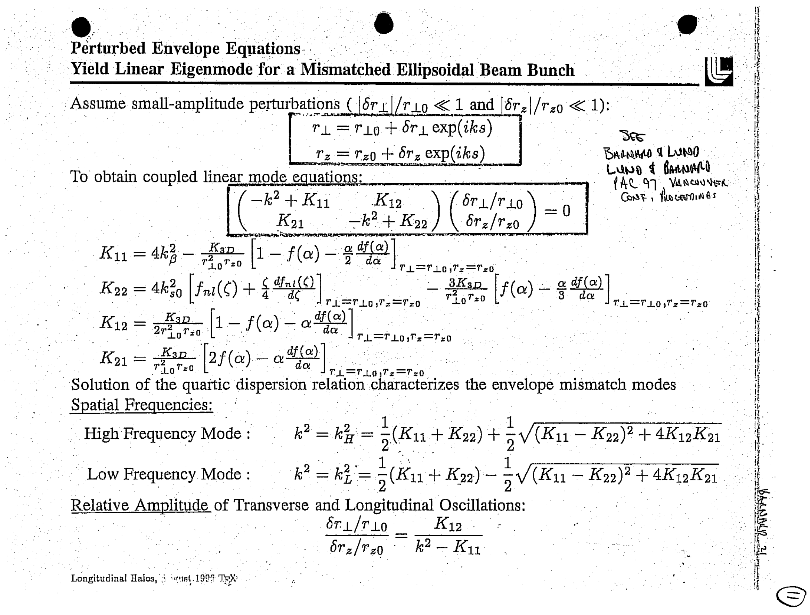{fig-align=center}

---

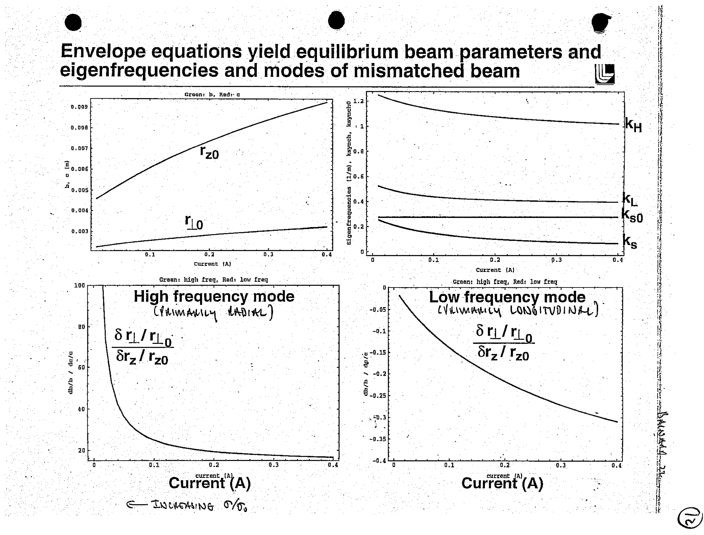{fig-align=center}

---

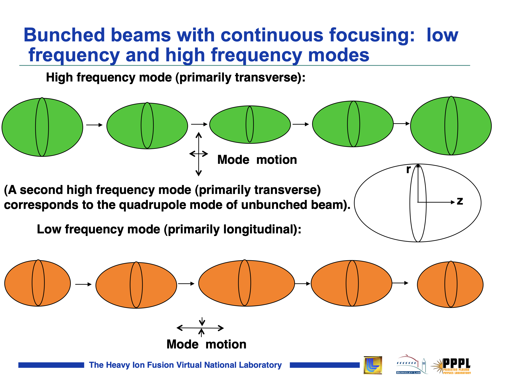{fig-align=center}

## Nonlinear RF fields suppress half-integer particle-core resonance

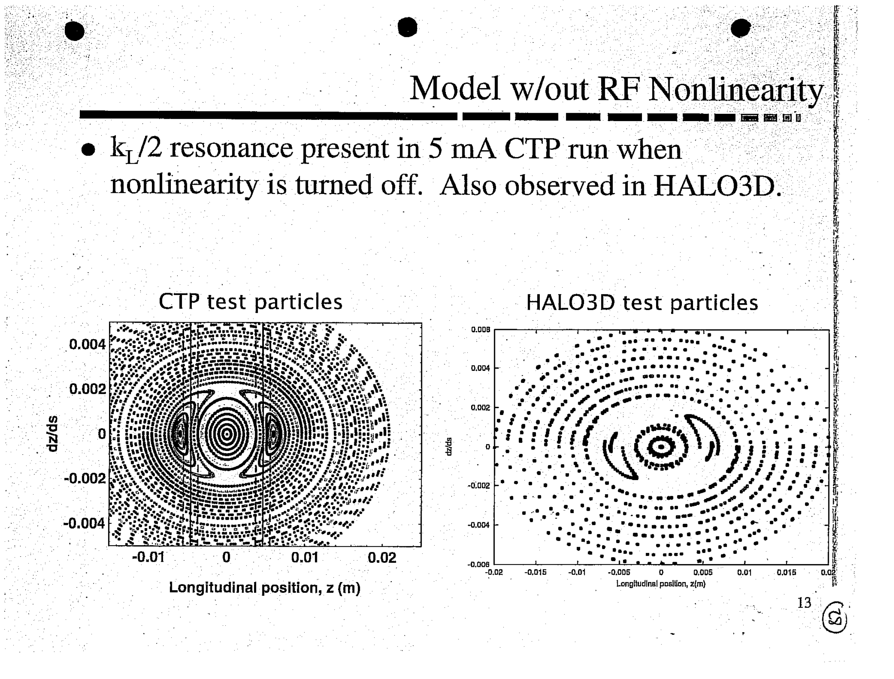{fig-align=center}

## Nonlinear RF fields suppress half-integer particle-core resonance

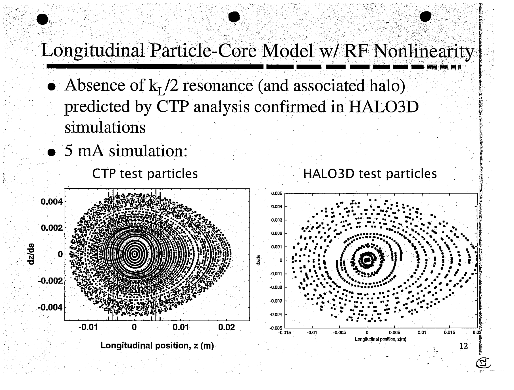{fig-align=center}

## Nonlinear RF fields suppress half-integer particle-core resonance

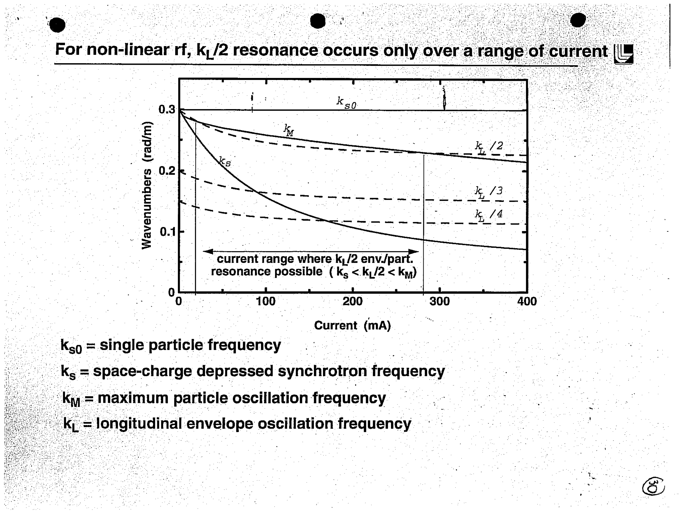{fig-align=center}

## Comments

* Envelope equations are not closed because there is no 3D KV equilibrium. Space charge forces are nonlinear.
* Extending Gluckstern's analytic approach to 3D would be very complicated.
* The paper *Halo formation in three-dimensional bunches* [@gluckstern_1998_halo] used simulations to examine 3D particle-core interaction in continuous focusing channels. This requires derivation of 3D equilibrium distributions --- see Lund lectures.
* Similar half-integer resonance structures can occur in double-harmonic RF systems (no space charge).

## Summary

* Beam core oscillations excite 2:1 parametric resonance.
* Particles just outside separatrix can be driven to large amplitudes.
* Halo amplitude bounded from nonlinear detuning outside core.
* Analytic, ODE, and PIC models agree on main features.
* Real story is more complicated. One example: [@bohn_2003_fluctuations]. Need to consider all effects together!
* See [https://github.com/austin-hoover/uspas-bpisc-2026](https://github.com/austin-hoover/uspas-bpisc-2026) for source code or to point out mistakes. 

## References {.allowframebreaks}

::: {#refs}
:::

