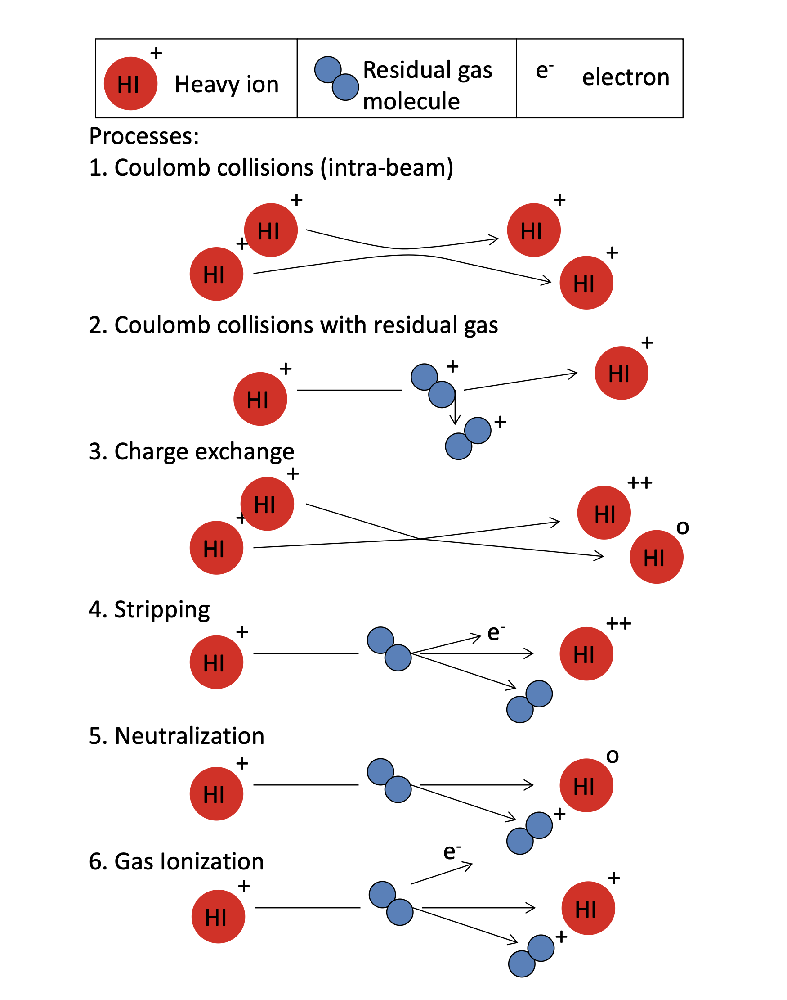
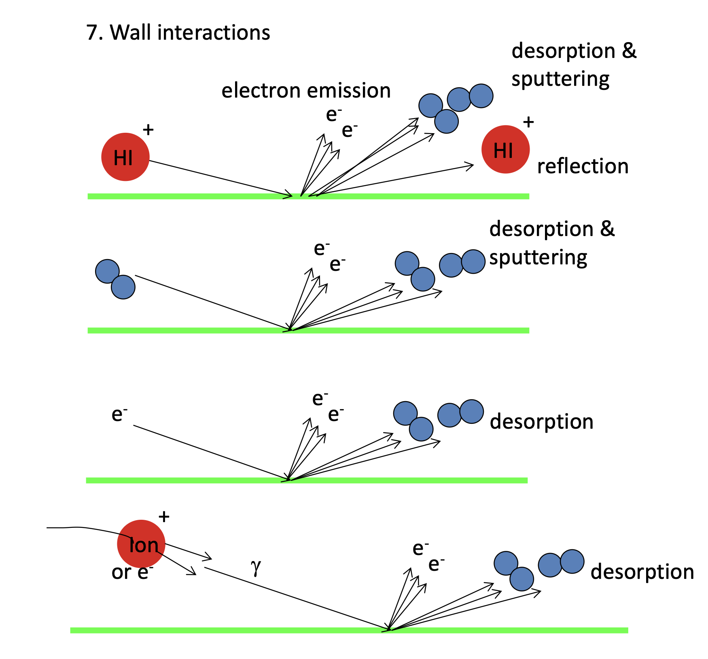
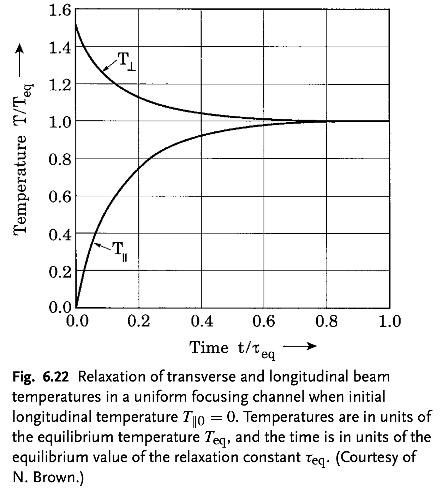

## General thoughts on collisions

* Effects depend strongly on particle mass and charge.
* Timescales are much different in circular accelerators vs. linacs ($t_{\text{residence}}$ \~ milliseconds to days vs. 10's of microseconds).
* Long vs. short pulse ($t_{pulse}$ \~ 10's of microseconds vs. 10's of nanoseconds).
* This lecture will give a brief introduction; future iteration may include more derivations.

---

{.absolute left=0 right=0 bottom=0 top=0 height="100%" style="margin: auto auto;"}

---

{.absolute left=0 right=0 bottom=0 top=0 height="100%" style="margin: auto auto;"}

# Intrabeam scattering (IBS) 

## Boltzmann equation

::: {.nonincremental}
* See [@kardar_2007_statistical] for detailed derivation of Boltzmann equation. 
* Idea is to truncate BBGYK heirarchy to ignore three-particle collisions, plus some other approximations.
* End result (after a lot of work!) is *collision integral* added to right side of Vlasov equation.
:::

\begin{align}
\frac{df}{dt} 
= 
\left\{ 
    \frac{\partial}{\partial t} 
  + \mathbf{v} \cdot \nabla_{\mathbf{x}}
  + \mathbf{F} \cdot \nabla_{\mathbf{p}}
\right\} 
f(\mathbf{x}, \mathbf{p}, t)
= \left( \frac{\partial f}{\partial t} \right)_{\text{coll}}
\end{align}

\begin{align}
\left( \frac{\partial f}{\partial t} \right)_{\text{coll}}
=\;& -\iint d\mathbf{p}_2\, d\Omega \left| \frac{d\sigma}{d\Omega} \right|
\left| \mathbf{v}_1 - \mathbf{v}_2 \right| \notag\\
&\times \Big[
f_1(\mathbf{x}_1, \mathbf{p}_1, t)\, f_1(\mathbf{x}_1, \mathbf{p}_2, t)
-
f_1(\mathbf{x}_1, \mathbf{p}_1', t)\, f_1(\mathbf{x}_1, \mathbf{p}_2', t)
\Big]
\end{align}

## Maxwell-Boltzmann equilibrium

::: {.nonincremental}
* Following Reiser [@reiser_2008_theory].
* Model RHS (collision integral) as diffusion process.
* End up with Fokker–Planck equation.
* Equilibrium (Maxwell-Boltzmann distribution) at low energies:
:::

\begin{equation}
f(\mathbf{x}, \mathbf{v}) 
=
f_0 \exp\left[ -\frac{H(\mathbf{x}, \mathbf{v})}{k_B T} \right]
=
f_0
\exp{
    \left[
        -\frac{m |\mathbf{v}|^2}{2 k_B T} 
        -\frac{q \phi(\mathbf{x})}{k_B T}
    \right]
}
\end{equation}

## Temperature relaxation in continuous focusing channel

Temperature is average kinetic energy in each plane:

\begin{align}
k_B T_x &= \langle v_x^2 \rangle \\
k_B T_y &= \langle v_y^2 \rangle \\
k_B T_z &= \langle v_z^2 \rangle \\
\end{align}

Consider effects of Coloumb collisions in a continuous focusing channel. 

Assume beam is equipartitioned in the transverse plane (T_x = T_y = T_\parallel) and that there is a temperature difference between the transverse and longitudinal temperatures ($T_\perp > T_\parallel$). 

Equilibrium distribution will be *equipartitioned/isotropic* in temperature ($T_\perp = T_\parallel$).

---

Result from [@ichimaru_1970_relaxation] for low-energy plasmas:

$$
\frac{d T_\perp}{dt} = -\frac{1}{2} \frac{d T_\parallel}{dt} = \frac{T_\parallel - T_\perp}{\tau} .
$$

(Since $T_x = T_y = T_\perp$, $T_\parallel$ changes at twice the rate of $T_\perp$.)

$$
\begin{aligned}
\tau 
&= \text{relaxation time} \\
&= \frac{15(k_B T_{\text{eff}} / mc^2)^{3/2} (4 \pi \epsilon_0)^2 m^2 c^3}{8 \pi^{1/2} q^4 \ln{\Lambda} \, n} \\
&= \left( \frac{15 \pi^{1/2}}{8 \ln{\Lambda}} \right) \frac{1}{\nu_c} ,
\end{aligned}
$$

where $\nu_c$ is the collision frequency at thermal equilibrium:

$$
\nu_c \sim \pi \left( \frac{q^2}{4 \pi \epsilon_0 k_B T} \right)^2 n_0 \left( \frac{k_B T}{m} \right)^{1/2} .
$$

---

Above we have defined $T_{\text{eff}}$ as an average of $T_\perp$ and $T_\parallel$:

$$
T_{\text{eff}} = T_\perp 
\left[ 
    \frac{15}{4} \int_{-1}^{1} \frac{\mu^2 (1 - \mu^2) d\mu}{ \left[ (1 - \mu^2) + \mu^2 (T_\parallel / T_\perp) \right]^{3/2} }
\right]^{-2/3} .
$$

Additionally, the *Coulomb parameter* $\ln\Lambda = \ln (\lambda_D / b)$, where $b$ is impact parameter for 90-degree deflection between particles.  

$$
\ln\Lambda = \begin{cases}
\ln \left[ \frac{12 \pi (\epsilon_0 k_B T_{\text{eff}})^{3/2}}{q^3 n^{1/2}} \right] , & \lambda_D < r_b \\
\ln \left[ \frac{12 \pi \epsilon_0 k_B T_{\text{eff}} r_b}{q^2} \right], & \lambda_D > r_b .
\end{cases}
$$

---

{height=300px fig-align=center}

---

{width=300px fig-align=center}

## Relaxation time typically much longer than storage time in linac

::: {.nonincremental}

* Approximate curves in previous slide as

\begin{align}
T_\perp(t)     &= \frac{2}{3} T_{\perp 0} \left( 1 + \frac{1}{2} e^{-3 t / \tau_{\text{eff}}} \right) , \\
T_\parallel(t) &= \frac{2}{3} T_{\perp 0} \left( 1 -             e^{-3 t / \tau_{\text{eff}}} \right) .
\end{align}

* $\tau_{\text{eff}} \approx 0.42 \tau_{\text{eq}} \rightarrow T_{\text{eff}} \approx 0.56 T_{\text{eq}}$.
* Example (Reiser)
    * Electron beam, 2.5 [MeV] energy, 200 [mA] current, 0.1 [eV] temperature.
    * Approximately 925 [m] to reach thermal equilibrium from Coloumb collisions.
    * But energy spread increases by 14 MeV (two orders of magnitude).
    * Observed experimentally by Boersch (1948).
* Example (Barnard)
    * [...]

::: 

---

Aren't collisions negligible? Putting in numbers for ions:

\begin{align}
\tau_{\text{eff}} &= 
4.3 \cdot 10^{-4} [s]
\left( \frac{A^{1/2}}{Z^4} \right)
\left( \frac{k T_{\text{eff}}}{[eV]} \right)^{3/2}
\left( \frac{15}{\ln\Lambda} \right)
\left( \frac{10^{10} [cm^{-3}]}{n} \right) \\
\Lambda &= \frac{1.5 \cdot 10^5 (k_B T / [eV])^{3/2} }{Z^3 (n / 10^{10} [cm^{-3}])} 
\end{align}

Example: 2 MeV injector:

[...]

## Intrabeam scattering in rings

[...]

# Coulomb collisions in residual gas

---

Rate of change of momentum transverse to velocity:

$$
\frac{dp_x}{dt} = \frac{Z Z_g e^2}{4 \pi \epsilon_0 r^2} \frac{b}{r}
$$

Total change in momentum:

$$
\begin{aligned}
\Delta p
&= \int_{-\infty}^{\infty} \frac{dp_x}{dt} dt \\
&= \int_{-\infty}^{\infty} \frac{dp_x}{dt} \frac{dt}{dz} dz \\
&= \frac{Z Z_g e^2 b}{4 \pi \epsilon_0 v} \int_{\infty}^{\infty} \frac{dz}{(z^2 + b^2)^{3/2}} \\
&= \frac{2 Z Z_g e^2 b}{4 \pi \epsilon_0 v b} .
\end{aligned}
$$

Approximate deflection angle $\theta$:

$$
\theta \approx \frac{\Delta p}{p} = \frac{2 Z Z_g e^2 b}{4 \pi \epsilon_0 p v b}
$$

This implies $db/d\theta \sim 1 / \theta^2$.

---

The differential cross section $d\sigma$ for scattering with impact parameter $b$ into solid angle $d\Omega$ at angle $\theta$ satisfies

$$
\underbrace{2 \pi b db}_{\text{Area}} = \frac{d\sigma}{d\Omega} \underbrace{2 \pi \sin\theta d\theta}_{\text{Solid angle}}
$$

Therefore,

$$
\frac{d\sigma}{d\Omega} 
= \frac{b}{\sin\theta} \left| \frac{db}{d\theta} \right|
= \left( \frac{2 Z Z_g e^2}{4 \pi \epsilon_0 p v} \right)^2 \frac{1}{\theta^4}
$$

Electron screening puts cutoff at small $\theta$ (large $b$), so better to use:

$$
\frac{d\sigma}{d\Omega} = \left( \frac{2 Z Z_g e^2}{4 \pi \epsilon_0 p v} \right)^2 \frac{1}{\left( \theta^2 + \theta_{min}^2 \right)} .
$$

---

Average angle squared for a single scattering event is:

$$
\begin{aligned}
\langle \theta \rangle^2
&= \frac{\int \theta^2 \frac{d\sigma}{d\Omega} 2 \pi \sin\theta d\theta}{\int \frac{d\sigma}{d\Omega} 2 \pi \sin\theta d\theta} .
\end{aligned}
$$

Assuming $\theta_{max}^2 \gg \theta_{min}^2$ and $\ln(\theta_{max} / \theta_{min}) \gg 1$, we have an approximate expression for $\bar\theta^2$:

$$
\begin{aligned}
\langle \theta \rangle^2 &\approx 
\frac
{\int_{0}^{\theta_{max}} \frac{\theta^3}{(\theta^2 + \theta_{min}^2)^2} d\theta}
{\int_{0}^{\theta_{max}} \frac{\theta  }{(\theta^2 + \theta_{min}^2)^2} d\theta} \\
&\approx 2 \theta_{min}^2 \ln{\left( \frac{\theta_{max}}{\theta_{min}} \right)} .
\end{aligned}
$$

## Multiple collisions

After traversing distance $s$ and undergoing $N_s$ collisions, the mean square angle $\langle \Theta^2 \rangle$ can be written

$$
\begin{aligned}
\langle \Theta^2 \rangle \\
&= N_s \langle \theta \rangle^2 \\
&= n_g \sigma_s s \langle\theta\rangle^2 \\
&= 8 \pi n_g \left( \frac{Z Z_g e^2}{4 \pi \epsilon_0 m c^2 \gamma \beta^2} \right)^2 \ln\left(\frac{\theta_{max}}{\theta_{min}}\right) s
\end{aligned}
$$

Writing

$$
\langle \Theta^2 \rangle = \langle x'^2 \rangle + \langle y'^2 \rangle = 2 \langle x'^2 \rangle ,
$$

and taking the $s$-derivative gives a dynamical equation for $\langle x'^2 \rangle$:

\begin{align}
\frac{d}{ds} \langle x'^2 \rangle 
&= 4 \pi n_g \left( \frac{Z Z_g e^2}{4 \pi \epsilon_0 m c^2 \gamma \beta^2} \right)^2 \ln\left(\frac{\theta_{max}}{\theta_{min}}\right) \\
&\equiv C .
\end{align}

## Approximation of $\theta_{min}$ and $\theta_{max}$

Jackson argues that $\theta_{max}$ arises from the distributed nature of the nucleus and $\theta_{min}$ from the screening of electrons or the quantum uncertainty principle.

$$
\ln\left(\frac{\theta_{max}}{\theta_{min}}\right)
\approx 2 \ln\left( 204 Z_g^{-1/3} \right)
$$

## How does scattering affect the envelope equations?

*Thin lens approximation*: assume the scattering locally changes the transverse momentum without directly changing the position.

Let the initial phase space coordinates be $x = x_0$ and $x' = x_0'$. After an incremental distance $\delta s$,

\begin{align}
x  &\rightarrow x_0 \\
x' &\rightarrow x_0' + \delta x'.
\end{align}

We can then calculate the incremental change in the second-order moments:

$$
\begin{aligned}
delta \langle x'^2 \rangle &= \langle \dots \rangle
\end{aligned}
$$

# Charge-changing collisions

##

# Electron cloud

##

# Electron-ion instability

##

## References

::: {#refs}
:::