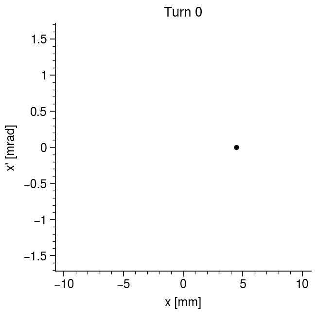

        
# 2D envelope modes in continuous focusing channels

## Equilibrium beam radius

Start from the KV envelope equations:

$$
\begin{aligned}
r_x'' + \kappa_x(s) r_x - \frac{2 Q}{r_x + r_y} - \frac{\varepsilon_x^2}{r_x^3} &= 0,
\\
r_y'' + \kappa_y(s) r_y - \frac{2 Q}{r_x + r_y} - \frac{\varepsilon_y^2}{r_y^3} &= 0,
\end{aligned}
$${#eq-env}

where $r_{x, y}$ are the beam ellipse radii, $\varepsilon_{x, y}$ are the invariant emittances, $\kappa_{x, y}(s)$ are the linear focusing strengths, and $Q$ is the dimensionless perveance.

## Equilibrium beam radius

Assume a continuous, axisymmetric lattice: $\kappa_x(s) = \kappa_y(s) = k_0^2$. Also assume that the beam has equal emittances in both planes: $\varepsilon_x = \varepsilon_y = \varepsilon$.

$$
\begin{aligned}
r_x'' + k_0^2 r_x - \frac{2 Q}{r_x + r_y} - \frac{\varepsilon^2}{r_x^3} &= 0 ,
\\
r_y'' + k_0^2 r_y - \frac{2 Q}{r_x + r_y} - \frac{\varepsilon^2}{r_y^3} &= 0.
\end{aligned}
$${#eq-env-continuous}

## Equilibrium beam radius

Equilibrium occurs at $r_x = r_y = r_0$ when $r_x'' = r_y'' = 0$, indicating exact force balance between internal and external fields.

$$
r_0 = \frac{Q^{1/2}}{k_0} \left[ \frac{1}{2} + \frac{1}{2} \sqrt{1 + \frac{4 k_0^2 \varepsilon^2}{Q^2}} \right]^{1/2}.
$${#eq-env-radius-2}

In the limit of a space-charge-dominated beam ($2 \kappa_0 \varepsilon \ll Q$), or emittance-dominated beam ($2 \kappa_0 \varepsilon \gg Q$), the equilibrium radius approaches

$$
r_0 \rightarrow 
\begin{cases}
    \sqrt{Q} / {k_0}, & 2 k_0 \varepsilon \ll Q, \\
    \sqrt{\varepsilon / k_0}, & 2 k_0 \varepsilon \gg Q.
\end{cases}
$${#eq-1}

The equilibrium beam size increases with the beam perveance and emittance and decreases with the lattice focusing strength. 

## Space charge tune depression

Particles perform harmonic oscillations within the equilibrium beam distribution:

$$
\begin{align}
    x'' + k^2 x = 0, \\
    y'' + k^2 y = 0, \\
\end{align}
$${#eq-1}

where $k^2$ is the *depressed frequency*:

$$ \label{eq:depressed_focusing_strength}
    k^2 \equiv k_0^2 - \frac{Q}{r_0^2}.
$${#eq-1}

We can also use $k^2$ to simplify the expression for the equilibrium radius in @eq-env-radius-2:

$$
r_0 = \sqrt{\frac{\varepsilon}{k}}.
$${#eq-1}

This makes sense: the equilibrium radius depends on the *relative* strengths of the external and self-generated fields.

## Test image

{width=50% fig-align=center}

## Test animation

{width=50% fig-align=center}

## Test scrollable slide

Lorem ipsum dolor sit amet, consectetur adipiscing elit. Sed egestas at magna ut rhoncus. Donec euismod est tortor, sit amet posuere eros porta nec. Morbi convallis vestibulum leo eu consectetur. Sed felis mi, maximus vel viverra id, rhoncus quis dui. Curabitur eu lacus at dolor consequat sagittis a a mi. Fusce sed dolor vitae leo tincidunt condimentum a vel dui. Etiam sodales ornare neque quis efficitur. Sed in imperdiet elit, luctus pellentesque lacus. Ut et eleifend eros. Vestibulum sapien sapien, pellentesque et mi ullamcorper, hendrerit sodales sem. Nunc nec gravida lorem. Mauris vitae nisl nec tortor lacinia fringilla. Duis at dignissim ipsum, quis euismod massa. Suspendisse condimentum felis sit amet blandit commodo.

Quisque malesuada suscipit massa nec posuere. Morbi mi ante, ultricies sed libero nec, elementum tempus leo. Fusce pulvinar pharetra nulla, eu fermentum nisl. Etiam eget vestibulum nisi, vitae faucibus ex. Duis lobortis ultricies enim, eu pretium ex efficitur vitae. Nam accumsan orci sagittis semper ullamcorper. Phasellus in felis id leo luctus fermentum vitae eget tortor. Donec semper a ligula et pharetra. Cras vitae molestie risus, sit amet rutrum velit. In gravida augue magna, nec consectetur erat feugiat id.

Maecenas et posuere sem, sed volutpat diam. Donec non est enim. Pellentesque malesuada lacus lacus, sit amet cursus diam feugiat id. Mauris pretium imperdiet tristique. Integer sed odio faucibus, luctus turpis non, tristique ex. Sed quis dignissim nunc, in mollis enim. Morbi tempus mollis magna, ut condimentum dui mollis a. Vivamus eget diam sed nulla fermentum imperdiet. Vivamus malesuada, purus sed venenatis fringilla, sapien ligula imperdiet purus, quis scelerisque lacus diam non felis. Vestibulum ante ipsum primis in faucibus orci luctus et ultrices posuere cubilia curae; Orci varius natoque penatibus et magnis dis parturient montes, nascetur ridiculus mus. Nulla tempus nisl id orci elementum, eget mollis neque ornare. Nam vulputate sed eros quis maximus.

Donec egestas quam eget nisl condimentum, vitae tempus nulla placerat. Curabitur aliquam turpis justo, sed gravida felis volutpat non. Nam egestas commodo purus, sed eleifend ligula gravida sit amet. Suspendisse et ipsum vel augue tincidunt elementum. Ut pellentesque lorem ut elit tempus facilisis. Pellentesque eget dictum libero. Nunc convallis sem id nunc placerat, id facilisis nulla malesuada. Nunc vulputate pharetra libero, et auctor lectus feugiat ut. Ut feugiat venenatis volutpat. Donec scelerisque mattis nisl, sit amet iaculis mi commodo eu. Vestibulum bibendum non magna sodales venenatis. Suspendisse dapibus nisl et fringilla congue. Vestibulum ante ipsum primis in faucibus orci luctus et ultrices posuere cubilia curae; Etiam a justo turpis. Nunc sit amet cursus dolor. Aliquam pretium lobortis nisi in sagittis.

Vestibulum semper felis eu velit viverra interdum. Aenean non lacinia nunc. Nulla hendrerit enim vel lorem laoreet, sit amet tempus sem egestas. Suspendisse potenti. Integer libero leo, efficitur a risus eu, interdum egestas justo. Pellentesque nec tellus eu arcu vulputate tristique. Sed eget justo pharetra, suscipit leo in, lobortis leo. Maecenas sit amet lectus at nulla pellentesque fringilla. Donec a fringilla lectus. Pellentesque volutpat mauris eget ligula tempus venenatis ac dignissim felis. Donec nibh risus, pretium et massa congue, pretium facilisis purus. Donec eleifend sem sed magna fermentum pellentesque.

## Test citation

This sentence ends with a citation @qiang_2026_study.

# 3D envelope modes in continuous focusing channels

## Section 1

Lorem ipsum dolor sit amet, consectetur adipiscing elit. Sed egestas at magna ut rhoncus. Donec euismod est tortor, sit amet posuere eros porta nec. Morbi convallis vestibulum leo eu consectetur. Sed felis mi, maximus vel viverra id, rhoncus quis dui. Curabitur eu lacus at dolor consequat sagittis a a mi. Fusce sed dolor vitae leo tincidunt condimentum a vel dui. Etiam sodales ornare neque quis efficitur. Sed in imperdiet elit, luctus pellentesque lacus. Ut et eleifend eros. Vestibulum sapien sapien, pellentesque et mi ullamcorper, hendrerit sodales sem. Nunc nec gravida lorem. Mauris vitae nisl nec tortor lacinia fringilla. Duis at dignissim ipsum, quis euismod massa. Suspendisse condimentum felis sit amet blandit commodo.

# Particle-core model of halo formation

## Section 2

Lorem ipsum dolor sit amet, consectetur adipiscing elit. Sed egestas at magna ut rhoncus. Donec euismod est tortor, sit amet posuere eros porta nec. Morbi convallis vestibulum leo eu consectetur. Sed felis mi, maximus vel viverra id, rhoncus quis dui. Curabitur eu lacus at dolor consequat sagittis a a mi. Fusce sed dolor vitae leo tincidunt condimentum a vel dui. Etiam sodales ornare neque quis efficitur. Sed in imperdiet elit, luctus pellentesque lacus. Ut et eleifend eros. Vestibulum sapien sapien, pellentesque et mi ullamcorper, hendrerit sodales sem. Nunc nec gravida lorem. Mauris vitae nisl nec tortor lacinia fringilla. Duis at dignissim ipsum, quis euismod massa. Suspendisse condimentum felis sit amet blandit commodo.

## Test slide

Some text.

::: {.notes}
Test speaker notes.
:::

## References

::: {#refs}
:::