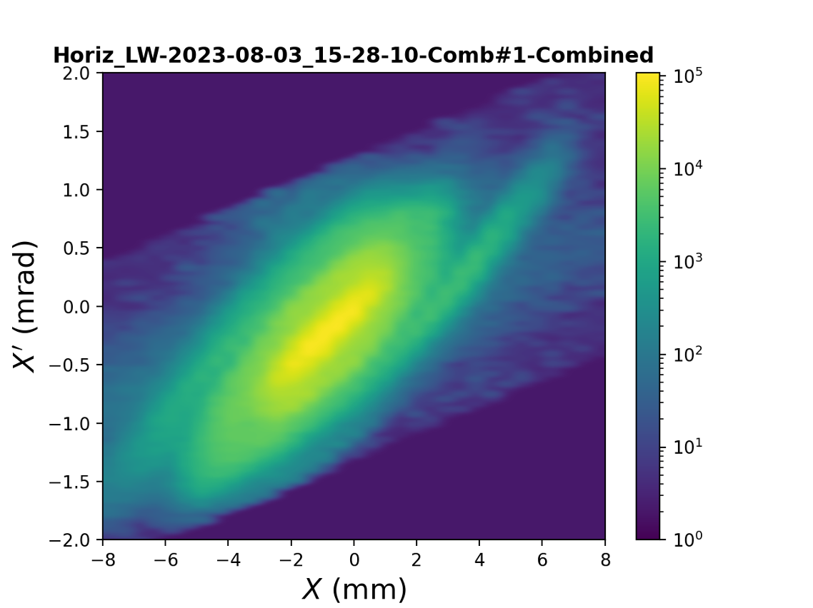
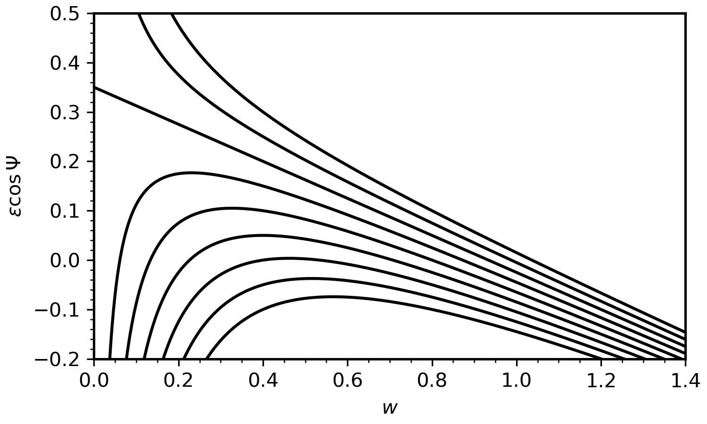
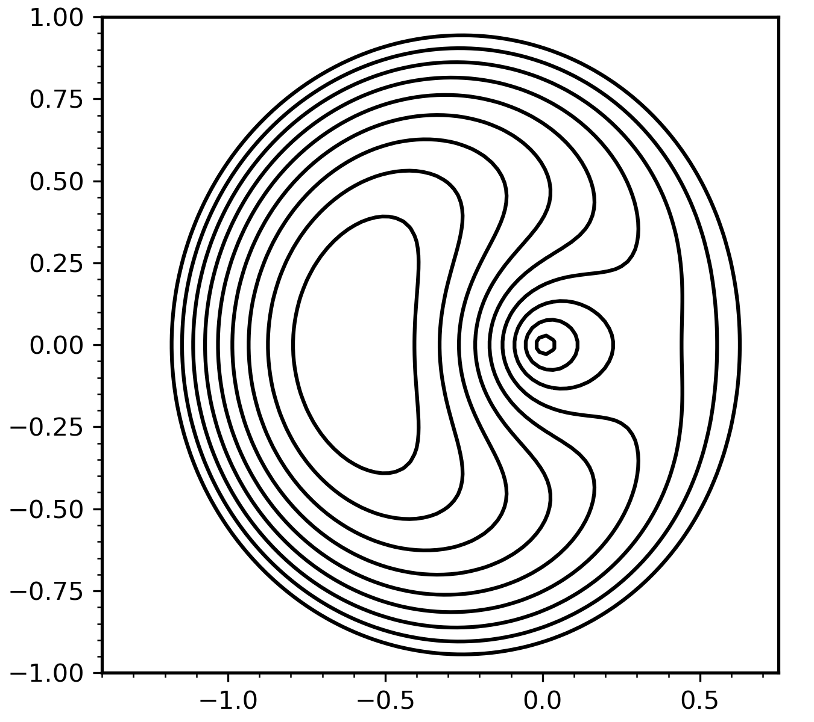
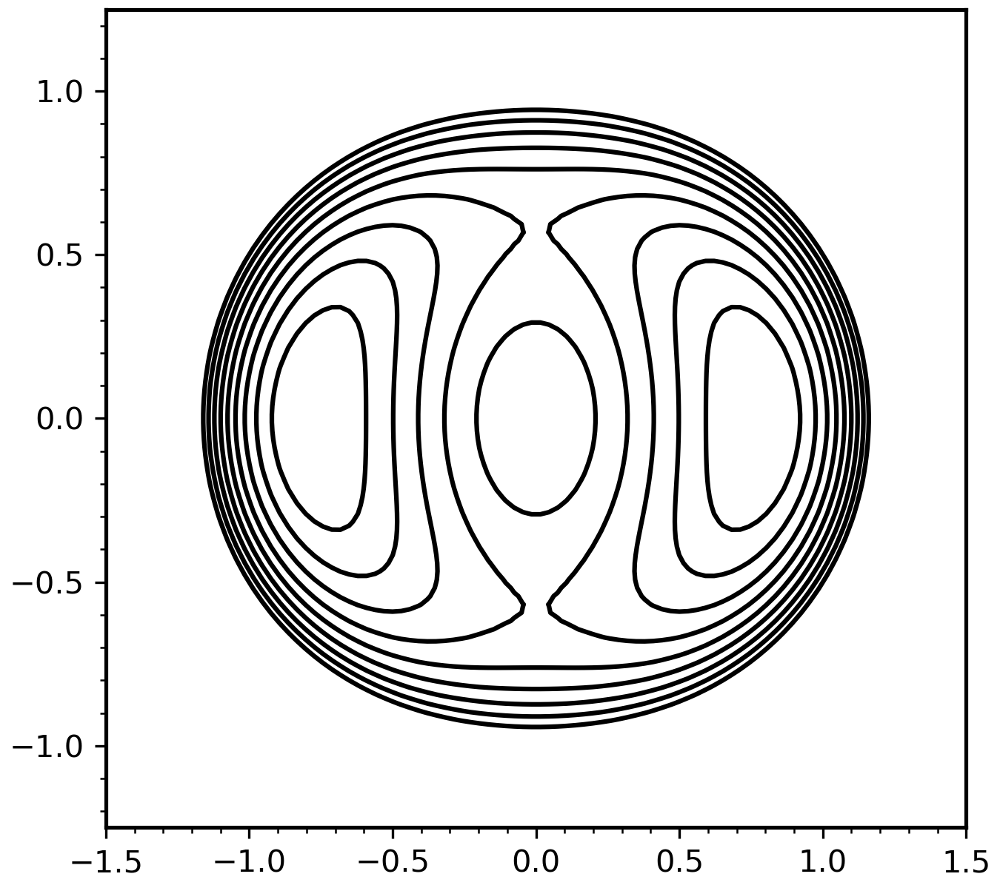

# 2D envelope modes in continuous focusing channels

## Derivation of equilibrium beam radius

The KV envelope equations describe the evolution of the elliptical beam radii $r_{x, y}$ in a linear focusing system:

$$
\begin{equation}
\begin{aligned}
    r_x'' + \kappa_x(s) r_x - \frac{2 Q}{r_x + r_y} - \frac{\varepsilon_x^2}{r_x^3} &= 0,
    \\
    r_y'' + \kappa_y(s) r_y - \frac{2 Q}{r_x + r_y} - \frac{\varepsilon_y^2}{r_y^3} &= 0,
\end{aligned}
\end{equation}
$$

where $\varepsilon_{x, y}$ are the invariant emittances, $Q$ is the beam perveance, and $\kappa_{x, y}(s)$ are the linear focusing strengths. We will study continuous, axisymmetric focusing systems with $\kappa_x(s) = \kappa_y(s) = k_0^2$. We will also assume equal emittances in each plane: $\varepsilon_x = \varepsilon_y = 0$. With these assumptions, the envelope equations become:

$$
\begin{equation}
\begin{aligned}
    r_x'' + k_0^2 r_x - \frac{2 Q}{r_x + r_y} - \frac{\varepsilon^2}{r_x^3} &= 0,
    \\
    r_y'' + k_0^2 r_y - \frac{2 Q}{r_x + r_y} - \frac{\varepsilon^2}{r_y^3} &= 0.
\end{aligned}
\end{equation}
$${#eq-env-continuous}

An equilibrium occurs when $r_x'' = r_y'' = 0$, indicating exact balance between external and internal forces. This gives the following expression for the equilibrium radius $r_x = r_y = r_0$:

$$
\begin{equation}
    k_0^2 r_0 - Q r_0^{-1} - \varepsilon_2 r_0^{-3} = 0.
\end{equation}
$${#eq-equilibrium-radius-equation}

Solving @eq-equilibrium-radius-equation for $r_0$ gives:

$$
\begin{equation}
    r_0 = \frac{Q^{1/2}}{k_0} \left[ \frac{1}{2} + \frac{1}{2} \sqrt{1 + \frac{4 k_0^2 \varepsilon^2}{Q^2}} \right]^{1/2}.
\end{equation}
$${#eq-radius}

In the limit of a space-charge-dominated beam ($2 \kappa_0 \varepsilon \ll Q$), or emittance-dominated beam ($2 \kappa_0 \varepsilon \gg Q$), the equilibrium radius approaches

$$
\begin{equation}
  r_0 \rightarrow \left\{
  \begin{array}{@{}ll@{}}
    \sqrt{Q} / {k_0}, & 2 k_0 \varepsilon \ll Q, \\
    \sqrt{\varepsilon / k_0}, & 2 k_0 \varepsilon \gg Q.
  \end{array}
  \right.
\end{equation} 
$$

## Definition of depressed betatron frequency

The single-particle equations of motion in the continuous focusing system are:

$$
\begin{equation}
\begin{aligned}
    x'' + k_0^2 x - \frac{2 Q}{r_x + r_y} \frac{x}{r_x} = 0, \\
    y'' + k_0^2 y - \frac{2 Q}{r_x + r_y} \frac{y}{r_y} = 0.
\end{aligned}
\end{equation}

At equilibrium ($r_x = r_y = r_0$),

\begin{equation}
\begin{aligned}
    x'' + \left( k_0^2 - \frac{Q}{r_0^2} \right) x = 0, \\
    y'' + \left( k_0^2 - \frac{Q}{r_0^2} \right) y = 0. \\
\end{aligned}
\end{equation}

We thus define the \textit{depressed} (net) focusing strength $k^2$:

$$
\begin{equation}
    k^2 \equiv k_0^2 - \frac{Q}{r_0^2},
\end{equation}
$${#eq-depressed-focusing-strength}
so that the single-particle equations of motion take the following form:

\begin{equation}
\begin{aligned}
    x'' + k^2 x = 0, \\
    y'' + k^2 y = 0. \\
\end{aligned}
\end{equation}

## Perturbation of equilibrium distribution

Define deviations from the equilibrium radius in each plane;

$$
\begin{equation} 
\begin{aligned}
    r_x(s) = r_0 + \eta_x(s), \\
    r_y(s) = r_0 + \eta_y(s). \\
\end{aligned}
\end{equation}
$${#eq-env-deviations}

Substituting @eq-env_deviations into @eq-env_continuous gives:

\begin{equation}
\begin{aligned}
    \eta_x'' + k_0^2 (r_0 + \eta_x) - \frac{Q}{r_0} \left(1 + \frac{\eta_x + \eta_y}{2 r_0}\right)^{-1} - \frac{\varepsilon^2}{r_0^3} \left( 1 + \frac{\eta_x}{r_0} \right)^{-3} &= 0, 
    \\
    \eta_y'' + k_0^2 (r_0 + \eta_y) - \frac{Q}{r_0} \left(1 + \frac{\eta_x + \eta_y}{2 r_0}\right)^{-1} - \frac{\varepsilon^2}{r_0^3} \left( 1 + \frac{\eta_y}{r_0} \right)^{-3} &= 0.
\end{aligned}
\end{equation}

We will assume the deviations $\eta_y$ and $\eta_x$ are much smaller than the equilibrium radius $r_0$. With this assumption, we may linearize the perturbed envelope equations via the approximation $(1 + x)^r \approx 1 + rx$. This gives:

\begin{equation}
\begin{aligned}
    \eta_x'' + k_0^2 (r_0 + \eta_x) - \frac{Q}{r_0} \left( 1 - \frac{\eta_x + \eta_y}{2 r_0} \right) - \frac{\varepsilon^2}{r_0^3} \left(1 - 3 \frac{\eta_x}{r_0} \right) = 0,
    \\
    \eta_y'' + k_0^2 (r_0 + \eta_y) - \frac{Q}{r_0} \left( 1 - \frac{\eta_x + \eta_y}{2 r_0} \right) - \frac{\varepsilon^2}{r_0^3} \left(1 - 3 \frac{\eta_y}{r_0} \right) = 0.
\end{aligned}
\end{equation}

Factoring $\eta_x$ and $\eta_y$ gives:

\begin{equation}
\begin{aligned}
    \eta_x'' + \left( k_0^2 + \frac{Q}{2 r_0^2} + \frac{3 \varepsilon^2}{r_0^4} \right) \eta_x + \left( \frac{Q}{2 r_0^2} \right) \eta_y &= 0,
    \\
    \eta_y'' + \left( k_0^2 + \frac{Q}{2 r_0^2} + \frac{3 \varepsilon^2}{r_0^4} \right) \eta_y + \left( \frac{Q}{2 r_0^2} \right) \eta_x &= 0,
\end{aligned}
\end{equation}

where we have used @eq-equilibrium-radius-equation to eliminate the remaining terms. Using the definition of $k$ (@eq-depressed-focusing-strength) we find:

$$
\begin{equation}
\begin{aligned}
\eta_x'' + \left( \frac{3}{2}k_0^2 + \frac{5}{2} k^2 \right) \eta_x + \left( \frac{1}{2}k_0^2 - \frac{1}{2} k^2 \right) \eta_y &= 0,
\\
\eta_y'' + \left( \frac{3}{2}k_0^2 + \frac{5}{2} k^2 \right) \eta_y + \left( \frac{1}{2}k_0^2 - \frac{1}{2} k^2 \right) \eta_x &= 0.
\end{aligned}
\end{equation}
$${#eq-env-pert-coupled-1}

## Eigenmode analysis or perturbed envelope equations

@eq-env-pert-coupeld-1 defines a coupled linear system of equations for $\eta_{x, y}$. We will analyze this system in terms of its normal modes. In vector form, @eq-env-pert-coupeld-1 can be written:

\begin{equation}
    \mathbf{\eta}'' + \mathbf{A}\mathbf{\eta} = 0,
\end{equation}

where $\mathbf{\eta} = [\eta_x, \eta_y]^T$ is the vector of perturbed envelope radii and $\mathbf{A}$ is a matrix of coefficients:

\begin{equation}
    \mathbf{A} = 
    \begin{bmatrix}
        \alpha_1 & \alpha_2 \\ \alpha_2 & \alpha_1
    \end{bmatrix},
\end{equation}

with entries defined as: 

\begin{equation}
\begin{aligned}
    \alpha_1 &= \frac{3}{2}k_0^2 + \frac{5}{2} k^2 , \\
    \alpha_2 &= \frac{1}{2}k_0^2 - \frac{1}{2} k^2.
\end{aligned}
\end{equation}

We search for solutions of the form

\begin{equation} \label{eq:ansantz}
\mathbf{\eta}_\pm(s) = \mathbf{\eta}_0 e^{i k_\pm s},
\end{equation}

where $k_\pm$ are two distinct frequencies. This leads to an eivenvalue problem:

\begin{equation}
    \left( \mathbf{A} - \mathbf{I} k_\pm^2 \right) \mathbf{\eta}_\pm = 0.
\end{equation}

The eigenvalues correspond to the following frequencies, written in terms of the natural frequency $k_0$ and depressed frequency $k$, are:

\begin{equation}
\begin{aligned}
    k_+ &= \alpha_1 + \alpha_2 = 2k_0^2 + 2k^2. \\
    k_- &= \alpha_1 - \alpha_2 =  k_0^2 + 3k^2.
\end{aligned}
\end{equation}

The frequencies correspond to eigenvectors $\mathbf{\eta}_\pm$:

\begin{equation}
\begin{aligned}
    \mathbf{\eta}_+ &= \sqrt{\frac{1}{2}} 
    \begin{bmatrix} +1 \\ +1 \end{bmatrix} \quad \text{(breathing mode)}.
    \\    
    \mathbf{\eta}_- &= \sqrt{\frac{1}{2}} 
    \begin{bmatrix} +1 \\ -1 \end{bmatrix} \quad \text{(quadrupole mode)}.
    \\
\end{aligned}
\end{equation}

[Plots showing mode frequency vs. tune depression.]

[Plots showing breathing vs. quadrupole model.]

# 3D envelope modes in continuous focusing channels

It is natural to extend the above analysis to three-dimensional systems. We will simplify things by restricting our attention to upright beams with axial symmetry. We study the coupling between the transverse radius $r_\perp$ and the longitudinal radius $r_z$.

[...]

# Particle-core models of halo formation

## Introduction

Beam distributions in high-intensity accelerators tend to develop a low-density cloud of charge surrounding a dense, oscillating core, which we call a *halo*. For example, @fig-sns-lw shows the measured two-dimensional phase space density after acceleration in the Spallation Neutron Source (SNS) linac. Although the halo density can be orders of magnitude less than the core, it still presents a problem in the SNS and other high-power facilities. The accelerator operating power is ultimately constrained by uncontrolled *beam loss*, which leads to radioactivation in the accelerator tunnel. High-power facilities must adhere to strict beam loss limits---typically set at 1 W/m. For a 1-MW beam, the loss limit corresponds to one out of every million particles, or a fractional loss of $10^{-6}$. Once the loss limit is reached, increasing the beam power requires a proportional decrease in the beam loss. Understanding the mechanisms of halo formation is, therefore, highly relevant for modern and future high-power accelerators.

{#fig-sns-lw width=400px}

In this section, we introduce a class of \textit{particle-core} models of space-charge-driven halo formation. Such models describe the motion of "test" particles in the field of an oscillating beam core, where the core is unaffected by the test particles. The particle-core treatment is, of course, much simpler than the self-consistent Vlasov-Poisson (V-P) treatment of the dynamics. The approach is useful because it isolates important halo formation mechanisms within a simple model, and because these mechanisms appear in the more realistic simulations.

We will continue to focus on KV equilibria in two-dimensional, axisymmetric, continuous focusing systems. Particles in the KV distribution experience only \textit{linear} forces and remain within the hard-edged beam core for all time. But suppose a particle deviates from its characteristic trajectory within the beam. For example, suppose the particle exists the core. What will happen? 

Return to @fig-mode-freq which plots the envelope mode frequencies $k_{\pm}$ as a function of the depressed single-particle frequency (a measure of space charge intensity). Particles far from the core oscillate at the natural frequency $k_0$, which is determined by the external focusing strength. Particles inside the core oscillate at the depressed frequency $k \le k_0$. Outside the core, the oscillation frequency decreases continuously and nonlinearly with the radius $r$. We expect resonances to occur when the particle oscillation frequency is a multiple of the envelope frequency $k_\pm$---particularly when the envelope frequency is \textit{twice} the single-particle frequency. We also expect resonances to be enhanced by larger oscillations of the beam. [...]

This section will focus on an important paper written by Gluckstern in 1994 \cite{?}. At the time, the maximum halo extent was an important theoretical question---and an important practical question for the design of new high-power accelerator. Gluckstern used classical perturbation theory to derive an approximate Hamiltonian to describe the resonant particle dynamics and, consequently, an upper bound on the halo amplitude. The Hamiltonian contours form the famous ``peanut diagram'' and is reproduced quite well by PIC simulations. [...]

## Equations of motion

Consider a matched KV distribution of radius $R$ in a continuous focusing channel. The single-particle equation of motion in the horizontal plane is

\begin{equation}
\begin{aligned}
    x'' + k_0^2 x &= 
    \begin{cases}
      \frac{Q}{R^2} x, & r \le R,\\
      \frac{Q}{r^2} x, &  r \ge R ,
    \end{cases} 
\end{aligned}
\end{equation}

where $r^2 = x^2 + y^2$.  (The equation is the same in the vertical plane.) For convenience, we will rewrite the equations using the step function function $\Theta$:

$4
\begin{equation}
    x'' + k_0^2 x = 
    \underbrace{\left(\frac{Q}{r^2}\right) x \Theta(r - R)}_{\text{Exterior}} +  \underbrace{\left(\frac{Q}{R^2}\right) x \Theta(R - r)}_{\text{Interior}} ,
\end{equation}
$${#eq-pcm-eom-exact}

where

$$
\begin{equation}
\Theta(x) =
    \begin{cases}
      1, & x \ge 0,\\
      0, &  x < 0 .
    \end{cases} 
\end{equation}
$$

Define a sinusoidal perturbation of the beam envelope radius:

\begin{equation}
    R(s) + R_0 \left( 1  - \epsilon \cos(k_+ s) \right),
\end{equation}

where $k_+$ is the breathing mode frequency, $R_0$ is the equilibrium radius, and $\epsilon$ is the strength of the perturbation. Subtracting the linear defocusing force $Q x / R_0^2$ from both sides gives

$$
\begin{equation}
    x'' + k^2 x = 
    -\frac{Q}{R_0^2} \left( 1 - \frac{R_0^2}{r^2} \right) x \Theta(r - R)
    +  Q \left( \frac{1}{R^2} -  \frac{1}{R_0^2}\right) x \Theta(R - r) ,
\end{equation}
$${#eq-pcm-eom-perturbed}

where $k^2$ is the depressed oscillation frequency within the beam:

$$
\begin{equation}
    k^2 =  k_0^2 - \frac{Q}{R_0^2}.
\end{equation}
$${#eq-depressed-frequency}

If $\epsilon$ is small,  the $1 / R^{2}$ term can be approximated by truncating its Taylor series expansion:

$$
\begin{equation}
    R^{-2} 
    = R_0^{-2} \left( 1 - \epsilon \cos(k_{+}s) \right)^{-2} 
    \approx R_0^{-2} \left( 1 + 2 \epsilon \cos(k_+ s) \right).
\end{equation}
$${#eq-pcm-taylor}

Substituting the approximation into the equation of motion gives:

$$
\begin{equation}
    x'' + k^2 x
    = -\frac{Q}{R_0^2} \left( 1 - \frac{R_0^2}{r^2} \right) x \Theta(r - R)
    + \frac{2 \epsilon Q}{R_0^2} x \cos(k_+ s) \Theta(R - r) .
\end{equation}
$${#eq-pcm-eom}

The first term is a nonlinear force that gives rise to an amplitude-dependent frequency. The second term is a linear force arising from the envelope perturbation. This term allows the transfer of particles from the interior to the exterior of the hard-edged beam core.

We will make two further approximations in our analysis. First, we will assume there is no angular momentum and simply the one-dimensional oscillations along the $x$ axis. Second, we will approximate the nonlinear defocusing outside the beam using a \textit{pendulum model}:

$$
\begin{equation}
    x'' + k^2 x
    = -\frac{Q}{R_0^4} x^3 + \frac{2 \epsilon Q}{R_0^2} x \cos(k_+ s).
\end{equation}
$${#eq-pcm-eom-pendulum}

Note that the second term (core oscillation) now extends beyond the core. While the pendulum model is a crude approximation of the external nonlinearity, it can still capture the essential physics. We will return to the full model later on. 

## Phase-amplitude coordinates

To analyze the equations of motion in @eq-pcm-eom-pendulum}, we transform to amplitude-phase coordinates $A$, $\psi$:

\begin{align}
\frac{x(s)}{R_0} &\equiv A(s) \sin(\psi(s)) ,\label{eq:pcm_phase_amp_x} \\
\frac{x'(s)}{R_0} &\equiv k A(s) \cos(\psi(s)), \label{eq:pcm_phase_amp_xp}
\end{align}

with the phase $\psi(s)$ defined as

$$
\begin{equation}
    \psi(s) = k s + \alpha(s),
\end{equation}
$${#eq-pcm-psi}

where $ks$ is the unperturbed phase advance within the beam and $\alpha(s)$ is a slowly varying function. We will derive dynamical equations for $A$ and $\psi$ by substituting @eq-pcm-phase-amp-x and @eq-pcm-phase-amp-xp into @eq-pcm-eom-pendulum. First, note that the $s$-derivative of @eq-pcm-phase-amp-x gives

\begin{equation}
    \frac{x'}{R_0} = A' \sin\psi + A (k + \alpha') \cos\psi .
\end{equation}

Therefore, from the definition in @eq-pcm-phase-amp-x,

$$
\begin{equation}
    A' \sin\psi + \alpha' A \cos\psi = 0.
\end{equation}
$${#eq-pcm-deriv-x}

The derivative of $x'$ in @eq-pcm-phase-amp-xp gives

$$
\begin{equation}
    \frac{x''}{R_0} = k A' \cos\psi - k A (k + \alpha') \sin\psi .
\end{equation}
$${#eq-pcm-deriv-xp}

The equation of motion @eq-pcm-eom-pendulum can then be written as

$$
\begin{equation}
    R_0 k \left( A' \cos\psi - A \alpha' \sin\psi  \right) = f(A, \psi, s),
\end{equation}
$${#eq-pcm-eom-pendulum-amp-phase}

where $f(A, \psi, s)$ is the driving force on the right hand side of @eq-pcm-eom-pendulum expressed in the new coordinates:

$$
\begin{align}
    f(A, \psi, s) &= \frac{Q}{R_0} \left[ -A^3 \sin^3\psi + 2 \epsilon A \sin\psi \cos(k_+ s) \right] .
\end{align}
$${#eq-pcm-amp-phase-drive}

@eq-pcm-deriv-x and @eq-pcm-eom-pendulum-amp-phase} define a linear system to solve for $A'$ and $\alpha'$.

\begin{equation}
    \begin{bmatrix}
        kR_0 \cos\psi & -k R_0 A\sin\psi \\
        \sin\psi & A \cos\psi
    \end{bmatrix}
    \begin{bmatrix}
        A' \\ \alpha'
    \end{bmatrix}
    = 
    \begin{bmatrix}
        f \\ 0
    \end{bmatrix} .
\end{equation}

Solving the linear system gives the dynamics of the amplitude and phase:

$$
\begin{align}
    A'       &= \frac{f(A, \psi, s)}{k R_0  } \cos\psi , \\
    -\alpha' &= \frac{f(A, \psi, s)}{k R_0 A} \sin\psi .
\label{eq:pcm_dyn_phase}.
\end{align}
$${#eq-pcm-amp-phase-dynamics}

## Phase averaging

We expect resonance to occur when the envelope oscillation frequency $k_+$ is a multiple of the particle oscillation frequency $k$. Therefore, we define a shifted phase coordinate $\Psi$ which will vary slowly near the resonant frequency:

$$
\begin{equation}
    \Psi \equiv 2 \psi - k_{+}s. 
\end{equation}
$${#eq-pcm-psi-shifted}

Using this new variable, the driving force in @eq-pcm-amp-phase-drive becomes

$$
\begin{align}
    f(A, \Psi, \psi) &= \frac{Q}{R_0} \left[ -A^3 \sin^3\psi + 2 \epsilon A \sin\psi \cos(2\psi - \Psi) \right] ,
\end{align}
$${#eq-pcm-amp-phase-drive-new}

and the full expressions for $A'$ and $\alpha'$ become:

$$
\begin{align}
A' &= \frac{Q}{k R_0^2} \left[ A^3 \sin^3\psi \cos\psi + 2 \epsilon A \sin\psi \cos\psi \cos(2\psi - \Psi) \right]
\\
\alpha' &= \frac{Q}{k R_0^2} \left[ A^2 \sin^4\psi - 2 \epsilon \sin^2\psi \cos(2\psi - \Psi) \right]
\end{align}
$${#eq-pcm-dyn}

We now average the expressions @eq-pcm-dyn over one period:

\begin{equation}
\begin{aligned}
A'      &\rightarrow \frac{1}{2\pi} \int_{0}^{2\pi} A'      d\psi
= \frac{\epsilon Q}{2 k R_0^2} A \sin\Psi ,
\\
\alpha' &\rightarrow \frac{1}{2\pi} \int_{0}^{2\pi} \alpha' d\psi 
= \frac{3Q}{8 k R_0^2}A^2  + \frac{\epsilon Q}{2 k R_0^2} \cos\Psi .
\end{aligned}
\end{equation}

The resonant phase $\Psi$ is held constant during the integration.

Switching to variables $w = A^2 / R_0^2$ and $\Psi' = (2k - k_+) + 2 \alpha'$:

\begin{align}
w'    &= \frac{\epsilon Q}{k R_0^2} w \sin\Psi , \\
\Psi' &= \frac{Q}{kR_0^2} \left[ -\Delta + \frac{3w}{4} + \epsilon \cos\Psi \right] ,
\end{align}

where 

\begin{equation}
    \Delta = k (k_+ - 2k) \frac{R_0^2 }{Q} .
\end{equation}

The variables $w$ and $\Psi$ are canonically conjugate: their evolution equations can be derived from a Hamiltonian $H$:

\begin{align}
    H(w, \Psi) &= \frac{Q}{k R_0^2} \left[ \Delta w - \frac{3}{8}w^2 - \epsilon w \cos\Psi \right] , \\
    w'    &= \partial H / \partial \Psi , \\
    \Psi' &= \partial H \partial w . 
\end{align}

## Analysis of the Hamiltonian

@fig-ham-eps-cos-psi plots [...]

@fig-ham-polar plots the contours of the Hamiltonian as a function of $w \cos\Psi$ and $w \sin\Psi$. Note that $w$ is the \textit{squared} amplitude. [...]

@fig-ham-xxp plots the Hamiltonian contours as a function of the phase space variables $x$ and $x'$. [...]

{#fig-ham-eps-cos-psi width=400px}

{#fig-ham-polar width=400px}

{#fig-ham-xxp width=400px}

## Comparison to exact model

The exact (hard-edged) model in @eq-pcm-eom-exact can be treated in the same way. [...]

## Particle tracking results

\textcolor{red}{[This will follow the beginning of Barnard lecture (with all the pictures).]}

## Three-dimensional particle-core models

\textcolor{red}{[Will cover longitudinal stuff in Barnard lecture.]}

## Summary

        

## References

::: {#refs}
:::