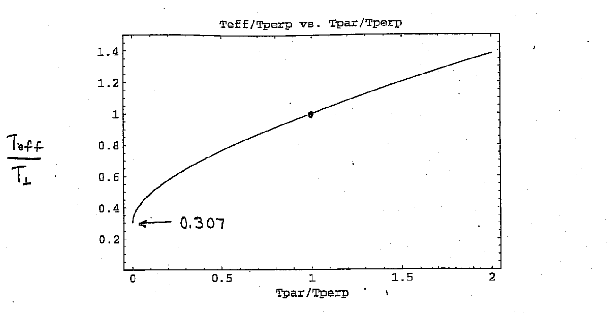
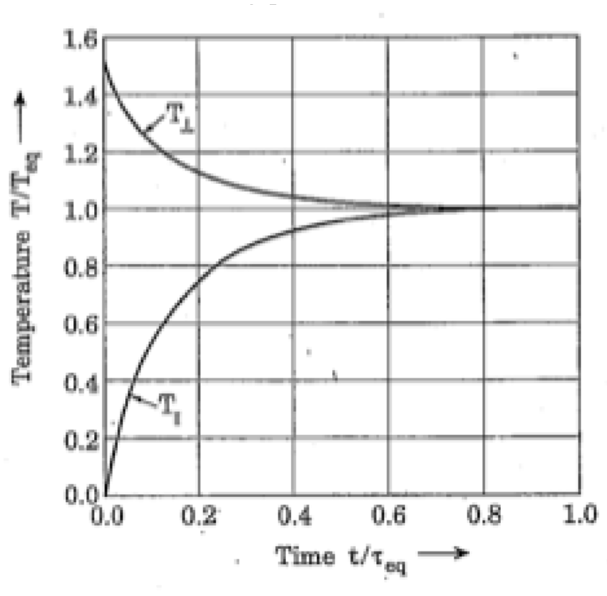

# Coulomb collisions

## Gas and electron effects

* Effects depend strongly on particle mass and charge.
* Timescales are much different in circular accelerators vs. linacs ($t_{residence}$ \~ milliseconds to days vs. 10's of microseconds).

* Long vs. short pulse ($t_{pulse}$ \~ 10's of microseconds vs. 10's of nanoseconds).

##

{.absolute left=0 right=0 bottom=0 top=0 height="100%" style="margin: auto auto;"}

##

{.absolute left=0 right=0 bottom=0 top=0 height="100%" style="margin: auto auto;"}

## Coulomb collisions

Consider effects of Coulomb collisions in a continuous beam propagating through a continuous focusing channel with $T_{\perp} \ne T_{\parallel}$. (If $T_{\perp} \ne T_{\parallel}$, the beam is already relaxed.)

From Ichimaru and Rosenbluth @ichimaru_1970_relaxation:

$$
\frac{d T_\perp}{dt} = -\frac{1}{2} \frac{d T_\parallel}{dt} = \frac{T_\parallel - T_\perp}{\tau} .
$$

(Since $T_x = T_y = T_\perp$, $T_\parallel$ changes at twice the rate of $T_\perp$. Abd since $2 k_B T_\perp + k_B T_\parallel = \text{constant}$.)

$$
\begin{aligned}
\tau 
&= \text{relaxation time} \\
&= \frac{15(k_B \tilde{T} / mc^2)^{3/2} (4 \pi \epsilon_0)^2 m^2 c^3}{8 \pi^{1/2} q^4 \ln{\Lambda} \, n} \\
&= \left( \frac{15 \pi^{1/2}}{8 \ln{\Lambda}} \right) \frac{1}{\nu_c} ,
\end{aligned}
$$

where $\nu_c$ is the collision frequency at thermal equilibrium:

$$
\nu_c \sim \pi \left( \frac{q^2}{4 \pi \epsilon_0 k_B T} \right)^2 n_0 \left( \frac{k_B T}{m} \right)^{1/2} .
$$

Above we have defined $\tilde{T}$ as an average of $T_\perp$ and $T_\parallel$:

$$
\tilde{T} = T_\perp 
\left[ 
    \frac{15}{4} \int_{-1}^{1} \frac{\mu^2 (1 - \mu^2) d\mu}{ \left[ (1 - \mu^2) + \mu^2 (T_\parallel / T_\perp) \right]^{3/2} }
\right]^{-2/3} ,
$$

and the quantity $\ln\Lambda$ as

$$
\ln\Lambda = \begin{cases}
\ln \left[ \frac{12 \pi (\epsilon_0 k_B \tilde{T})^{3/2}}{q^3 n^{1/2}} \right] , & \lambda_D < r_b \\
\ln \left[ \frac{12 \pi \epsilon_0 k_B \tilde{T} r_b}{q^2} \right], & \lambda_D > r_b .
\end{cases}
$$

##

{height=400 fig-align=center}

[...]

##

{height=400 fig-align=center}

[...]

## The Boersch effect

Aren't collisions negligible? Putting in numbers for ions:

$$
\begin{align}
\tau_{\text{eff}} &= 
4.3 \cdot 10^{-4} [s]
\left( \frac{A^{1/2}}{Z^4} \right)
\left( \frac{k \tilde{T}}{[eV]} \right)^{3/2}
\left( \frac{15}{\ln\Lambda} \right)
\left( \frac{10^{10} [cm^{-3}]}{n} \right) \\
\Lambda &= \frac{1.5 \cdot 10^5 (k_B T / [eV])^{3/2} }{Z^3 (n / 10^{10} [cm^{-3}])} 
\end{align}
$$

Example: 2 MeV injector:

[...]

# Beam-gas scattering

## Coulomb collisions in residual gas

Rate of change of momentum transverse to velocity:

$$
\frac{dp_x}{dt} = \frac{Z Z_g e^2}{4 \pi \epsilon_0 r^2} \frac{b}{r}
$$

Total change in momentum:

$$
\begin{aligned}
\Delta p
&= \int_{-\infty}^{\infty} \frac{dp_x}{dt} dt \\
&= \int_{-\infty}^{\infty} \frac{dp_x}{dt} \frac{dt}{dz} dz \\
&= \frac{Z Z_g e^2 b}{4 \pi \epsilon_0 v} \int_{\infty}^{\infty} \frac{dz}{(z^2 + b^2)^{3/2}} \\
&= \frac{2 Z Z_g e^2 b}{4 \pi \epsilon_0 v b} .
\end{aligned}
$$

Approximate deflection angle $\theta$:

$$
\theta \approx \frac{\Delta p}{p} = \frac{2 Z Z_g e^2 b}{4 \pi \epsilon_0 p v b}
$$

This implies $db/d\theta \sim 1 / \theta^2$.

The differential cross section $d\sigma$ for scattering with impact parameter $b$ into solid angle $d\Omega$ at angle $\theta$ satisfies

$$
\underbrace{2 \pi b db}_{\text{Area}} = \frac{d\sigma}{d\Omega} \underbrace{2 \pi \sin\theta d\theta}_{\text{Solid angle}}
$$

Therefore,

$$
\frac{d\sigma}{d\Omega} 
= \frac{b}{\sin\theta} \left| \frac{db}{d\theta} \right|
= \left( \frac{2 Z Z_g e^2}{4 \pi \epsilon_0 p v} \right)^2 \frac{1}{\theta^4}
$$

Electron screening puts cutoff at small $\theta$ (large $b$), so better to use:

$$
\frac{d\sigma}{d\Omega} = \left( \frac{2 Z Z_g e^2}{4 \pi \epsilon_0 p v} \right)^2 \frac{1}{\left( \theta^2 + \theta_{min}^2 \right)} .
$$

Average angle squared for a single scattering event is:

$$
\begin{aligned}
\langle \theta \rangle^2
&= \frac{\int \theta^2 \frac{d\sigma}{d\Omega} 2 \pi \sin\theta d\theta}{\int \frac{d\sigma}{d\Omega} 2 \pi \sin\theta d\theta} .
\end{aligned}
$$

Assuming $\theta_{max}^2 \gg \theta_{min}^2$ and $\ln(\theta_{max} / \theta_{min}) \gg 1$, we have an approximate expression for $\bar\theta^2$:

$$
\begin{aligned}
\langle \theta \rangle^2 &\approx 
\frac
{\int_{0}^{\theta_{max}} \frac{\theta^3}{(\theta^2 + \theta_{min}^2)^2} d\theta}
{\int_{0}^{\theta_{max}} \frac{\theta  }{(\theta^2 + \theta_{min}^2)^2} d\theta} \\
&\approx 2 \theta_{min}^2 \ln{\left( \frac{\theta_{max}}{\theta_{min}} \right)} .
\end{aligned}
$$

## Multiple collisions

After traversing distance $s$ and undergoing $N_s$ collisions, the mean square angle $\langle \Theta^2 \rangle$ can be written

$$
\begin{aligned}
\langle \Theta^2 \rangle \\
&= N_s \langle \theta \rangle^2 \\
&= n_g \sigma_s s \langle\theta\rangle^2 \\
&= 8 \pi n_g \left( \frac{Z Z_g e^2}{4]pi \epsilon_0 m c^2 \gamma \beta^2} \right) \ln\left(\frac{\theta_{max}}{\theta_{min}}\right) s
\end{aligned}
$$

Jackson argues that $\theta_{max}$ arises from the distributed nature of the nucleus and $\theta_{min}$ from the screening of electrons or the quantum uncertainty principle.

# Charge-changing processes

# Gas pressure instability

# Electron cloud processes

# Electron-ion instability