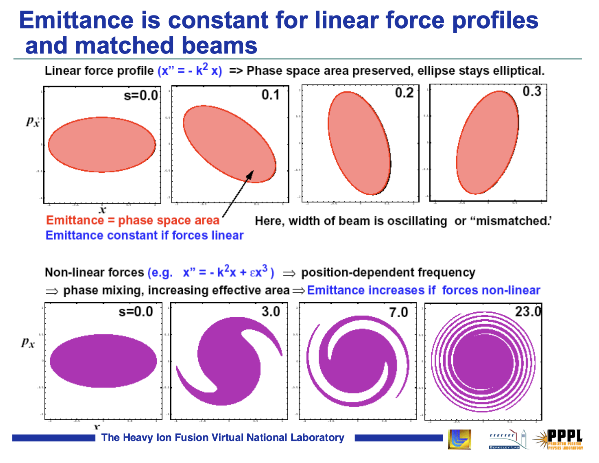

## Overview 

* We'll use concepts/techniques from plasma physics to describe intense charged particle beams.
* This lecture introduces the *kinetic theory* of plasmas, a self-consistent treatment including both external and self-generated electromagnetic fields. 
* We'll derive the Vlasov-Poisson (V-P) equations, which are the basis of the analysis in the rest of the course.

# Useful quantities

* We start by introducing several useful quantities: the *Debye length*, *plasma parameter*, and *plasma frequency*. 
* These quantities are derived for neutral plasmas in thermal equilibrium, but they will also appear in the analysis of charged particle beams (non-neutral plasmas).

## Debye length

* Consider uniform density of electrons and ions over all space.

$$
n_i(\mathbf{x}) = n_e(\mathbf{x}) = n_0
$$

* Add test particle of charge $q_T$ and infinite mass at $\mathbf{x} = 0$.
* How does the test particle change the electric potential $\phi(\mathbf{x})$?

---

Poisson equation:

$$
\nabla^2 \phi(\mathbf{x}) = 
-\underbrace{\frac{e \left( n_i(\mathbf{x}) - n_e(\mathbf{x}) \right) }{\epsilon_0}}_{\text{background}} 
- \underbrace{\frac{q_T \delta(\mathbf{x}) }{\epsilon_0}}_{\text{perturbation}} ,
$${#eq-poisson}

where $e$ is elementary charge, $\epsilon_0$ is electric constant, $n_e(\mathbf{x})$ is electron density, $n_i(\mathbf{x})$ is ion density, and $\delta$ is Dirac delta function.

Electron-electron collisions drive electron distribution to thermal equilibrium at temperature $T_e$ (measured in eV):

$$
n_e(\mathbf{x}) = n_0 \exp{ \left( \frac{e \phi(\mathbf{x})}{T_e} \right) } 
$${#eq-1}

Ion-ion collisions eventually drive ion distribution to equilibrium at temperture $T_i$.

$$
n_i(\mathbf{x}) = n_0 \exp{ \left( -\frac{e \phi(\mathbf{x})}{T_i} \right) } 
$${#eq-1}

Stop here, before electron-ion collisions relax the entire distribution to equilibrium at the same temperature.

---

Assume thermal energy dominates: $e \phi \ll T_{i, e}$. Truncate exponential after single term in Taylor series:

$$
\exp{ \left( \frac{e \phi(\mathbf{x})}{T_e} \right) } \approx 1 + \frac{e \phi(\mathbf{x})}{T_e}
$${#eq-1}

Insert truncated density functions into @eq-poisson. Away from the origin, in radial coordiantes ($r = |\mathbf{x}|$):

$$
\frac{1}{r^2} \frac{\partial }{\partial r} \left( r^2 \frac{\partial \phi}{\partial r} \right) 
= \frac{e^2 n_0}{\epsilon_0} \left( \frac{1}{T_e} + \frac{1}{T_i} \right) \phi(r) .
$${#eq-poisson-radial}

Define **Debye length** $\lambda_{e}$ and $\lambda_i$ for electrons and ions:

$$
\lambda_{e} = \sqrt{\frac{\epsilon_0 T_{e}}{n_0 e^2}}, \quad\quad \lambda_{i} = \sqrt{\frac{\epsilon_0 T_{i}}{n_0 e^2}}
$$

And the total Debye length $\lambda_D^{-2} = \lambda_e^{-2} + \lambda_i^{-2}$ such that

$$
\frac{1}{r^2} \frac{\partial }{\partial r} \left( r^2 \frac{\partial \phi}{\partial r} \right) 
= \lambda_D^{-2} \phi(r) .
$${#eq-poisson-radial-debye}

--- 

The solution to @eq-poisson-radial-debye is the *Yukawa potential*:

$$
\boxed{
\phi(r) = \frac{q_T}{4 \pi \epsilon_0 r} e^{-r/\lambda_D} = \phi_0(r) e^{-r/\lambda_D}
}
$${#eq-yukawa}

* Describes *screening* effect: test particle attracts cloud of opposite charge.
* Deybe length $\lambda_D$ sets length scale for *collective* vs. *collisional* effects.
* Similar potentials appear in nuclear physics.

## Plasma parameter

For a collection of particles with average density $n_0$, the average nearest-neighbor distance is given by $n_0^{-1/3}$. The average potential energy between particles is given by

$$
\left| q\phi(\mathbf{x}) \right| \sim q^2 r^{-1} \sim q^2 n_0^{1/3}, 
$${#eq-1}

ignoring scaling factors. We will assume that the average kinetic energy $T$ is much larger than the average nearest-neighbor potential energy:

$$
T \gg q^2 n_0^{1/3}.
$${#eq-1}

This can be equivalently stated by defining the *plasma parameter* $\Lambda$:

$$
\Lambda \equiv n_0 \lambda_D^3 \gg 1.
$${#eq-plasma-parameter}

The plasma parameter defines the average number of particles within a *Debye cube* of volume $\lambda_D^3$. We will assume @eq-plasma-parameter is satisfied for all systems studied in this course. Systems for which the average nearest-neighbor potential energy is comparable to the average kinetic energy are labeled *strongly coupled* plasmas and will not be considered.

## Plasma frequency

The *plasma frequency* $\omega_p$ is derived by considering a one-dimensional slab of uniform density ions and electrons, constrained to the region $0 \le x \le L$. Displacing the electrons by a small distance $\Delta \ll L$ will create an electric field $E(\Delta) = - n_0 q \Delta / \epsilon_0$. The resulting harmonic oscillations are described by

$$
\ddot{\Delta} + \omega^2 \Delta = 0,
$${#eq-1}

where

$$
\omega_p \equiv \left( \frac{n_0 q^2}{\epsilon_0 m} \right)^{1/2}.
$${#eq-1}

The relationship between the plasma frequency and Debye length defines the *thermal velocity* $v_p$:

$$
v_p \equiv \omega_p \lambda_D = \left( \frac{T}{m} \right)^{1/2}.
$${#eq-1}

The Debye length $\lambda_D$, plasma frequency $\omega_p$, and thermal velocity $v_p$ define the characteristic length and time scales of collective oscillations.

# Klimontovich Equation

## Klimontovich Equation

Consider a set of $N$ point-particles moving in the six-dimensional phase space defined by the position vector $\mathbf{x} = (x, y, z)$ and momentum vector $\mathbf{p} = (p_x, p_y, p_z)$. Let $\left\{ \mathbf{X}_i(t) ,\mathbf{P}_i(t) \right\}$ be the coordinates of particle number $i$ at time $t$. For simplicity, we will only consider a single particle species with mass $m$ and charge $q$; the generalization to multiple species is straightforward. Let $f^m(\mathbf{x}, \mathbf{p}, t)$ be the particle density at point $(\mathbf{x}, \mathbf{p})$ in the phase space at time $t$:

$$
    f^m(\mathbf{x}, \mathbf{p}, t) = 
    \sum_{i=1}^{N}
    \delta \left[ \mathbf{x} - \mathbf{X}_i(t) \right]
    \delta \left[ \mathbf{p} - \mathbf{P}_i(t) \right],
$${#eq-dist-dirac}

where $\delta$ is the Dirac delta function and $m$ stands for *microscopic*, indicating a singular distribution function describing a set of point-particles, rather than a smooth density. The total number of particles is constant and is given by the integral of the density function over the phase space coordinates:

$$
    N = \int f^m(\mathbf{x}, \mathbf{p}, t) d\mathbf{x} d\mathbf{p}.
$${#eq-dist-norm}

The charge density $\rho^m(\mathbf{x}, t)$ is given by:

$$
\begin{aligned}
    \rho^m(\mathbf{x}, t) 
    &= 
    \rho^0(\mathbf{x}, t) + 
    q \int f^m(\mathbf{x}, \mathbf{p}, t) d\mathbf{p} \\
    &= 
    \rho^0(\mathbf{x}, t) + 
    q \sum_{i=1}^{N} {
        \delta \left[ \mathbf{x} - \mathbf{X}_i(t) \right]
    },
\end{aligned}
$${#eq-1}

where $\rho^0(\mathbf{x}, t)$ is the charge density from external sources. Similarly, the current density $\mathbf{J}^m(\mathbf{x}, t)$ is given by:

$$
\begin{aligned}
    \mathbf{J}^m(\mathbf{x}, t) 
    &= 
    \mathbf{J}^0(\mathbf{x}, t) +
    q \int \dot{\mathbf{x}} f^m(\mathbf{x}, \mathbf{p}, t) d\mathbf{p} \\
    &= 
    \mathbf{J}^0(\mathbf{x}, t) + 
    q \sum_{i=1}^{N} {
        \dot{\mathbf{X}}_i(t) 
        \delta \left[ \mathbf{x} - \mathbf{X}_i(t) \right]
    },
\end{aligned}
$${#eq-1}

where $\mathbf{J}^0(\mathbf{x}, t)$ is the current density from external sources. The charge and current densities generate an electric field $\mathbf{E}^m(\mathbf{x}, t)$ and magnetic field $\mathbf{B}^m(\mathbf{x}, t)$, which satisfy the Maxwell equations:

$$ \label{eq: micro_maxwell}
\begin{aligned}
    \nabla \cdot \mathbf{E}^m(\mathbf{x}, t) &= \rho^m(\mathbf{x}, t) / \epsilon_0. \\
    \nabla \cdot \mathbf{B}^m(\mathbf{x}, t) &= 0. \\
    \nabla \times \mathbf{E}^m(\mathbf{x}, t) &= \partial_t \mathbf{B}^m(\mathbf{x}, t). \\
    \nabla \times \mathbf{B}^m(\mathbf{x}, t) &= 
        \mu_0 \mathbf{J}^m(\mathbf{x}, t) + 
        \mu_0 \epsilon_0  \partial_t \mathbf{E}^m(\mathbf{x}, t),
\end{aligned}
$${#eq-1}

along with boundary conditions. Here $\partial_t \equiv \partial / \partial t$ is the partial time derivative, $\nabla \equiv \partial_{\mathbf{x}} \equiv (\partial_{x}, \partial_{y}, \partial_{z})$ is the spatial gradient, $\varepsilon_0$ is the electric constant, and $\mu_0$ is the magnetic constant. Given the fields and the particle trajectories, the force $\mathbf{F}_i$ on particle $i$ is given by:

$$
\begin{aligned}
    \mathbf{F}_i
    = \dot{\mathbf{P}}_i(t)
    = q 
    \left(
        \mathbf{E}^{m} \left[ \mathbf{X}_i(t), t) \right] 
        + \dot{\mathbf{X}}_i(t) \times \mathbf{B}^{m} \left[ \mathbf{X}_i(t), t \right]
    \right),
\end{aligned}
$${#eq-1}

where $\dot{} \equiv d/dt$. Note that the momentum and velocity are related by

$$
    \mathbf{P}_i(t) = \gamma_i m \dot{\mathbf{X}}_i(t),
$${#eq-1}

where $\gamma_i$ is the usual Lorentz factor:

$$
    \gamma_i = \left[ 1 + \frac{|\mathbf{P}_i|^2}{(mc)^2} \right]^{1/2}.
$${#eq-1}

We study the time-evolution of the microscopic distribution function:

$$
\begin{aligned}
    \partial_t f^m(\mathbf{x, \mathbf{p}, t})
    &= 
    \partial_t  
    \left[
        \sum_{i=1}^{N}
        \delta \left[ \mathbf{x} - \mathbf{X}_i(t) \right]
        \delta \left[ \mathbf{p} - \mathbf{P}_i(t) \right]
    \right] \\
    &= 
    - 
    \sum_{i=1}^{N}
        \left[
              \dot{\mathbf{X}_i}(t) \cdot \nabla{\mathbf{x}}
            + \dot{\mathbf{P}_i}(t) \cdot \nabla{\mathbf{p}}
        \right]
        \delta \left[ \mathbf{x} - \mathbf{X}_i(t) \right]
        \delta \left[ \mathbf{p} - \mathbf{P}_i(t) \right]
\end{aligned}
$${#eq-1}

Since $a \delta(a - b) = b \delta(a - b)$, we can replace $\mathbf{X}_i$ and $\mathbf{P}_i$ with $\mathbf{x}$ and $\mathbf{p}$:

$$
\begin{aligned}
\boxed{
    \left\{
        \partial_t
        + \dot{\mathbf{x}} \cdot \nabla{\mathbf{x}}
        + q 
        \left[ 
            \mathbf{E}^m(\mathbf{x}, t) 
            + \dot{\mathbf{x}} \times \mathbf{B}^m(\mathbf{x}, t) 
        \right]
        \cdot \nabla{\mathbf{p}}
    \right\}
    f^m(\mathbf{x}, \mathbf{p}, t) =0
}
\end{aligned}
$${#eq-klimontovich}

[[I'm not quite know how to show this. It makes sense if $a$ and $b$ are functions, but in our case we have an operator acting on the delta function.]]{style="color: red;"}
@eq-klimontovich is known as the *Klimontovich Equation*.

# Vlasov Equation

## Vlasov Equation

The Klimontovich equation, combined with the Maxwell equations, is an exact description of the $N$-particle system. However, this is more information than we need. We will proceed by calculating a smooth density function $f(\mathbf{x}, \mathbf{p}, t)$ by averaging the microscopic density function $f^m(\mathbf{x}, \mathbf{p}, t)$ over a box of dimensions $\Delta_x$, $\Delta_p$ in phase space:

$$
\begin{aligned}
    f(\mathbf{x}, \mathbf{p}, t)
    &= \langle f^m(\mathbf{x}, \mathbf{p}, t) \rangle \\
    &= 
    \frac{1}{\Delta_{x}^3 \Delta_{p}^3}
    \int_{\Delta_{\mathbf{x}}} \int_{\Delta_{\mathbf{p}}} f^m(\mathbf{x}, \mathbf{p}, t) d\mathbf{x} d\mathbf{p}.
\end{aligned}
$${#eq-1}

We assume that the spatial dimensions of the box are much smaller than the characteristic Debye length: $n^{-1/3} \ll \Delta_{x} \ll \lambda_D$.\footnote{This is always possible because, by definition, there are many particles with a Debye cube.} We also assume the dimensions in momentum space are much smaller than the characteristic thermal momentum: $0 \ll \Delta_{p} \ll mv_T$.

With the averaging procedure defined, we may split the distribution function into smooth and rapidly fluctuating components:

$$
    f^m(\mathbf{x}, \mathbf{p}, t) = f(\mathbf{x}, \mathbf{p}, t) + \delta f(\mathbf{x}, \mathbf{p}, t)
$${#eq-smooth-f}

The averaging procedure gives $\langle \delta f \rangle = 0$. Similarly, we split the fields into smooth and fluctuating components

$$
\begin{aligned}
\mathbf{E}^m(\mathbf{x}, t) &= \mathbf{E}(\mathbf{x}, t) + \delta \mathbf{E}(\mathbf{x}, t), \\
\mathbf{B}^m(\mathbf{x}, t) &= \mathbf{B}(\mathbf{x}, t) + \delta \mathbf{B}(\mathbf{x}, t),
\end{aligned}
$${#eq-smooth-fields}

where $\langle \delta \mathbf{E} \rangle = \langle \delta \mathbf{B} \rangle = 0$, $\mathbf{E} = \langle \mathbf{E}^m \rangle$, and $\mathbf{B} = \langle \mathbf{B}^m \rangle $.  The course-grained Klimontovich equation gives:

$$
\begin{multline}
\left[
    \partial_{t} + 
    \dot{\mathbf{x}} \cdot \nabla{\mathbf{x}}
    + q \left[ \mathbf{E}(\mathbf{x}, t) + \dot{\mathbf{x}} \times \mathbf{B}(\mathbf{x}, t) \right]  \cdot \nabla{\mathbf{p}}   
\right]
f(\mathbf{x}, \mathbf{p}, t)
= \\
-q 
\left\langle 
    \left[ 
        \delta\mathbf{E}(\mathbf{x}, t) 
        + \dot{\mathbf{x}} \times \delta\mathbf{B}(\mathbf{x}, t) 
        \right]
\right \rangle
\end{multline}
$${#eq-kinetic}

The left side of @eq-kinetic describes *collective* effects involving smoothly varying quantities, while the right side describes *collisional* effects involving rapidly varying quantities. The importance of collisional effects may be estimated using classical scattering theory. This is not described in any detail here. A rough estimate is obtained by defining a collisional cross section $\sigma$ and collision frequency $\omega_c = \sigma n v_t$. The ratio between the collision frequency $\omega_c$ and plasma frequency $\omega_p$ gives the approximate relation:

$$
\frac{\text{Collisional effects}}{\text{Collective effects}} \sim \frac{1}{\Lambda}.
$${#eq-1}

Recall that the plasma parameter $\Lambda$ is the typical number of particles within a Debye cube, which is a large number for weakly coupled plasmas. More detailed estimates can be found in \cite{nicholson_intro}. [[Do we need to include a more detailed estimate of collisional effects and when to ignore them? We do have a lecture at the end of the course that focused on scattering.]]{style="color: red;"}

Setting the collisional terms @eq-kinetic to zero gives the *Vlasov Equation*:

$$
\boxed{
    \left[
        \partial_{t} + 
        \dot{\mathbf{x}} \cdot \nabla{\mathbf{x}}
        + q \left[ \mathbf{E}(\mathbf{x}, t) + \dot{\mathbf{x}} \times \mathbf{B}(\mathbf{x}, t) \right]  \cdot \nabla{\mathbf{p}}   
    \right]
    f(\mathbf{x}, \mathbf{p}, t)
    = 0
}
$${#eq-vlasov}

The smoothed fields satisfy the Maxwell equations: 

$$
\begin{aligned}
\nabla \cdot \mathbf{E}(\mathbf{x}, t) &= \rho(\mathbf{x}, t) / \epsilon_0, \\
\nabla \cdot \mathbf{B}(\mathbf{x}, t) &= 0, \\
\nabla \times \mathbf{E}(\mathbf{x}, t) &= \partial_t \mathbf{B}(\mathbf{x}, t), \\
\nabla \times \mathbf{B}(\mathbf{x}, t) &= 
    \mu_0 \mathbf{J}(\mathbf{x}, t) + 
    \mu_0 \epsilon_0  \partial_t \mathbf{E}(\mathbf{x}, t),
\end{aligned}
$${#eq-maxwell}

where $\rho(\mathbf{x}, t)$ and $\mathbf{J}(\mathbf{x}, t)$ are the smoothed charge and current densities:

\begin{align}
\rho(\mathbf{x}, t) 
&= \rho^0(\mathbf{x}, t) 
+ q \int f(\mathbf{x}, \mathbf{p}, t) d\mathbf{p} \\
\mathbf{J}(\mathbf{x}, t) 
&= \mathbf{J}^0(\mathbf{x}, t) 
+ q \int \dot{\mathbf{x}} f(\mathbf{x}, \mathbf{p}, t) d\mathbf{p}.
\end{align}

[[Note on when to go from Vlasov-Maxwell to Vlasov-Poisson?]]{style="color: red;"}

# Consequences of Vlasov equation

## Liouville Theorem

The Vlasov equation will be the starting point for much of the analysis in the rest of this course. Before proceeding, we will briefly discuss one of its important features: the conservation of phase space density. The Vlasov equation may be viewed as an expression of the *Liouville Theorem*, which states that the phase space density is conserved along particle trajectories (orbits) in Hamiltonian systems:

$$
    \frac{df}{dt} \bigg\rvert_{\text{orbit}} = 0.
$${#eq-1}

To show this, start from the continuity equation for the phase space density:

$$
    \partial_{t} f + \nabla{\mathbf{z}} (f \dot{\mathbf{z}}) = 0,
$${#eq-1}

with $\mathbf{z} = (\mathbf{q}, \mathbf{p})$ containing the canonical coordinate vector $\mathbf{q}$ and momentum $\mathbf{p}$. Given a Hamiltonian $H(\mathbf{q}, \mathbf{p}, t)$, the coordinates evolve according to

$$
\begin{aligned}
\dot{\mathbf{q}} &= +\nabla{\mathbf{p}} H, \\
\dot{\mathbf{p}} &= -\nabla{\mathbf{q}} H.
\end{aligned}
$${#eq-1}

Thus, the divergence of $\dot{\mathbf{z}}$ vanishes:

$$
\begin{aligned}
\nabla{\mathbf{z}} \cdot \dot{\mathbf{z}}
&= \nabla{\mathbf{q}} \cdot \dot{\mathbf{q}} 
 + \nabla{\mathbf{p}} \cdot \dot{\mathbf{p}} \\
&= \left[ \nabla{\mathbf{q}} \cdot \nabla{\mathbf{p}} - \nabla{\mathbf{p}} \cdot \nabla{\mathbf{q}} \right] H \\
&= 0.
\end{aligned}
$${#eq-1}

And the continuity equation reduces to the time derivative along the orbit:

$$
\begin{aligned}
    \partial_{t} f  + \nabla{\mathbf{z}} (f \dot{\mathbf{z}}) &= 0,  \\
    \partial_{t} f + \dot{\mathbf{z}} \cdot (\nabla{\mathbf{z}} f) + (\nabla{\mathbf{z}} \cdot \dot{\mathbf{z}}) f &= 0, \\
    \partial_{t} f + \dot{\mathbf{z}} \cdot (\nabla{\mathbf{z}} f) &= 0, \\
    \frac{df}{dt} \bigg\rvert_{\text{orbit}} &= 0.
\end{aligned}
$${#eq-1}

Liouville's theorem is true for any set of canonical phase space variables. It also remains true when mean-field (averaged) collective effects are included. In canonical phase space coordinates, the Vlasov equation takes the form:

$$
\begin{aligned}
\frac{\partial f}{\partial t}
+ \frac{\partial H}{\partial \mathbf{p}} \cdot \frac{\partial f}{\partial \mathbf{q}}
- \frac{\partial H}{\partial \mathbf{q}} \cdot \frac{\partial f}{\partial \mathbf{p}}
= 0.
\end{aligned}
$${#eq-1}

Or, defining the *Poisson bracket*,

$$
    \left\{ H, f \right\} \equiv
      \frac{\partial H}{\partial \mathbf{p}} \cdot \frac{\partial f}{\partial \mathbf{q}}
    - \frac{\partial H}{\partial \mathbf{q}} \cdot \frac{\partial f}{\partial \mathbf{p}},
$${#eq-1}

the Vlasov equation becomes:

$$
    \frac{\partial f}{\partial t} + \left\{ H, f \right\} = 0.
$${#eq-1}

Non-Hamiltonian processes (such as scattering) violate the Liouville Theorem and do not conserve phase space density.

## Statistical measures of phase space volume

It will later be useful to describe the phase space density by its low-order moments. The most common quantity used in accelerator physics is the statistical *emittance*. Emittances are calculated from the second-order moments in the covariance matrix $\mathbf{\Sigma}$:

$$
\mathbf{\Sigma} = \int \mathbf{z} \mathbf{z}^T f(\mathbf{z}) d\mathbf{z}.
$${#eq-1}

 For example, with $\mathbf{z} = (x, p_x, y, p_y, z, p_z)$,
 
 $$
     \mathbf{\Sigma} = 
     \begin{bmatrix}
         \langle x x \rangle & 
         \langle x p_x \rangle & 
         \langle x y \rangle & 
         \langle x p_y \rangle & 
         \langle x z \rangle & 
         \langle x p_z \rangle
         \\
         \langle p_x x \rangle & 
         \langle p_x p_x \rangle & 
         \langle p_x y \rangle & 
         \langle p_x p_y \rangle & 
         \langle p_x z \rangle & 
         \langle p_x p_z \rangle
         \\
         \langle y x \rangle & 
         \langle y p_x \rangle & 
         \langle y y \rangle & 
         \langle y p_y \rangle & 
         \langle y z \rangle & 
         \langle y p_z \rangle
         \\
         \langle p_y x \rangle & 
         \langle p_y p_x \rangle & 
         \langle p_y y \rangle & 
         \langle p_y p_y \rangle & 
         \langle p_y z \rangle & 
         \langle p_y p_z \rangle
         \\
         \langle z x \rangle & 
         \langle z p_x \rangle & 
         \langle z y \rangle & 
         \langle z p_y \rangle & 
         \langle z z \rangle & 
         \langle z p_z \rangle
         \\
         \langle p_z x \rangle & 
         \langle p_z p_x \rangle & 
         \langle p_z y \rangle & 
         \langle p_z p_y \rangle & 
         \langle p_z z \rangle & 
         \langle p_z p_z \rangle
     \end{bmatrix}.
 $${#eq-1}
 
For a phase space of dimension $K$, the $K$-dimensional emittance $\varepsilon$ is the square root of the determinant of the covariance matrix.

$$
    \varepsilon = \sqrt{ \det{\mathbf{\Sigma}} }.
$${#eq-1}

The emittance is the volume of an ellipsoid defined by the covariance matrix. It is conserved under linear symplectic transformations. The $K$-dimensional emittance may be written as the product of the *intrinsic* emittances $\varepsilon_1, \dots, \varepsilon_K$:

$$
    \varepsilon = \prod_{k = 1}^{K} \varepsilon_k,
$${#eq-1}

defined by the following eigenvalue problem:

$$
    \det(\mathbf{\Sigma} \mathbf{U} - i\varepsilon_k \mathbf{I}) = 0,
$${#eq-1}

where $\mathbf{U}$ is the Poisson matrix \cite{lebedev_2010_betatron}. The intrinsic emittances are individually conserved under any symplectic linear transformation. If the covariance matrix takes the following block-diagonal form

$$
    \mathbf{\Sigma} = 
    \begin{bmatrix}
        \mathbf{\Sigma}_{xx} & 0 & 0 \\
        0 & \mathbf{\Sigma}_{yy} & 0 \\
        0 & 0 & \mathbf{\Sigma}_{zz}
    \end{bmatrix},
$${#eq-1}

the intrinsic emittances reduce the *projected* emittances $\varepsilon_x$, $\varepsilon_y$, $\varepsilon_z$:

$$
\begin{aligned}
    \varepsilon_x &= \sqrt{ \det{ \mathbf{\Sigma}_{xx} }}, \\
    \varepsilon_y &= \sqrt{ \det{ \mathbf{\Sigma}_{yy} }}, \\
    \varepsilon_z &= \sqrt{ \det{ \mathbf{\Sigma}_{zz} }}. \\
\end{aligned}
$${#eq-1}

The projected emittances are conserved only for *uncoupled* symplectic linear transformations. The Vlasov evolution does *not* necessarily conserve statistical quantities such as the emittances. In general, nonlinear forces will tend to increase the emittances, as shown in @fig-plasma-diagram.

![Plasmas characterized by temperature and number density. Green lines indicate constant plasma parameter $\Lambda$. [[Updated version?]]{style="color: red;"}](images/plasma_diagram.png){#fig-plasma-diagram width=400px}

{#fig-spirals width=500px}
